# Animation

`econ-viz` v1.4.0 adds a lightweight GIF workflow built around `Animator`. The API stays close to normal plotting: you write a frame factory that returns a fresh `Canvas` or `Figure`, then sweep a numeric frame sequence and save the result as a GIF.

## Install

```bash
pip install "econ-viz[animation]"
```

If you also want notebook widgets, install:

```bash
pip install "econ-viz[all]"
```

## Minimal example

```python
import numpy as np

from econ_viz import Canvas, levels, solve
from econ_viz.animation import Animator
from econ_viz.models import CobbDouglas

def draw(px: float) -> Canvas:
    model = CobbDouglas(alpha=0.5, beta=0.5)
    eq = solve(model, px=px, py=2.0, income=20.0)
    lvls = levels.around(eq.utility, n=5)

    return (
        Canvas(x_max=14, y_max=12, x_label="X_1", y_label="X_2", title="Price sweep")
        .add_utility(model, levels=lvls)
        .add_budget(px=px, py=2.0, income=20.0, fill=True)
        .add_equilibrium(eq, show_ray=True, drop_dashes=True)
    )

Animator(draw, frames=np.linspace(1.0, 6.0, 45)).save(
    "price_sweep.gif",
    fps=12,
    dpi=120,
)
```

## Teaching sweeps

The local example script at `examples/animation.py` now generates three separate sweep families:

- Parameter sweeps: move one utility-function parameter while holding prices and income fixed.
- Price sweeps: hold the utility function fixed and sweep `p_x` while holding `p_y` fixed.
- Income sweeps: hold the utility function and prices fixed and move only income.
- Budget-only sweeps: remove the utility layer entirely so students can isolate budget-line motion.

The docs site embeds the same GIF assets directly, so what you see here matches the locally generated examples.

## Parameter sweeps

These animations answer “how does the preference map itself change?”

<div class="media-grid" markdown>
  <figure class="gif-card">
    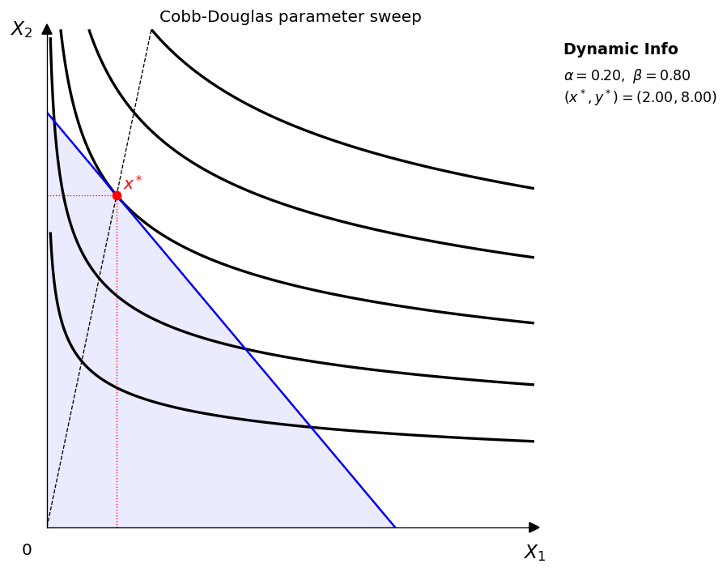
    <figcaption>Cobb-Douglas: vary <code>alpha</code> while <code>beta = 1 - alpha</code>.</figcaption>
  </figure>
  <figure class="gif-card">
    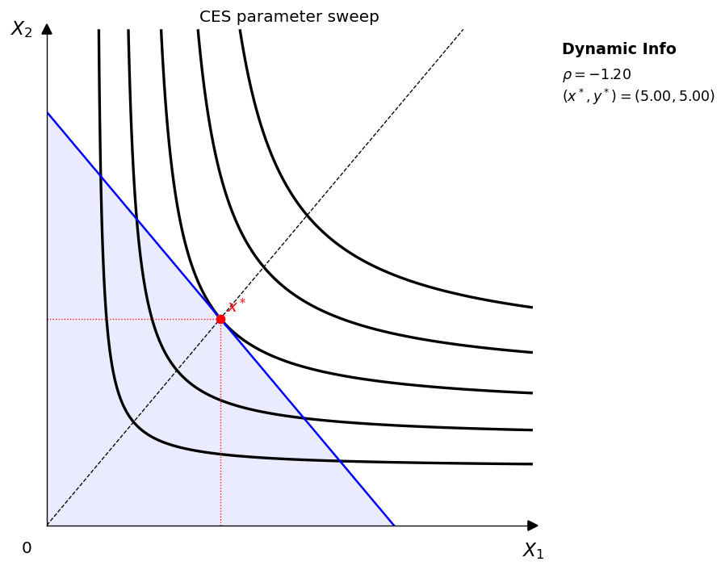
    <figcaption>CES: vary <code>rho</code> to change curvature and substitutability.</figcaption>
  </figure>
  <figure class="gif-card">
    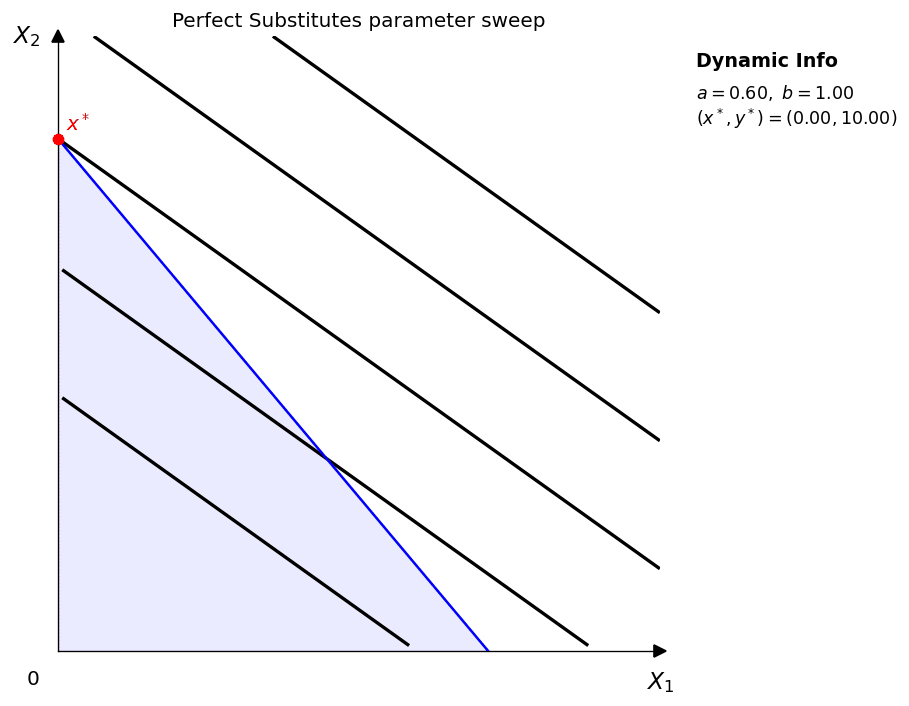
    <figcaption>Perfect substitutes: vary <code>a</code> with <code>b</code> fixed.</figcaption>
  </figure>
  <figure class="gif-card">
    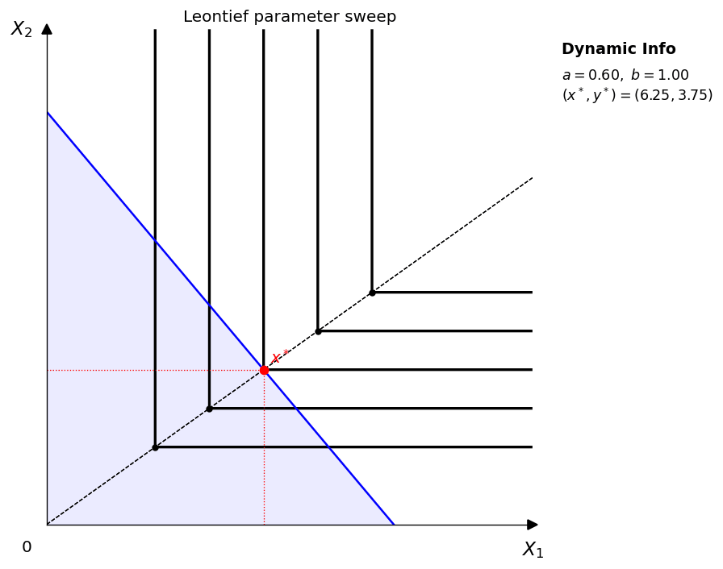
    <figcaption>Leontief: vary <code>a</code> with <code>b</code> fixed to move the kink path.</figcaption>
  </figure>
</div>

## Price sweeps

These animations answer “how does equilibrium move when the budget line rotates?” The key design choice in `v1.4.0` is that the utility function is held fixed, and the background indifference-map levels are also held fixed.

<div class="media-grid" markdown>
  <figure class="gif-card">
    
    <figcaption>Cobb-Douglas price sweep with <code>p_y</code> fixed.</figcaption>
  </figure>
  <figure class="gif-card">
    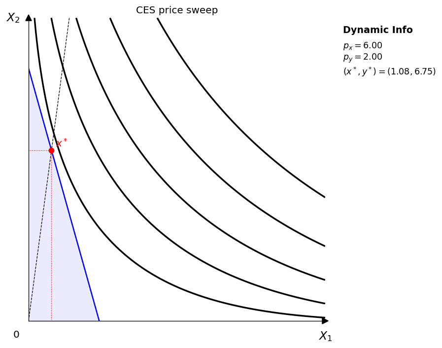
    <figcaption>CES price sweep with a fixed utility surface.</figcaption>
  </figure>
  <figure class="gif-card">
    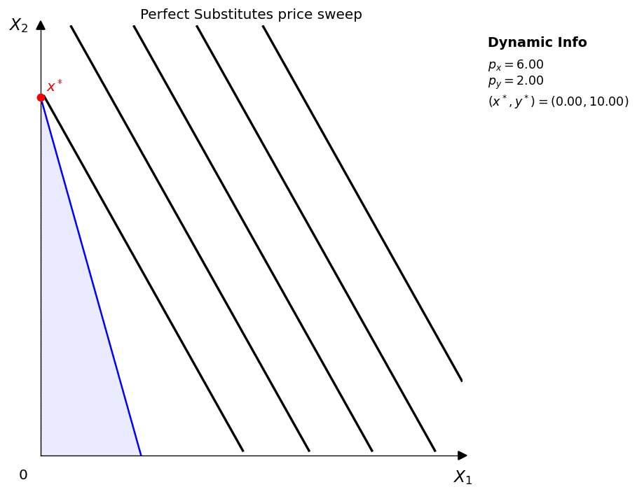
    <figcaption>Perfect substitutes under a rotating budget line.</figcaption>
  </figure>
  <figure class="gif-card">
    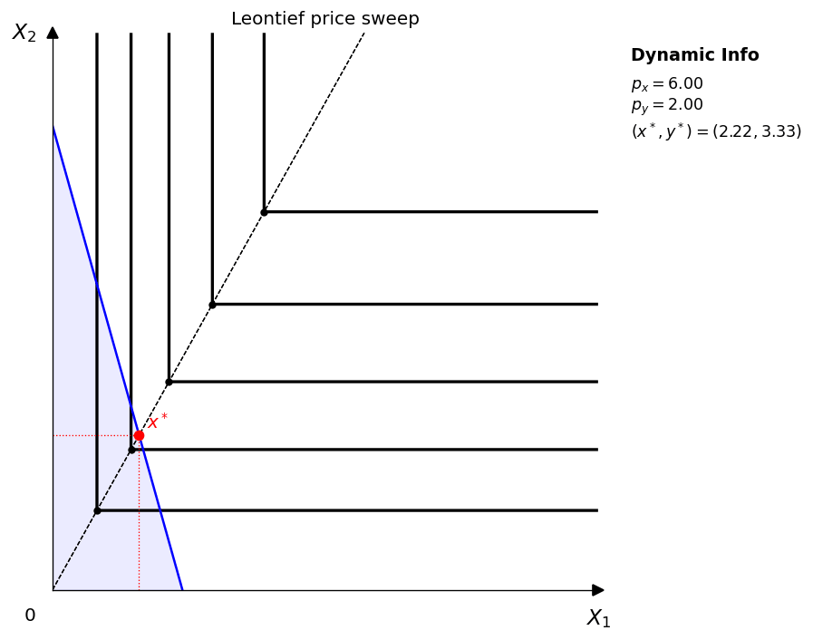
    <figcaption>Leontief price sweep with fixed right-angle indifference curves.</figcaption>
  </figure>
  <figure class="gif-card">
    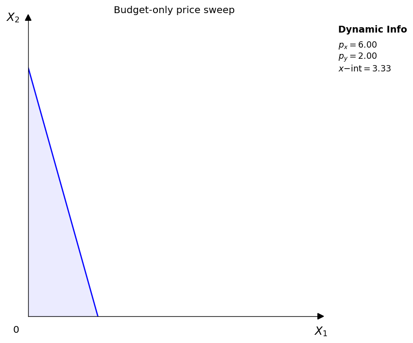
    <figcaption>Budget-only price sweep for isolating pure rotation of the constraint.</figcaption>
  </figure>
</div>

## Income sweeps

These animations answer “how does equilibrium move when the budget line shifts in parallel?”

<div class="media-grid" markdown>
  <figure class="gif-card">
    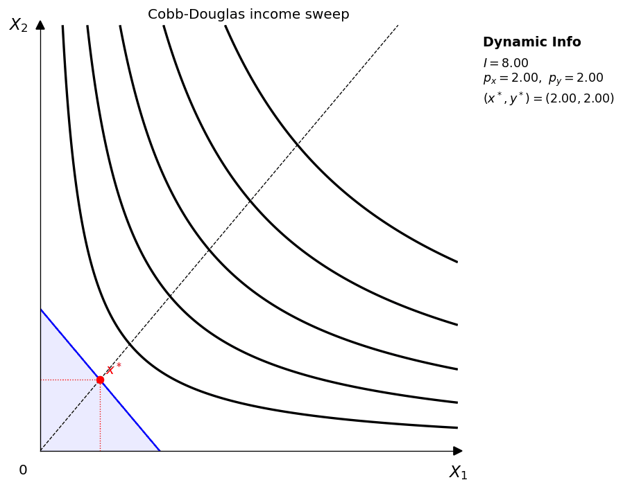
    <figcaption>Cobb-Douglas income sweep with fixed prices.</figcaption>
  </figure>
  <figure class="gif-card">
    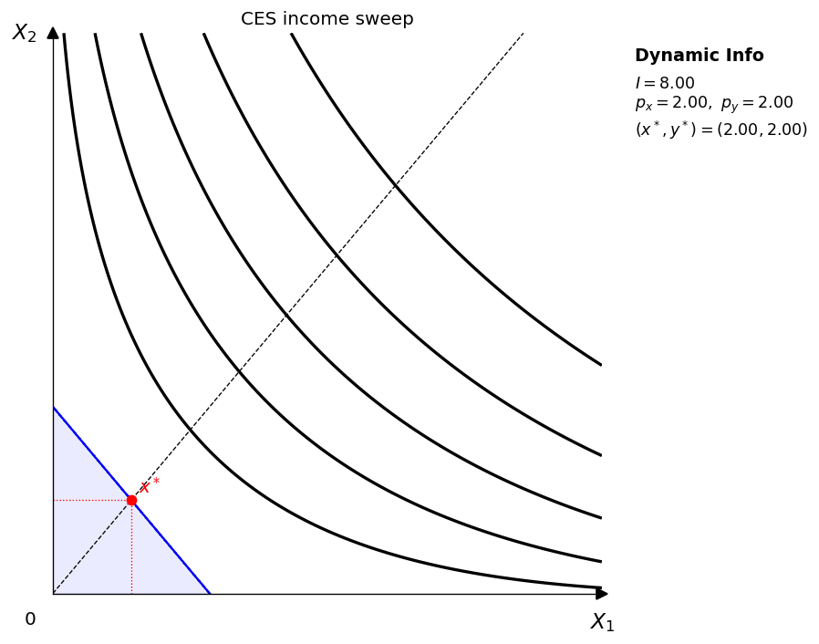
    <figcaption>CES income sweep with fixed prices and fixed utility function.</figcaption>
  </figure>
  <figure class="gif-card">
    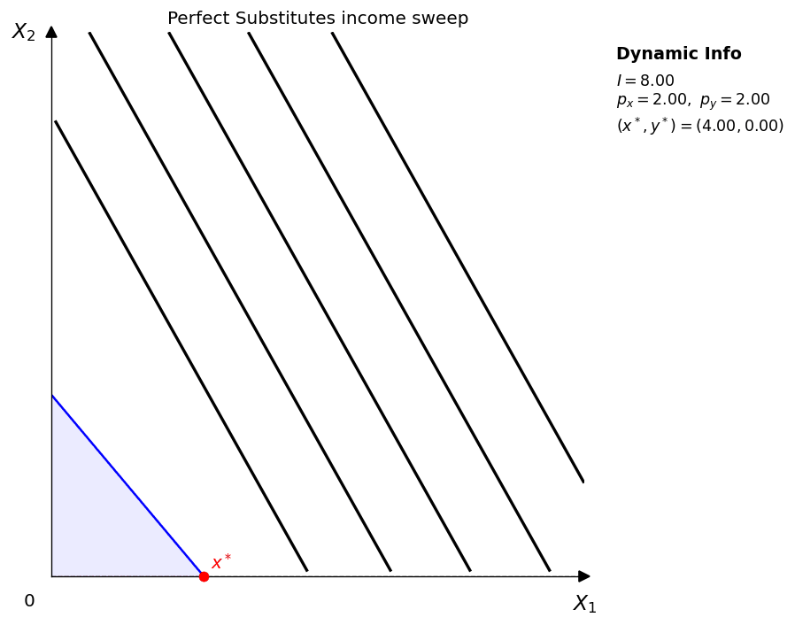
    <figcaption>Perfect substitutes income sweep.</figcaption>
  </figure>
  <figure class="gif-card">
    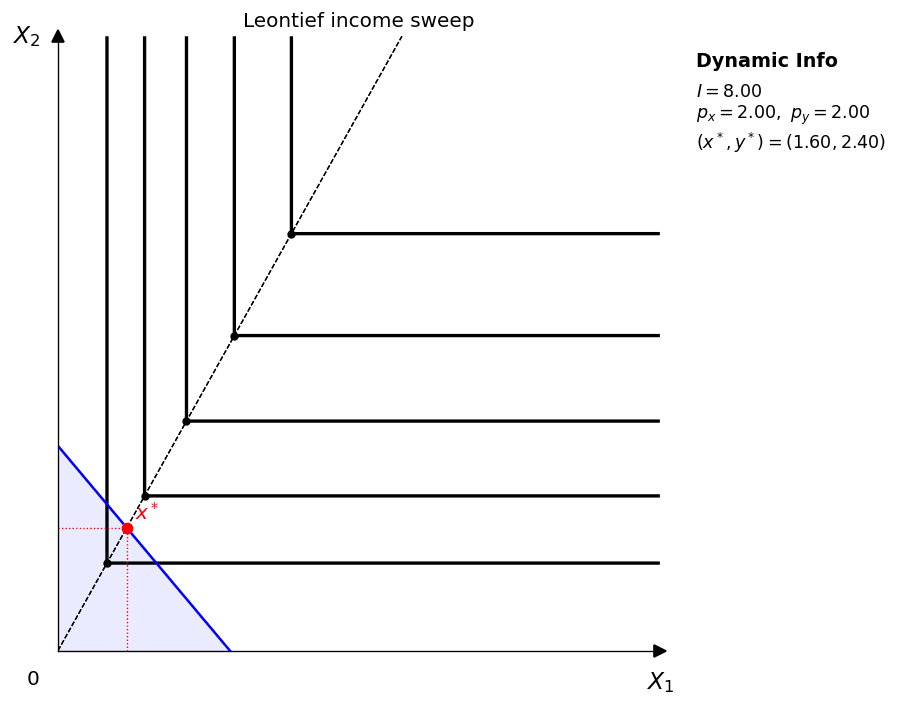
    <figcaption>Leontief income sweep with fixed prices.</figcaption>
  </figure>
  <figure class="gif-card">
    
    <figcaption>Budget-only income sweep for isolating parallel shifts in the constraint.</figcaption>
  </figure>
</div>

## Export notes

- `Animator.save()` uses Pillow, so no `ffmpeg` dependency is required.
- GIF frames are composited onto white before export to prevent frame stacking artifacts.
- `fps`, `dpi`, and `loop` are configurable per animation.
