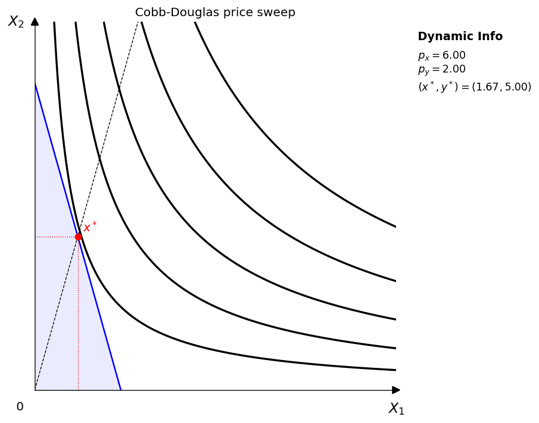
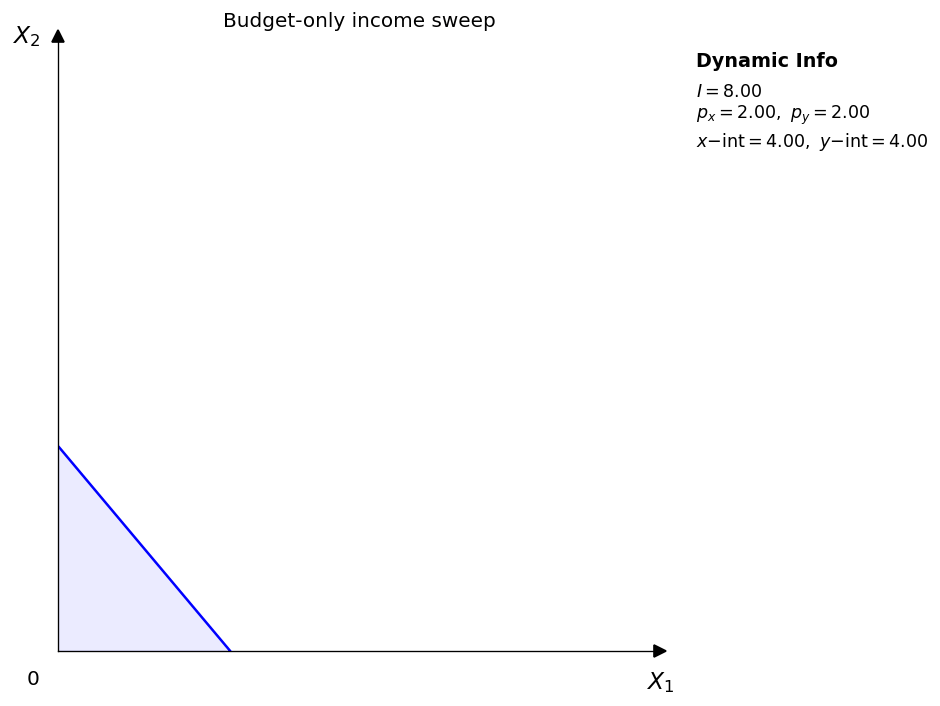
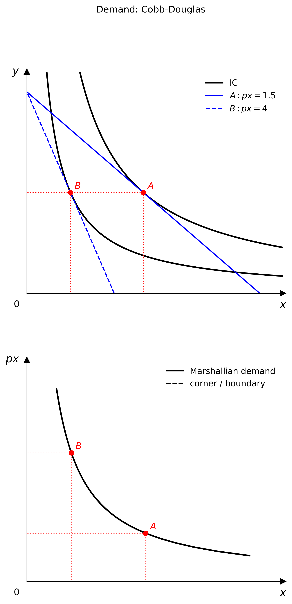

# Changelog

This page mirrors the project's release history from `CHANGELOG.md`.

## v1.4.0 (2026-04-10)

### Features

- Add `Animator` GIF export examples for parameter, price, and income sweeps across four standard utility families
- Add budget-only sweep examples so teaching pages can isolate how the budget constraint moves
- Add `WidgetViewer` numeric input boxes alongside sliders for notebook use

### Fixes

- Prevent GIF frame stacking by compositing each frame onto a white background before export
- Improve the Playground notebook install flow for Colab by making the install cell restart-safe

  <figure class="gif-card">
    
    <figcaption>Cobb-Douglas price sweep with a fixed utility function and moving budget line.</figcaption>
  </figure>
  <figure class="gif-card">
    
    <figcaption>Budget-only income sweep used to isolate pure budget-line motion.</figcaption>
  </figure>

## v1.2.0 (2026-03-30)

### Features

- Add multi-panel `Figure` layouts and `Layout` enum (closes #7)
- Add linked `DemandDiagram` for Marshallian demand teaching figures (closes #31)
- Add `PricePath` / `IncomePath` helpers and `Canvas.add_path()` for PCC / ICC plots (closes #5)

## v1.1.0 (2026-03-30)

### Features

- Add `comparative_statics` helper (closes #12)
- Add `HomogeneityAnalyzer` and `ReturnsToScale` to the analysis submodule (closes #14)
- Add `Translog` model (#9) and legend / indifference-curve label support (#11)

## v1.0.2 (2026-03-29)

### Bug fixes

- Prevent double-wrap of math axis labels (closes #2)
- Remove NumPy upper bound to prevent Colab environment conflicts

## v1.0.1 (2026-03-29)

### Bug fixes

- Pin `numpy<2` to prevent ABI mismatch on Colab and local installs

### Chores

- Relax Python / NumPy bounds and pin `pytest` to 8.x

### Documentation

- Add Stone-Geary to README and update the test-count badge

## v1.0.0 (2026-03-28)

- Initial release
