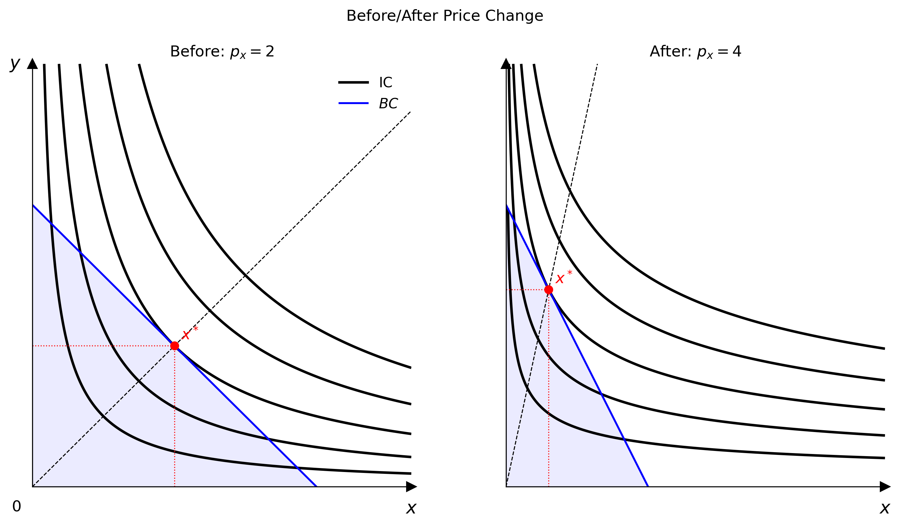

# Figures & Demand Diagrams

`econ-viz` now includes higher-level teaching primitives on top of `Canvas`:

- `Figure` for multi-panel layouts
- `PricePath` and `IncomePath` for budget / equilibrium sweeps
- `DemandDiagram` for linked goods-space and Marshallian-demand views

## Multi-panel `Figure`

Use `Figure` when one panel is not enough: before/after comparisons, decomposition diagrams, or classroom slides.

```python
from econ_viz import Figure, Layout, levels, solve
from econ_viz.models import CobbDouglas

fig = Figure(
    Layout.SIDE_BY_SIDE,
    x_max=20,
    y_max=15,
    x_label="x",
    y_label="y",
    title="Before / After Price Change",
    shared_y=True,
)

cases = [
    (CobbDouglas(alpha=0.5, beta=0.5), 2.0, 3.0, 30.0, r"Before: $p_x=2$"),
    (CobbDouglas(alpha=0.3, beta=0.7), 4.0, 3.0, 30.0, r"After: $p_x=4$"),
]

for idx, (model, px, py, income, title) in enumerate(cases):
    eq = solve(model, px=px, py=py, income=income)
    panel = fig[idx]
    panel.ax.set_title(title)
    panel.add_utility(model, levels=levels.around(eq.utility, n=5), label="IC")
    panel.add_budget(px, py, income, fill=True, label="BC")
    panel.add_equilibrium(eq, show_ray=True)

fig[0].show_legend(loc="upper right")
fig.save("figure_side_by_side.png")
```



### Available layouts

- `Layout.SINGLE`
- `Layout.STACKED`
- `Layout.SIDE_BY_SIDE`
- `Layout.TOP_TWO_BOTTOM_ONE`
- `Layout.TOP_ONE_BOTTOM_TWO`
- `Layout.GRID_2X2`
- `Layout.GRID_3X3`

`Figure[idx]` returns a panel `Canvas`, so the drawing API is the same once the layout exists.

## Path helpers

Path objects sweep one budget parameter while repeatedly solving the consumer problem.

```python
from econ_viz import IncomePath, LinearBudget, PricePath
from econ_viz.models import CobbDouglas

model = CobbDouglas(alpha=0.5, beta=0.5)
budget = LinearBudget(px=2.0, py=2.0, income=40.0)

price_path = PricePath(model, budget=budget, price="px", price_range=(0.8, 6.0), n=40)
income_path = IncomePath(model, budget=budget, income_range=(20.0, 80.0), n=30)
```

Use these paths to:

- draw PCC / ICC style equilibrium traces with `Canvas.add_path(...)`
- feed a `DemandDiagram`
- inspect how bundles move as prices or income vary

## `DemandDiagram`

`DemandDiagram` builds a stacked two-panel figure:

- top panel: indifference curves, budget lines, equilibrium markers
- bottom panel: the corresponding Marshallian demand curve

```python
from econ_viz import DemandDiagram, LinearBudget, PricePath
from econ_viz.models import CobbDouglas

model = CobbDouglas(alpha=0.5, beta=0.5)
budget = LinearBudget(px=2.0, py=2.0, income=40.0)
path = PricePath(model, budget=budget, price="px", price_range=(0.8, 6.0), n=40)

fig = DemandDiagram(path, title="Demand: Cobb-Douglas")
fig.add_marshallian_panel(
    price_markers=[1.5, 4.0],
    show_pcc=False,
    show_demand_guides=True,
)
fig.save("demand_cobb_douglas.png")
```


### Notes

- `DemandDiagram` currently expects a `PricePath`
- it handles smooth, kinked, and corner-demand cases differently so the bottom panel stays economically meaningful
- `show_pcc=True` overlays the price-consumption curve in the goods-space panel

## `Canvas.add_path(...)`

When you do not need a full demand diagram, you can still render a path directly on a `Canvas`.

```python
from econ_viz import Canvas, levels

eq = price_path.equilibria[len(price_path.equilibria) // 2]
lvls = levels.around(eq.utility, n=5)

Canvas(x_max=25, y_max=20) \
    .add_utility(model, levels=lvls) \
    .add_path(price_path, label="PCC") \
    .save("price_path.png")
```
