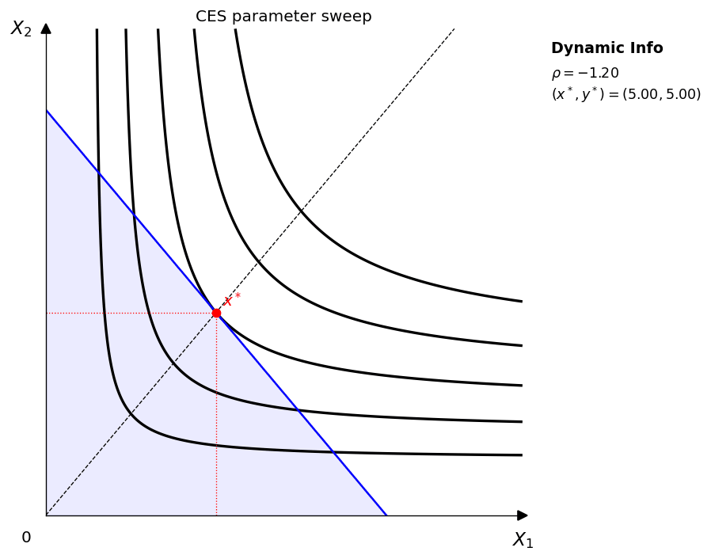
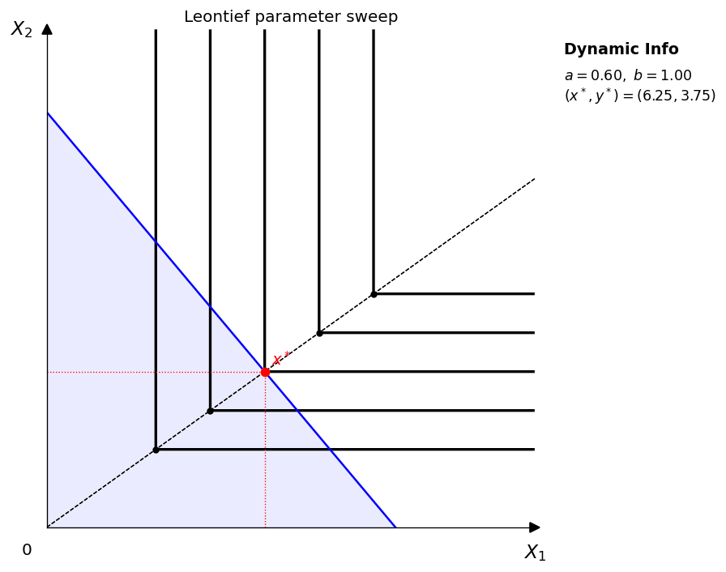
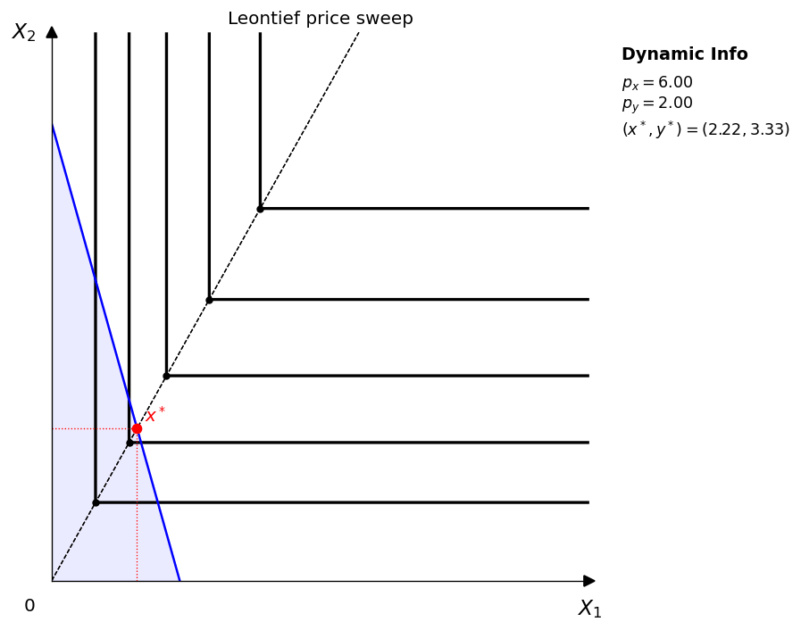
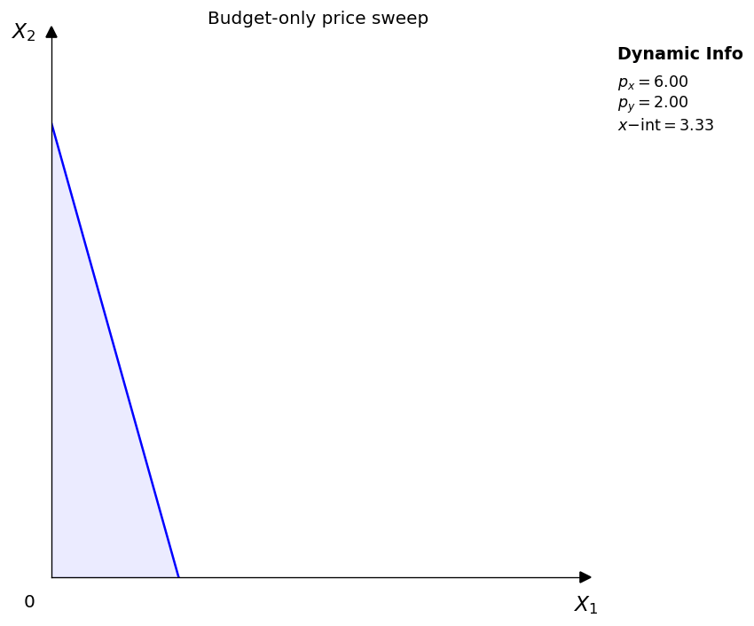
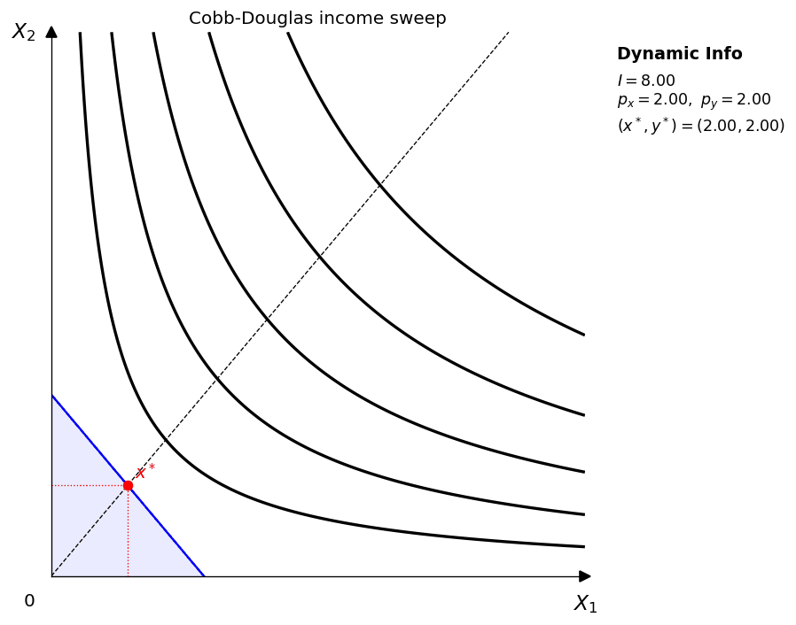
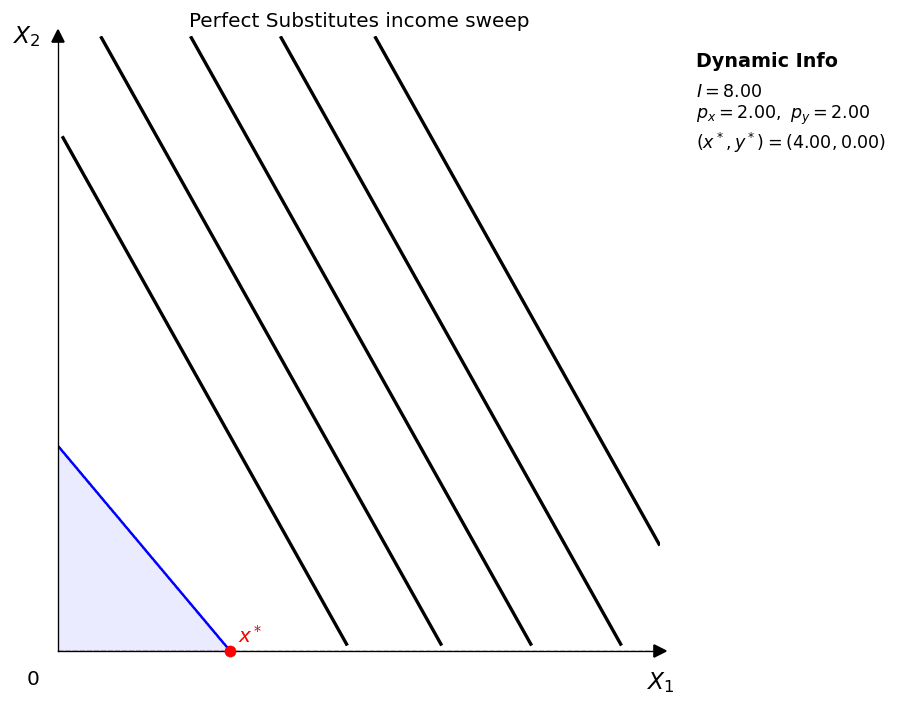
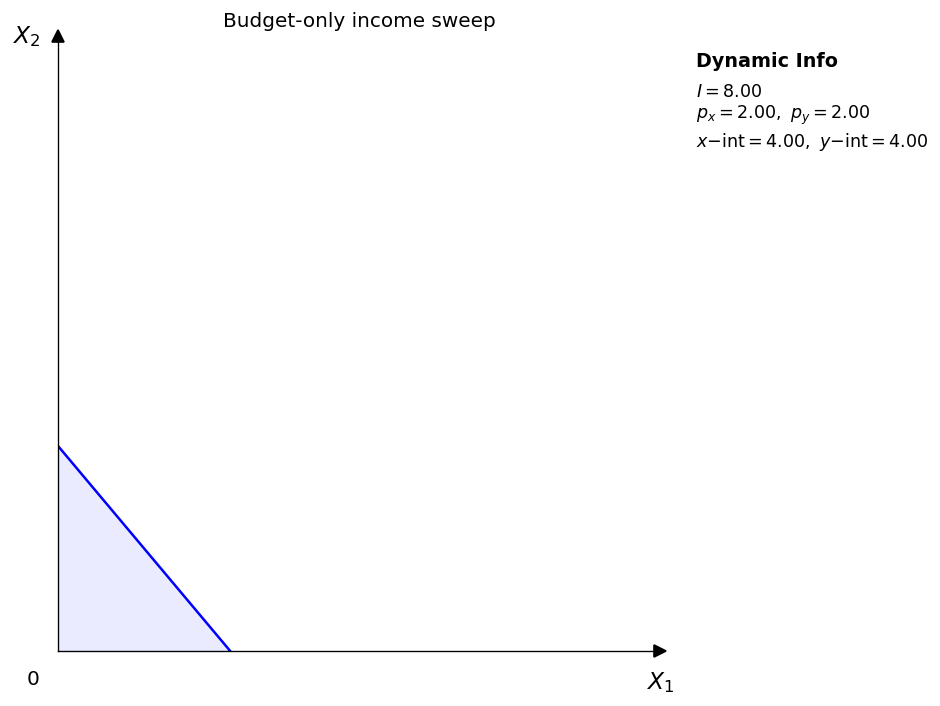

# Animation

`econ-viz` includes a lightweight GIF workflow built around `Animator`. The API stays close to normal plotting: you write a frame factory that returns a fresh `Canvas` or `Figure`, then sweep a numeric frame sequence and save the result as a GIF.

## Install

```bash
uv add "econ-viz[animation]"
```

If you also want notebook widgets, install:

```bash
uv add "econ-viz[all]"
```

## Minimal example

```python
import numpy as np

from econ_viz import Canvas, levels, solve
from econ_viz.animation import Animator
from econ_viz.models import CobbDouglas

def draw(px: float) -> Canvas:
    model = CobbDouglas(alpha=0.5, beta=0.5)
    eq = solve(model, px=px, py=2.0, income=20.0)
    lvls = levels.around(eq.utility, n=5)

    return (
        Canvas(
            x_max=14, y_max=12,
            x_label="X_1", y_label="X_2",
            title="Price sweep"
        )
        .add_utility(model, levels=lvls)
        .add_budget(px=px, py=2.0, income=20.0, fill=True)
        .add_equilibrium(eq, show_ray=True, drop_dashes=True)
    )

Animator(draw, frames=np.linspace(1.0, 6.0, 45)).save(
    "price_sweep.gif",
    fps=12,
    dpi=120,
)
```

## Teaching sweeps

The local example script at `examples/animation.py` now generates three separate sweep families:

- Parameter sweeps: move one utility-function parameter while holding prices and income fixed.
- Price sweeps: hold the utility function fixed and sweep `p_x` while holding `p_y` fixed.
- Income sweeps: hold the utility function and prices fixed and move only income.
- Budget-only sweeps: remove the utility layer entirely so students can isolate budget-line motion.

The docs site embeds the same GIF assets directly, so what you see here matches the locally generated examples.

## Parameter sweeps

Vary utility-function parameters to see how the shape of the preference map changes.

<table class="gif-table">
  <tbody>
    <tr>
      <td>
  <figure class="gif-card">
    <span class="gif-card__title">Cobb-Douglas</span>
    
    <figcaption>Vary \(\alpha\) while \(\beta = 1 - \alpha\)</figcaption>
  </figure>
      </td>
      <td>
  <figure class="gif-card">
    <span class="gif-card__title">CES</span>
    
    <figcaption>Vary \(\rho\) to change curvature and substitutability</figcaption>
  </figure>
      </td>
    </tr>
    <tr>
      <td>
  <figure class="gif-card">
    <span class="gif-card__title">Perfect substitutes</span>
    
    <figcaption>Vary \(a\) with \(b\) fixed</figcaption>
  </figure>
      </td>
      <td>
  <figure class="gif-card">
    <span class="gif-card__title">Leontief</span>
    
    <figcaption>Vary \(a\) with \(b\) fixed to move the kink path</figcaption>
  </figure>
      </td>
    </tr>
  </tbody>
</table>

## Price sweeps

Hold the utility function and background indifference-curve levels fixed, then vary one good's price to trace equilibrium as the budget line rotates.

<table class="gif-table">
  <tbody>
    <tr>
      <td>
  <figure class="gif-card">
    <span class="gif-card__title">Cobb-Douglas</span>
    
    <figcaption>Price sweep with \(p_y\) fixed</figcaption>
  </figure>
      </td>
      <td>
  <figure class="gif-card">
    <span class="gif-card__title">CES</span>
    
    <figcaption>Price sweep with a fixed utility surface</figcaption>
  </figure>
      </td>
    </tr>
    <tr>
      <td>
  <figure class="gif-card">
    <span class="gif-card__title">Perfect substitutes</span>
    
    <figcaption>Under a rotating budget line</figcaption>
  </figure>
      </td>
      <td>
  <figure class="gif-card">
    <span class="gif-card__title">Leontief</span>
    
    <figcaption>Price sweep with fixed right-angle indifference curves</figcaption>
  </figure>
      </td>
    </tr>
    <tr>
      <td>
  <figure class="gif-card">
    <span class="gif-card__title">Budget only</span>
    
    <figcaption>Price sweep for isolating pure rotation of the constraint</figcaption>
  </figure>
      </td>
      <td class="gif-table__empty" aria-hidden="true"></td>
    </tr>
  </tbody>
</table>

## Income sweeps

Hold the utility function and prices fixed, then vary income to trace equilibrium as the budget line shifts in parallel.

<table class="gif-table">
  <tbody>
    <tr>
      <td>
  <figure class="gif-card">
    <span class="gif-card__title">Cobb-Douglas</span>
    
    <figcaption>Income sweep with fixed prices</figcaption>
  </figure>
      </td>
      <td>
  <figure class="gif-card">
    <span class="gif-card__title">CES</span>
    
    <figcaption>Income sweep with fixed prices and fixed utility function</figcaption>
  </figure>
      </td>
    </tr>
    <tr>
      <td>
  <figure class="gif-card">
    <span class="gif-card__title">Perfect substitutes</span>
    
    <figcaption>Income sweep</figcaption>
  </figure>
      </td>
      <td>
  <figure class="gif-card">
    <span class="gif-card__title">Leontief</span>
    
    <figcaption>Income sweep with fixed prices</figcaption>
  </figure>
      </td>
    </tr>
    <tr>
      <td>
  <figure class="gif-card">
    <span class="gif-card__title">Budget only</span>
    
    <figcaption>Income sweep for isolating parallel shifts in the constraint</figcaption>
  </figure>
      </td>
      <td class="gif-table__empty" aria-hidden="true"></td>
    </tr>
  </tbody>
</table>

## Export notes

GIF export follows these rules:

- `Animator.save()` uses Pillow, so no `ffmpeg` dependency is required.
- GIF frames are composited onto white before export to prevent frame stacking artifacts.
- `fps`, `dpi`, and `loop` are configurable per animation.
