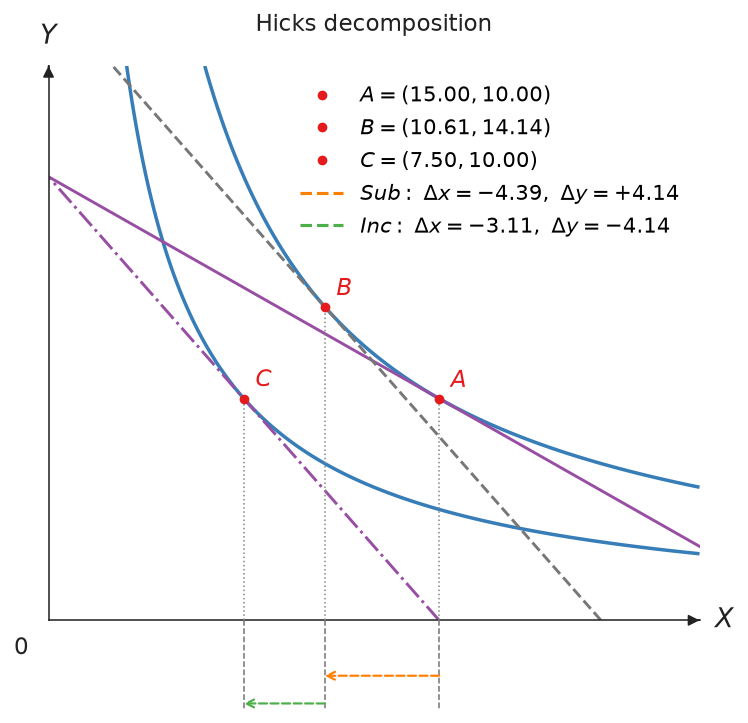
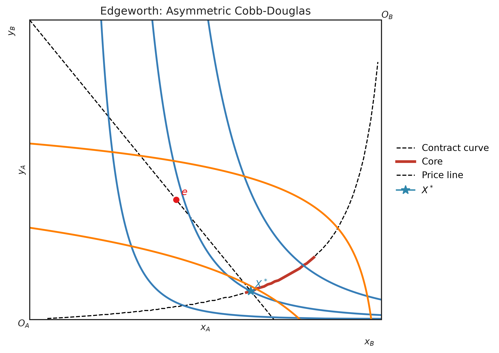

# Figures & Demand Diagrams

`econ-viz` now includes higher-level teaching primitives on top of `Canvas`:

- `Figure` for multi-panel layouts
- `PricePath` and `IncomePath` for budget / equilibrium sweeps
- `DemandDiagram` for linked goods-space and Marshallian-demand views
- `decompose_price_effect(...)` for Hicks and Slutsky decomposition
- `EdgeworthBox` for two-consumer exchange diagrams

## Multi-panel figures {#multi-panel-figure data-toc-label="Multi-panel figures"}

Use `Figure` when one panel is not enough: before/after comparisons, decomposition diagrams, or classroom slides.

```python
from econ_viz import Figure, Layout, levels, solve
from econ_viz.models import CobbDouglas

fig = Figure(
    Layout.SIDE_BY_SIDE,
    x_max=20,
    y_max=15,
    x_label="x",
    y_label="y",
    title="Before / After Price Change",
    shared_y=True,
)

cases = [
    (CobbDouglas(alpha=0.5, beta=0.5), 2.0, 3.0, 30.0, r"Before: $p_x=2$"),
    (CobbDouglas(alpha=0.3, beta=0.7), 4.0, 3.0, 30.0, r"After: $p_x=4$"),
]

for idx, (model, px, py, income, title) in enumerate(cases):
    eq = solve(model, px=px, py=py, income=income)
    panel = fig[idx]
    panel.ax.set_title(title)
    panel.add_utility(model, levels=levels.around(eq.utility, n=5), label="IC")
    panel.add_budget(px, py, income, fill=True, label="BC")
    panel.add_equilibrium(eq, show_ray=True)

fig[0].show_legend(loc="upper right")
fig.save("figure_side_by_side.png")
```


### Available layouts

`Figure` supports these layouts:

- `Layout.SINGLE`
- `Layout.STACKED`
- `Layout.SIDE_BY_SIDE`
- `Layout.TOP_TWO_BOTTOM_ONE`
- `Layout.TOP_ONE_BOTTOM_TWO`
- `Layout.GRID_2X2`
- `Layout.GRID_3X3`

`Figure[idx]` returns a panel `Canvas`, so the drawing API is the same once the layout exists.

## Path helpers

Path objects sweep one budget parameter while repeatedly solving the consumer problem.

```python
from econ_viz import IncomePath, LinearBudget, PricePath
from econ_viz.models import CobbDouglas

model = CobbDouglas(alpha=0.5, beta=0.5)
budget = LinearBudget(px=2.0, py=2.0, income=40.0)

price_path = PricePath(
    model,
    budget=budget,
    price="px",
    price_range=(0.8, 6.0),
    n=40,
)
income_path = IncomePath(
    model,
    budget=budget,
    income_range=(20.0, 80.0),
    n=30,
)
```

Use these paths to:

- draw PCC / ICC style equilibrium traces with `Canvas.add_path(...)`
- feed a `DemandDiagram`
- inspect how bundles move as prices or income vary

## Demand diagrams {#demanddiagram data-toc-label="Demand diagrams"}

`DemandDiagram` builds a stacked two-panel figure:

- top panel: indifference curves, budget lines, equilibrium markers
- bottom panel: the corresponding Marshallian demand curve

```python
from econ_viz import DemandDiagram, LinearBudget, PricePath
from econ_viz.models import CobbDouglas

model = CobbDouglas(alpha=0.5, beta=0.5)
budget = LinearBudget(px=2.0, py=2.0, income=40.0)
path = PricePath(
    model,
    budget=budget,
    price="px",
    price_range=(0.8, 6.0),
    n=40,
)

fig = DemandDiagram(path, title="Demand: Cobb-Douglas")
fig.add_marshallian_panel(
    price_markers=[1.5, 4.0],
    show_pcc=False,
    show_demand_guides=True,
)
fig.save("demand_cobb_douglas.png")
```


### Notes

Keep these constraints in mind when building demand diagrams:

- `DemandDiagram` currently expects a `PricePath`
- it handles smooth, kinked, and corner-demand cases differently so the bottom panel stays economically meaningful
- `show_pcc=True` overlays the price-consumption curve in the goods-space panel

## Price-effect decomposition

`decompose_price_effect(...)` separates a price change into substitution and
income effects. Choose `HICKS` to hold the original utility fixed or `SLUTSKY`
to keep the original bundle affordable.

```python
from econ_viz import Canvas, DecompositionMethod, levels
from econ_viz.models import CobbDouglas
from econ_viz.optimizer import decompose_price_effect

model = CobbDouglas(alpha=0.5, beta=0.5)
result = decompose_price_effect(
    model,
    px=(2.0, 4.0),
    py=3.0,
    income=60.0,
    method=DecompositionMethod.HICKS,
)

(
    Canvas(x_max=25, y_max=25, title="Hicks decomposition")
    .add_decomposition(
        result,
        show_arrows=True,
        label_effects=True,
        show_x_projections=True,
    )
    .save("hicks.png")
)
```

`add_decomposition` draws the indifference curves through A and C by
default, plus the one through B under Slutsky, where B is off the original
curve. Pass `show_curves=False` when you draw them yourself with
`add_utility`.

`result.A`, `result.B`, and `result.C` are the original, compensated, and
final bundles. The result also exposes `substitution_effect`, `income_effect`,
`total_effect`, and `compensated_income`.

Use `Effect` to set each effect's colour, the height of its range arrow below
the axis, and a label beside it. `point_label` moves or hides the A, B, and C
labels:

```python
from econ_viz import Effect, Label

canvas.add_decomposition(
    result,
    substitution=Effect(color="#E67E22", label="SE", label_position="top"),
    income=Effect(color="#27AE60", label="IE"),
    point_label=Label(visible=False),
)
```

`curve_stroke` and `curve_label` restyle and label those curves, and `legend`
places the legend:

```python
from econ_viz import Label, Legend, Stroke

canvas.add_decomposition(
    result,
    curve_stroke=Stroke(opacity=0.6),        # restyle U0, U1 (and U_B)
    curve_label=Label(position="top"),       # turn on the U0, U1 labels
    legend=Legend(position="bottom"),        # or Legend(visible=False)
)
```



## Edgeworth box

`EdgeworthBox` draws a two-consumer exchange economy. Consumer A is measured
from the lower-left origin, while consumer B is measured from the upper-right
origin.

```python
from econ_viz import EdgeworthBox
from econ_viz.models import CobbDouglas

box = EdgeworthBox(
    CobbDouglas(alpha=0.8, beta=0.2),
    CobbDouglas(alpha=0.2, beta=0.8),
    total_x=12.0,
    total_y=10.0,
    title="Asymmetric Cobb-Douglas",
)

(
    box.add_endowment(5.0, 4.0)
    .add_contract_curve(n=100, method="mrs")
    .add_core()
    .add_price_line(px=1.2, py=1.0)
    .add_walrasian_equilibrium(px=1.2, py=1.0)
    .show_legend(loc="center left", bbox_to_anchor=(1.02, 0.5))
    .save("edgeworth.png")
)
```

Use `method="mrs"` for smooth preferences. Use `method="pareto"` for models
with kinks, corners, or custom piecewise utility functions.



## Draw paths {#canvasadd_path data-toc-label="Draw paths"}

When you do not need a full demand diagram, you can still render a path directly on a `Canvas`.

```python
from econ_viz import Canvas, levels

eq = price_path.equilibria[len(price_path.equilibria) // 2]
lvls = levels.around(eq.utility, n=5)

Canvas(x_max=25, y_max=20) \
    .add_utility(model, levels=lvls) \
    .add_path(price_path, label="PCC") \
    .save("price_path.png")
```
