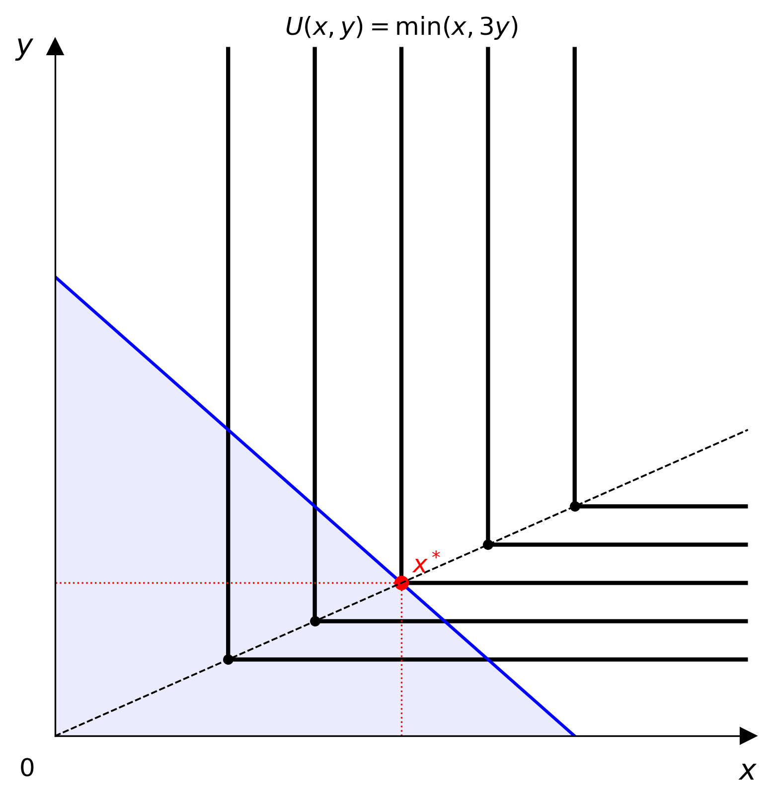
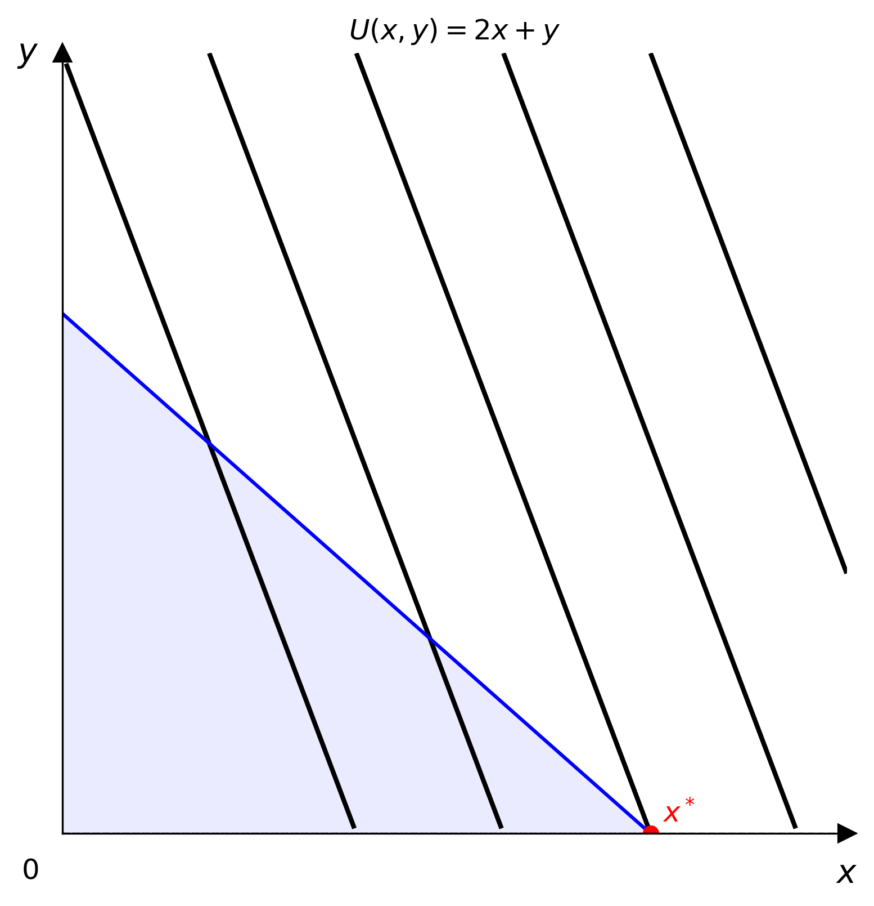

# LaTeX Parsing

`parse_latex` converts a LaTeX math string directly into a concrete model instance.


```python
from econ_viz import parse_latex

model = parse_latex(r"x^{0.4} y^{0.6}")       # CobbDouglas(alpha=0.4, beta=0.6)
model = parse_latex(r"\min(2x, 3y)")           # Leontief(a=2.0, b=3.0)
model = parse_latex(r"2x + 3y")               # PerfectSubstitutes(a=2.0, b=3.0)
```

## Supported forms

| Family | Pattern | Example |
|--------|---------|---------|
| Cobb-Douglas | `x^{α} y^{β}` or `x^α y^β` | `x^{0.3} y^{0.7}` |
| Leontief | `\min(ax, by)` or `min(ax, by)` | `\min(2x, y)` |
| Perfect Substitutes | `ax + by` | `3x + 1.5y` |

Coefficients and exponents are optional and default to 1.

## Accepted preambles

The following leading preambles are stripped automatically:

```
U(x,y) = x^{0.5} y^{0.5}
U = x^{0.5} y^{0.5}
x^{0.5} y^{0.5}
```

## Errors

Unrecognised patterns raise `econ_viz.exceptions.ParseError`:

```python
from econ_viz.exceptions import ParseError

try:
    model = parse_latex(r"x^2 + y^2")
except ParseError as e:
    print(e)
```

## In the CLI

```bash
econ-viz plot --latex "x^{0.4} y^{0.6}" --px 2 --py 3 --income 30 -o out.png
```




