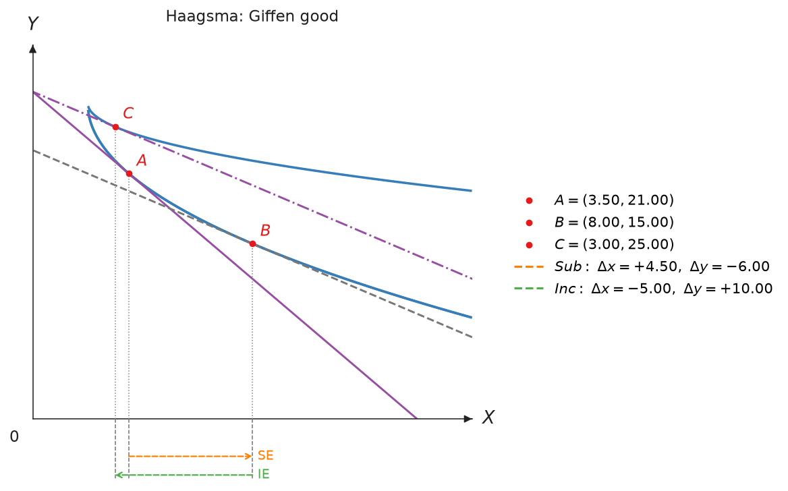

# Advanced Models

Advanced models extend the built-in utility families with user-defined
functions, more than two goods, or goods that are inferior or Giffen.

## Extensible models

Use these models when a predefined two-good utility class is not enough.

=== "Custom Utility"

    `CustomUtility` wraps any vectorised Python callable as an econ-viz model.

    $$
    U(x,y)=\ln x+\ln y
    $$

    The equation above is one example. The callable must accept two NumPy
    arrays and return an array with the same shape.

    **Parameters**

    | Parameter | Meaning |
    |-----------|---------|
    | `func` | Vectorised utility function of $x$ and $y$ |
    | `name` | Display name for the custom model |

    **Example**

    ```python
    import numpy as np
    from econ_viz import Canvas, levels, solve
    from econ_viz.models import CustomUtility

    model = CustomUtility(
        func=lambda x, y: np.log(x) + np.log(y),
        name="log+log",
    )
    eq = solve(model, px=2.0, py=3.0, income=30.0)

    (
        Canvas(x_max=20, y_max=15, title="Custom Utility")
        .add_utility(model, levels=levels.around(eq.utility, n=5))
        .add_budget(2.0, 3.0, 30.0)
        .add_equilibrium(eq)
        .save("custom.png")
    )
    ```

    

=== "Multi-Good Cobb-Douglas"

    `MultiGoodCD` represents Cobb-Douglas preferences over $N$ goods.

    $$
    U(x_1,\ldots,x_N)=\prod_{i=1}^{N}x_i^{\alpha_i}
    $$

    `freeze()` fixes every good except $x$ and $y$, then returns a
    `CustomUtility` that can be drawn on a two-dimensional canvas.

    **Parameters**

    | Parameter | Meaning |
    |-----------|---------|
    | `shares` | Mapping from each good name to its exponent $\alpha_i$ |
    | `freeze(...)` | Fixed quantities for goods other than $x$ and $y$ |

    **Example**

    ```python
    from econ_viz import Canvas, levels, solve
    from econ_viz.models import MultiGoodCD

    model = MultiGoodCD({"x": 0.3, "y": 0.3, "z": 0.4})
    two_good_model = model.freeze(z=10.0)
    eq = solve(two_good_model, px=2.0, py=3.0, income=30.0)

    (
        Canvas(x_max=20, y_max=15, title="Multi-Good Cobb-Douglas")
        .add_utility(
            two_good_model,
            levels=levels.around(eq.utility, n=5),
        )
        .add_budget(2.0, 3.0, 30.0, fill=True)
        .add_equilibrium(eq)
        .save("multigood.png")
    )
    ```

    

## Inferior and Giffen goods

`Haagsma` implements the utility function of \citet{haagsma2012}, in which good
$x$ is **always inferior** and becomes a **Giffen good** when income is high
enough.

$$
U(x,y)=\alpha_x\ln(x-\gamma_x)-\alpha_y\ln(\gamma_y-y),
\qquad 0<\alpha_x<\alpha_y,\quad x>\gamma_x,\quad 0\le y<\gamma_y
$$

At an interior optimum, Marshallian demand for $x$ has a closed form:

$$
x^*=\frac{\alpha_x(\gamma_y p_y-I)}{(\alpha_y-\alpha_x)\,p_x}+\frac{\alpha_y\gamma_x}{\alpha_y-\alpha_x}
$$

so $\partial x^*/\partial I<0$ for every price and income. The sign of
$\partial x^*/\partial p_x$ depends on income:

| Income | Good $x$ |
|--------|----------|
| $I<\gamma_y p_y$ | Inferior; demand still falls as $p_x$ rises |
| $I=\gamma_y p_y$ | Inferior; substitution and income effects cancel |
| $\gamma_y p_y<I<\gamma_y p_y+\gamma_x p_x$ | Giffen; demand rises with $p_x$ |

With $I\ge\gamma_y p_y+\gamma_x p_x$ the consumer can push $y$ towards
$\gamma_y$, utility grows without bound, and no optimum exists; `solve()`
raises an error.

**Parameters**

| Parameter | Meaning |
|-----------|---------|
| `alpha_x` | Weight $\alpha_x$ on good $x$, below `alpha_y` |
| `alpha_y` | Weight $\alpha_y$ on good $y$ |
| `gamma_x` | Lower bound $\gamma_x$ of good $x$ |
| `gamma_y` | Upper bound $\gamma_y$ of good $y$ |

`demand(px, py, income)` returns the closed-form bundle, and
`is_giffen(px, py, income)` reports whether $x$ is a Giffen good.

**Example**

```python
from econ_viz import Canvas, Effect
from econ_viz.models import Haagsma
from econ_viz.optimizer import decompose_price_effect

model = Haagsma(alpha_x=1.0, alpha_y=2.0, gamma_x=2.0, gamma_y=27.0)
model.is_giffen(px=2.0, py=1.0, income=28.0)  # True

result = decompose_price_effect(model, px=(2.0, 1.0), py=1.0, income=28.0, method="hicks")

(
    Canvas(x_max=16, y_max=32, title="Haagsma: Giffen good")
    .add_decomposition(
        result,
        show_x_projections=True,
        substitution=Effect(label="SE"),
        income=Effect(label="IE"),
    )
    .save("haagsma.png")
)
```

When $p_x$ falls from 2 to 1, the substitution effect raises $x$ by 4.5 while
the income effect lowers it by 5, so demand for $x$ falls.


