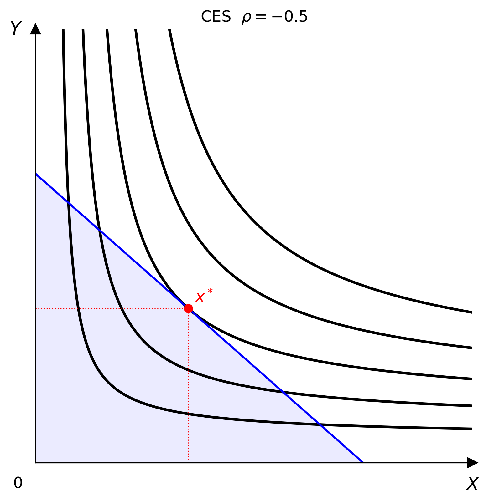

# CES (Constant Elasticity of Substitution)

$$U(x, y) = \left(\alpha x^\rho + \beta y^\rho\right)^{1/\rho}$$

The elasticity of substitution is $\sigma = 1/(1-\rho)$. CES nests several special cases:

| $\rho$ | Limit | Equivalent to |
|--------|-------|---------------|
| $\rho \to 0$ | $x^\alpha y^\beta$ | Cobb-Douglas |
| $\rho \to -\infty$ | $\min(\alpha x, \beta y)$ | Leontief |
| $\rho = 1$ | $\alpha x + \beta y$ | Perfect Substitutes |



## Parameters

| Parameter | Type | Default | Description |
|-----------|------|---------|-------------|
| `alpha` | float | 0.5 | Share parameter for good $x$ |
| `beta` | float | 0.5 | Share parameter for good $y$ |
| `rho` | float | 0.5 | Substitution parameter ($\rho \ne 1$) |

## Optimisation

The consumer solves

$$\max_{x,\,y}\; \left(\alpha x^\rho + \beta y^\rho\right)^{1/\rho} \quad \text{subject to}\quad p_x x + p_y y = I$$

The Lagrangian is

$$\mathcal{L}(x, y, \lambda) = \left(\alpha x^\rho + \beta y^\rho\right)^{1/\rho} - \lambda\,(p_x x + p_y y - I)$$

First-order conditions:

$$\begin{aligned}
\frac{\partial \mathcal{L}}{\partial x} &= \alpha x^{\rho-1}\left(\alpha x^\rho + \beta y^\rho\right)^{1/\rho - 1} - \lambda p_x = 0 \\[6pt]
\frac{\partial \mathcal{L}}{\partial y} &= \beta y^{\rho-1}\left(\alpha x^\rho + \beta y^\rho\right)^{1/\rho - 1} - \lambda p_y = 0 \\[6pt]
\frac{\partial \mathcal{L}}{\partial \lambda} &= p_x x + p_y y - I = 0
\end{aligned}$$

Dividing the first two conditions cancels the common factor and gives the tangency condition:

$$\frac{\alpha}{\beta}\left(\frac{y}{x}\right)^{1-\rho} = \frac{p_x}{p_y}$$

Solving for the optimal ratio and using $\sigma = 1/(1-\rho)$:

$$\frac{y^*}{x^*} = \left(\frac{\alpha\,p_y}{\beta\,p_x}\right)^{\!\sigma}$$

## Usage

=== "Python"

    ```python
    from econ_viz import Canvas, levels, solve
    from econ_viz.models import CES

    model = CES(rho=-0.5, alpha=0.5, beta=0.5)   # σ = 1/(1+0.5) ≈ 0.667
    eq    = solve(model, px=2.0, py=3.0, income=30.0)
    lvls  = levels.around(eq.utility, n=5)

    Canvas(x_max=20, y_max=15, title=r"CES $\rho = -0.5$") \
        .add_utility(model, levels=lvls) \
        .add_budget(2.0, 3.0, 30.0) \
        .add_equilibrium(eq) \
        .save("ces.png")
    ```

=== "CLI"

    ```bash
    econ-viz plot --model ces --rho -0.5 --alpha 0.5 \
                  --px 2 --py 3 --income 30 --output ces.png
    ```
