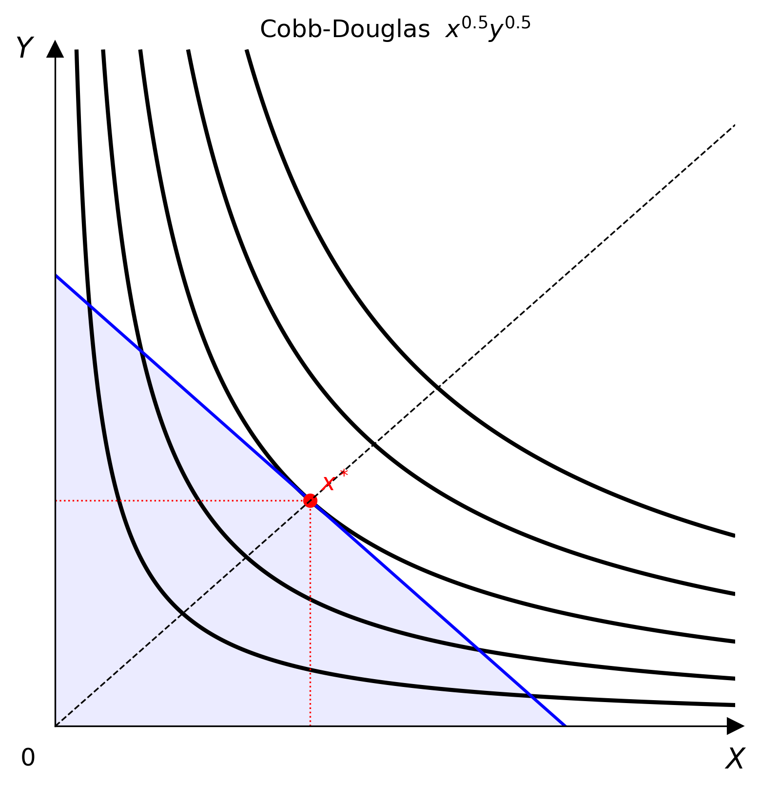

# Model Catalogue

All models live in `econ_viz.models` and conform to the `UtilityFunction` protocol — they are callable dataclasses that evaluate `U(x, y)` element-wise over NumPy arrays.



## Parametric models

| Model | Expression | Class |
|-------|-----------|-------|
| [Cobb-Douglas](cobb-douglas.md) | $x^\alpha y^\beta$ | `CobbDouglas` |
| [Leontief](leontief.md) | $\min(ax, by)$ | `Leontief` |
| [Perfect Substitutes](perfect-substitutes.md) | $ax + by$ | `PerfectSubstitutes` |
| [CES](ces.md) | $(\alpha x^\rho + \beta y^\rho)^{1/\rho}$ | `CES` |
| [Translog](translog.md) | Flexible log-quadratic utility | `Translog` |
| [Satiation](satiation.md) | $-a(x-x^*)^2 - b(y-y^*)^2$ | `Satiation` |
| [Quasi-Linear](quasi-linear.md) | $f(x) + y$ or $x + f(y)$ | `QuasiLinear` |
| [Stone-Geary](stone-geary.md) | $(x-\bar{x})^\alpha(y-\bar{y})^\beta$ | `StoneGeary` |

## Advanced models

| Model | Description | Class |
|-------|-------------|-------|
| [Custom Utility](advanced.md#custom-utility) | Wrap any vectorised callable | `CustomUtility` |
| [Multi-Good Cobb-Douglas](advanced.md#multi-good-cobb-douglas) | N goods, projected to 2-D | `MultiGoodCD` |

## Common interface

Every model exposes:

```python
model(x, y)            # evaluate U(x, y) — accepts scalars or NumPy arrays
model.utility_type     # UtilityType.SMOOTH | KINKED | LINEAR
model.ray_slopes()     # list of expansion-path slopes
model.kink_points(lvls)# kink coordinates for Leontief-type preferences
```
