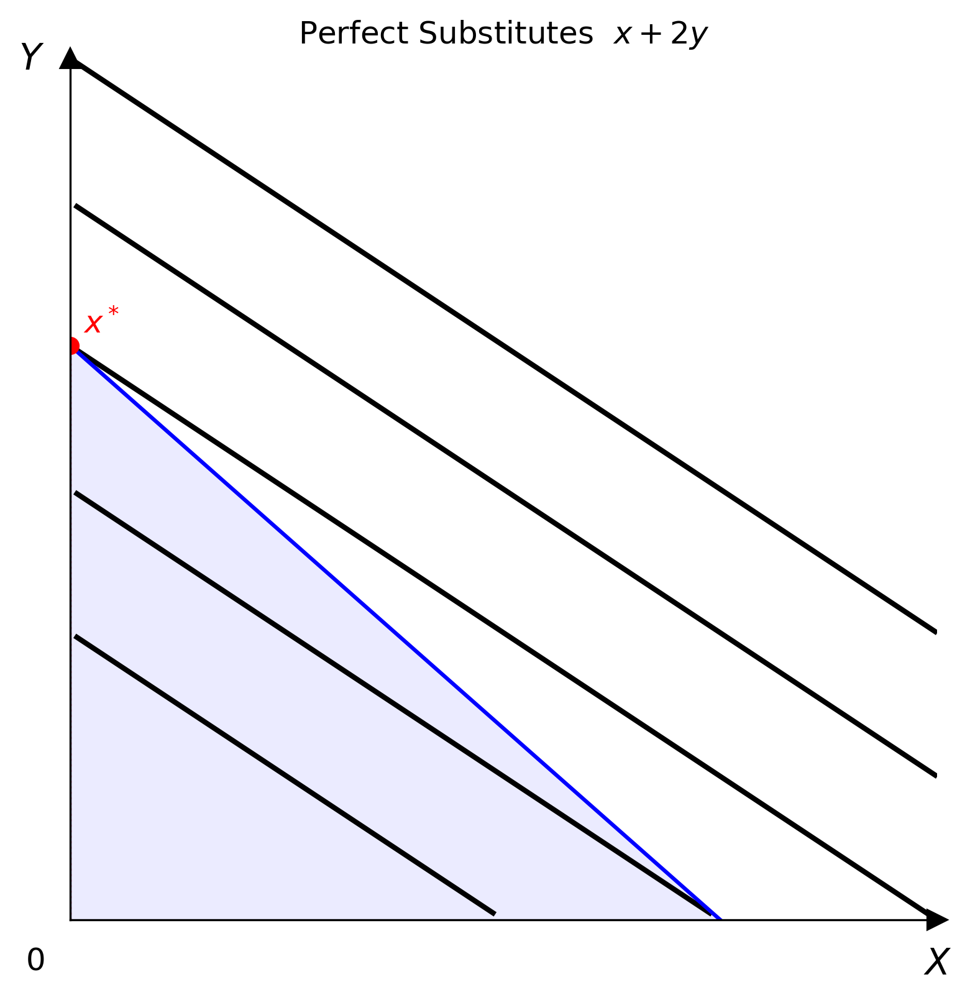

# Perfect Substitutes

$$U(x, y) = ax + by$$

Goods are perfect substitutes with a constant $\mathrm{MRS} = a/b$. Indifference curves are straight lines with slope $-a/b$.



## Parameters

| Parameter | Type | Default | Description |
|-----------|------|---------|-------------|
| `a` | float | 1.0 | Marginal utility of good $x$ |
| `b` | float | 1.0 | Marginal utility of good $y$ |

## Optimisation

The consumer solves

$$\max_{x,\,y}\; ax + by \quad \text{subject to}\quad p_x x + p_y y = I,\quad x, y \ge 0$$

Because the objective is linear, the optimum is always a corner. The indirect utility from spending all income on each good is

$$V_x = \frac{a\,I}{p_x}, \qquad V_y = \frac{b\,I}{p_y}$$

The Marshallian demands are therefore

$$\begin{aligned}
x^* &= \begin{cases} I/p_x & \text{if } a/p_x > b/p_y \\ 0 & \text{if } a/p_x < b/p_y \end{cases} \\[10pt]
y^* &= \begin{cases} 0 & \text{if } a/p_x > b/p_y \\ I/p_y & \text{if } a/p_x < b/p_y \end{cases}
\end{aligned}$$

When $a/p_x = b/p_y$ the budget line coincides with an indifference curve and every bundle on the line is optimal.

## Usage

=== "Python"

    ```python
    from econ_viz import Canvas, levels, solve
    from econ_viz.models import PerfectSubstitutes

    model = PerfectSubstitutes(a=1.0, b=2.0)
    eq    = solve(model, px=2.0, py=3.0, income=30.0)
    lvls  = levels.around(eq.utility, n=5)

    Canvas(x_max=20, y_max=15, title=r"Perfect Substitutes $x + 2y$") \
        .add_utility(model, levels=lvls) \
        .add_budget(2.0, 3.0, 30.0) \
        .add_equilibrium(eq) \
        .save("perfect_substitutes.png")
    ```

=== "CLI"

    ```bash
    econ-viz plot --model perfect-substitutes --a 1 --b 2 \
                  --px 2 --py 3 --income 30 --output ps.png
    ```
