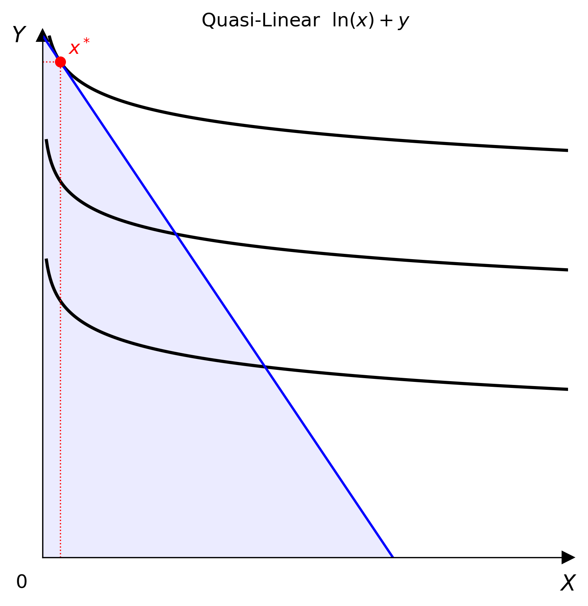

# Quasi-Linear

$$U(x, y) = f(x) + y \quad \text{or} \quad U(x, y) = x + f(y)$$

One good enters linearly; the other enters through a strictly concave, strictly increasing transformation $f$. Indifference curves have the same shape at every income level — there is no income effect on the non-linear good.



## Parameters

| Parameter | Type | Default | Description |
|-----------|------|---------|-------------|
| `v_func` | Callable | `numpy.log` | Strictly increasing, strictly concave scalar function $f(z)$ |
| `linear_in` | `'x'` or `'y'` | `'y'` | Which good enters linearly |

`v_func` is validated numerically on $z \in [0.1, 10]$ at construction time — non-monotone or convex functions raise `ValueError`.

## Optimisation

Taking $U = f(x) + y$ as the canonical form, the consumer solves

$$\max_{x,\,y}\; f(x) + y \quad \text{subject to}\quad p_x x + p_y y = I$$

The Lagrangian is

$$\mathcal{L}(x, y, \lambda) = f(x) + y - \lambda\,(p_x x + p_y y - I)$$

First-order conditions:

$$\begin{aligned}
\frac{\partial \mathcal{L}}{\partial x} &= f'(x) - \lambda p_x = 0 \\[6pt]
\frac{\partial \mathcal{L}}{\partial y} &= 1 - \lambda p_y = 0 \\[6pt]
\frac{\partial \mathcal{L}}{\partial \lambda} &= p_x x + p_y y - I = 0
\end{aligned}$$

From the second condition $\lambda = 1/p_y$, so the optimal $x^*$ satisfies

$$f'(x^*) = \frac{p_x}{p_y}$$

This pins $x^*$ independently of income $I$ — the hallmark of the quasi-linear form. Income is then fully absorbed by $y^*$:

$$y^* = \frac{I - p_x\,x^*}{p_y}$$

## Usage

=== "Python"

    ```python
    import numpy as np
    from econ_viz import Canvas, levels, solve
    from econ_viz.models import QuasiLinear

    model = QuasiLinear(v_func=np.log, linear_in="y")   # U = log(x) + y
    eq    = solve(model, px=2.0, py=1.0, income=20.0)
    lvls  = levels.around(eq.utility, n=5)

    Canvas(x_max=15, y_max=15, title=r"Quasi-Linear $\ln(x) + y$") \
        .add_utility(model, levels=lvls) \
        .add_budget(2.0, 1.0, 20.0) \
        .add_equilibrium(eq) \
        .save("quasi_linear.png")
    ```

!!! note
    `QuasiLinear` is not available via the CLI. Use the Python API directly.
