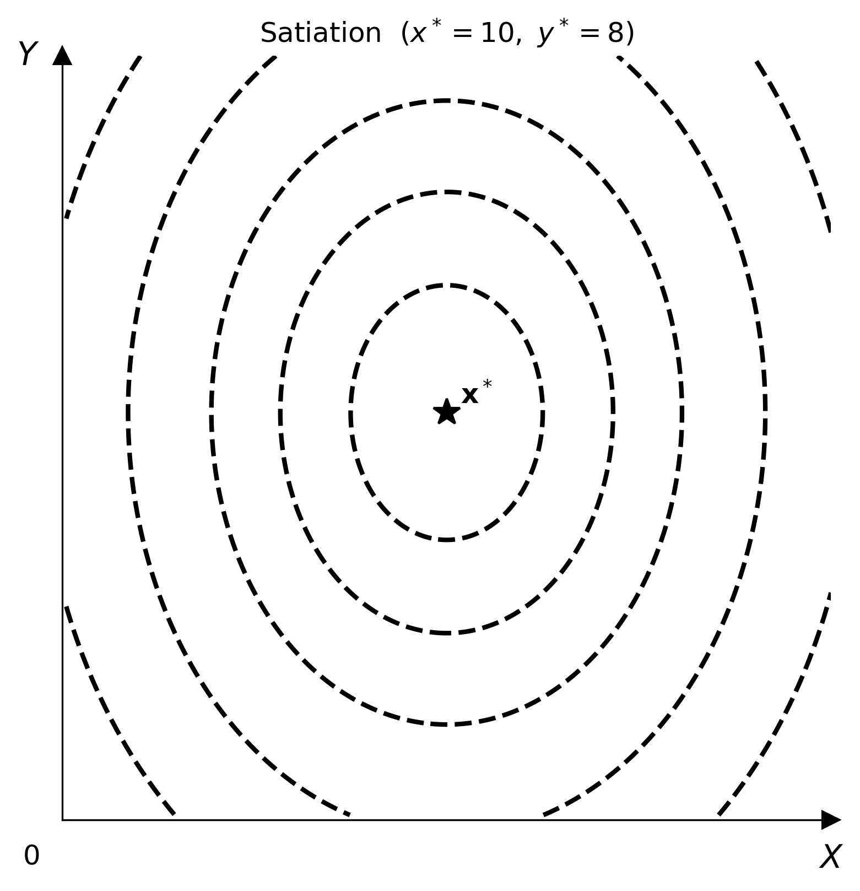

# Satiation (Bliss Point)

$$U(x, y) = -a(x - x^*)^2 - b(y - y^*)^2$$

Utility rises toward the bliss point $(x^*, y^*)$ and falls away in all directions. Indifference curves are closed ellipses centred on the bliss point. This violates the standard monotonicity axiom — a consumer can have "too much" of a good.



## Parameters

| Parameter | Type | Default | Description |
|-----------|------|---------|-------------|
| `bliss_x` | float | 5.0 | $x$-coordinate of the bliss point $x^*$ |
| `bliss_y` | float | 5.0 | $y$-coordinate of the bliss point $y^*$ |
| `a` | float | 1.0 | Curvature along the $x$-axis (must be positive) |
| `b` | float | 1.0 | Curvature along the $y$-axis (must be positive) |

## Optimisation

The consumer solves

$$\max_{x,\,y}\; -a(x-x^*)^2 - b(y-y^*)^2 \quad \text{subject to}\quad p_x x + p_y y = I$$

The Lagrangian is

$$\mathcal{L}(x, y, \lambda) = -a(x-x^*)^2 - b(y-y^*)^2 - \lambda\,(p_x x + p_y y - I)$$

First-order conditions:

$$\begin{aligned}
\frac{\partial \mathcal{L}}{\partial x} &= -2a(x - x^*) - \lambda p_x = 0 \\[6pt]
\frac{\partial \mathcal{L}}{\partial y} &= -2b(y - y^*) - \lambda p_y = 0 \\[6pt]
\frac{\partial \mathcal{L}}{\partial \lambda} &= p_x x + p_y y - I = 0
\end{aligned}$$

Dividing the first two conditions gives the tangency condition:

$$\frac{a(x - x^*)}{b(y - y^*)} = \frac{p_x}{p_y}$$

If the bliss point $(x^*, y^*)$ is interior to the budget set (i.e.\ $p_x x^* + p_y y^* \le I$), the unconstrained maximum is attained at the bliss point itself and the consumer does not spend all income.

!!! note
    `Satiation` is not compatible with `solve()` because the standard budget-tangency optimum may lie outside the bliss ellipse. Use `--no-budget --no-equilibrium` in the CLI, or omit `add_budget` / `add_equilibrium` in Python.

`add_utility()` draws a ★ marker at the bliss point by default (`show_bliss=True`). Pass `show_bliss=False` to hide it.

## Usage

=== "Python"

    ```python
    import numpy as np
    from econ_viz import Canvas, levels
    from econ_viz.models import Satiation

    model = Satiation(bliss_x=6.0, bliss_y=4.0)

    x_pts = np.linspace(0.1, 12, 300)
    y_pts = np.linspace(0.1, 10, 300)
    X, Y  = np.meshgrid(x_pts, y_pts)
    lvls  = levels.percentile(model(X, Y), n=5)

    Canvas(x_max=12, y_max=10, title="Satiation — bliss at $(6, 4)$") \
        .add_utility(model, levels=lvls, show_bliss=True) \
        .save("satiation.png")

    # Pass show_bliss=False to hide the marker
    Canvas(x_max=12, y_max=10) \
        .add_utility(model, levels=lvls, show_bliss=False) \
        .save("satiation_no_marker.png")
    ```

=== "CLI"

    ```bash
    econ-viz plot --model satiation --bliss-x 6 --bliss-y 4 \
                  --x-max 12 --y-max 10 \
                  --no-budget --no-equilibrium \
                  --output satiation.png
    ```
