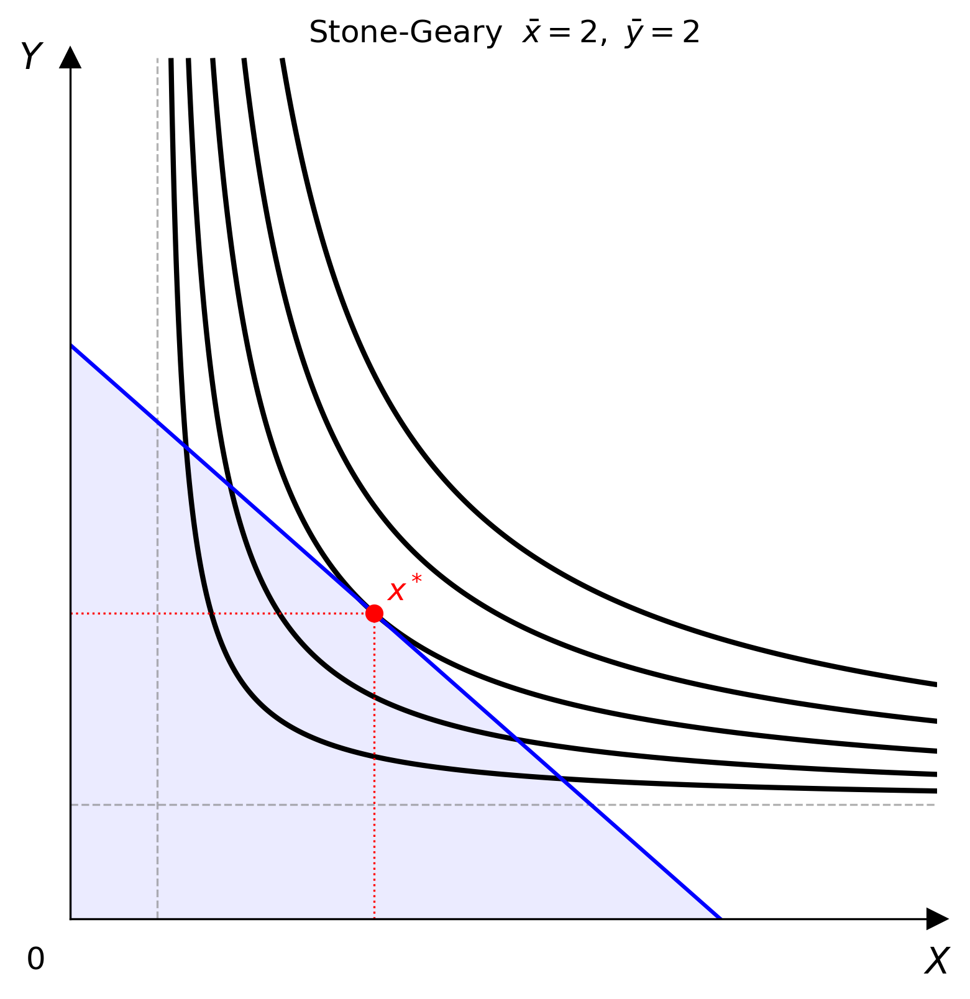

# Stone-Geary

$$U(x, y) = (x - \bar{x})^{\alpha}(y - \bar{y})^{\beta}$$

A generalisation of Cobb-Douglas that introduces **subsistence quantities** $\bar{x}$ and $\bar{y}$ — the minimum amounts of each good required before any utility is derived. The consumer first secures subsistence, then allocates the remaining *supernumerary* income like a Cobb-Douglas consumer.

Utility is defined only in the supernumerary region $x > \bar{x}$, $y > \bar{y}$. Indifference curves have the same shape as Cobb-Douglas but are shifted away from the origin by $(\bar{x}, \bar{y})$. Dashed reference lines at $x = \bar{x}$ and $y = \bar{y}$ are drawn automatically on the canvas.



## Parameters

| Parameter | Type | Default | Description |
|-----------|------|---------|-------------|
| `alpha` | float | 0.5 | Expenditure share on supernumerary $x$ (must be positive) |
| `beta` | float | 0.5 | Expenditure share on supernumerary $y$ (must be positive) |
| `bar_x` | float | 1.0 | Subsistence quantity of good $x$ (must be non-negative) |
| `bar_y` | float | 1.0 | Subsistence quantity of good $y$ (must be non-negative) |

## Optimisation

Let $m = I - p_x \bar{x} - p_y \bar{y}$ be the **supernumerary income** — the budget remaining after securing subsistence. The consumer solves

$$\max_{x,\,y}\; (x - \bar{x})^{\alpha}(y - \bar{y})^{\beta} \quad \text{subject to}\quad p_x x + p_y y = I$$

Substituting $\tilde{x} = x - \bar{x}$ and $\tilde{y} = y - \bar{y}$, the problem reduces to

$$\max_{\tilde{x},\,\tilde{y}}\; \tilde{x}^{\alpha}\tilde{y}^{\beta} \quad \text{subject to}\quad p_x \tilde{x} + p_y \tilde{y} = m$$

which is a standard Cobb-Douglas problem in the supernumerary quantities. The Marshallian demands are therefore

$$x^* = \bar{x} + \frac{\alpha}{\alpha + \beta}\cdot\frac{m}{p_x}, \qquad y^* = \bar{y} + \frac{\beta}{\alpha + \beta}\cdot\frac{m}{p_y}$$

A necessary condition for an interior solution is $m > 0$, i.e.

$$I > p_x \bar{x} + p_y \bar{y}$$

If this fails, `solve()` raises `InvalidParameterError`.

!!! note "Relationship to Cobb-Douglas"
    Setting $\bar{x} = \bar{y} = 0$ reduces Stone-Geary to Cobb-Douglas exactly.
    The expansion path for Stone-Geary does not pass through the origin — it is a ray from $(\bar{x}, \bar{y})$ — so no expansion-path ray is drawn on the canvas.

## Usage

=== "Python"

    ```python
    from econ_viz import Canvas, levels, solve
    from econ_viz.models import StoneGeary

    model = StoneGeary(alpha=0.5, beta=0.5, bar_x=2.0, bar_y=2.0)
    eq    = solve(model, px=2.0, py=3.0, income=30.0)
    lvls  = levels.around(eq.utility, n=5)

    # Subsistence lines (dashed) are drawn automatically
    Canvas(x_max=20, y_max=15, title=r"Stone-Geary  $\bar{x}=2,\ \bar{y}=2$") \
        .add_utility(model, levels=lvls) \
        .add_budget(2.0, 3.0, 30.0, fill=True) \
        .add_equilibrium(eq) \
        .save("stone_geary.png")
    ```

!!! note
    `StoneGeary` is not yet available via the CLI. Use the Python API directly.

## LaTeX parsing

Stone-Geary does not have a standard compact LaTeX form, so `parse_latex()` does not support it. Construct the model directly via the Python API.
