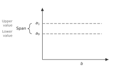
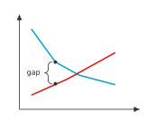
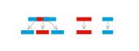

# Axis annotations

<span id="sec-annotations"></span>

The y axis is the plot's left edge and the x axis its bottom edge; the space
outside them is the _gutter_. Three layer types place text in the gutter, and
a fourth draws braces inside the plot.

## Marks, notes and braces

<!-- api: agora.mosaickit.guides_annotations_1 -->

A short symbol next to axis `"x"` or `"y"` at `value`, outside the plot,
such as $a_0$ or $p^*$.

<!-- api: agora.mosaickit.guides_annotations_2 -->

An explanation of `value`, possibly on several lines, in the outermost
gutter column. The `axes.note` role makes notes smaller and lighter than
marks in the default theme (9 pt, `grey-600`).

<!-- api: agora.mosaickit.guides_annotations_3 -->

A curly brace over `start`..`end` on an axis, with an optional label.
`side="outside"` draws it in the gutter, past the marks; `"inside"` draws
it just inside the plot and places its label so that it covers no line,
point, region or text, on a leader when nothing past the tip is free.

<!-- api: agora.mosaickit.guides_annotations_4 -->

A brace between two points inside the plot. The span must be horizontal
(`side` `"above"` or `"below"`) or vertical (`"left"` or `"right"`); the
brace bulges to `side`, 4 pt clear of the points and 8 pt deep, and its
label sits past the tip, placed so it covers nothing ([Region and point labels](labels.md#sec-labels)).

```python
from mosaickit import (
    AxisMarkLayer,
    AxisNoteLayer,
    BraceLayer,
    Canvas,
    quadrant_axes,
)

canvas = Canvas().extend(quadrant_axes(10, 10))
for value, symbol, note in [
    (7, "a_1", "Upper\nvalue"),
    (5, "a_0", "Lower\nvalue"),
]:
    canvas.add(AxisMarkLayer("y", value, symbol, math=True))
    canvas.add(AxisNoteLayer("y", value, note))
canvas.add(BraceLayer("y", 5, 7, "Span", side="outside"))
canvas.add(AxisMarkLayer("x", 6, "b", math=True))
```

<span id="fig-gutter"></span>

{ .ev-figure-sm }

<span id="fig-span"></span>

{ .ev-figure-sm }

## Gutter columns

Columns run outward from the axis line, starting 5 pt away and separated by
8 pt: marks, then one column per lane of outside braces, then notes. Each
column is as wide as its widest item. An empty column takes no space and adds
no gap ([Marks, notes and an outside brace in the y gutter (guide lines added).](annotations.md#fig-gutter)). The layout must also keep neighbouring texts within a
column from overlapping and decide which braces may share a lane.

## Spreading text along an axis

Each text in a column is an interval along the axis, centred on the value it
labels. When intervals overlap they are moved apart, keeping their order and
moving as little as possible in the least-squares sense.

<span id="def-packing"></span>

!!! abstract "Definition · Order-preserving packing"

    Let $c_1, \ldots, c_n$ be centres, $s_1, \ldots, s_n \ge 0$ sizes and $g \ge 0$
    a gap, numbered so that $c_1 \le \cdots \le c_n$ (ties in input order). A
    _packing_ is a vector $x \in \mathbb{R}^n$ with

    $$
    x_{k+1} - x_k \ge (s_k + s_{k+1}) / 2 + g, \quad k = 1, \ldots, n - 1,
    $$

    and the _order-preserving packing problem_ is to minimize
    $\sum_k (x_k - c_k)^2$ over all packings.

<!-- api: agora.mosaickit.guides_annotations_5 -->

Solves the problem by merging runs of overlapping items into clusters,
packing each cluster tightly around the mean of its members' targets, and
merging again while a cluster runs into the one before it. The result is
returned in input order. Mismatched lengths or a negative size raise
`ValueError`.

<span id="thm-spread"></span>

!!! abstract "Theorem · Spreading is optimal"

    `spread` returns the unique solution of the order-preserving packing
    problem of [Order-preserving packing](annotations.md#def-packing).

The procedure is the pool-adjacent-violators algorithm (PAVA) from isotonic
regression [Ayer (1955)](../project/references.md#ayer1955): subtracting the packed offsets turns the gap
constraints into $y_1 \le \cdots \le y_n$.

<span id="cor-spread"></span>

!!! abstract "Corollary · Properties of a spread"

    Let $x$ be the result of `spread`. Then
    (i) any two items $i \ne j$ satisfy $|x_i - x_j| \ge (s_i + s_j) / 2 + g$;
    (ii) if the centres already form a packing, $x = c$;
    (iii) within every cluster the displacements sum to zero, so the cluster's
    mean position equals its members' mean target.

<span id="fig-spread"></span>

{ .ev-figure-sm }

In [Targets (top) and their spread (bottom).](annotations.md#fig-spread) the first three items overlap and form one cluster centred at
their mean target. The other two are already clear and do not move.

## Lanes for braces

Braces whose spans (with their labels) come too close must go in different
lanes, that is, at different distances from the axis.

<span id="def-conflict"></span>

!!! abstract "Definition · Conflicting intervals"

    Intervals $[a, b]$ and $[a', b']$ _conflict_ for a gap $g \ge 0$ when
    neither $b + g \le a'$ nor $b' + g \le a$. A _lane assignment_ gives each
    interval a lane number so that no two conflicting intervals share a lane.

<!-- api: agora.mosaickit.guides_annotations_6 -->

First fit takes the intervals in input order and gives each the lowest
lane in which it conflicts with nothing already there. Endpoints may be
given in either order.

<span id="thm-lanes"></span>

!!! abstract "Theorem · First fit uses the fewest lanes"

    `assign_lanes` always returns a lane assignment. If the intervals are given
    in increasing order of their lower ends and each satisfies
    $b - a + g > 0$, it uses exactly $\omega$ lanes, where $\omega$ is the
    largest number of pairwise conflicting intervals; no lane assignment uses
    fewer.

In other orders first fit can use more lanes than necessary, so add braces
along an axis from low to high values when they may overlap.

<!-- api: agora.mosaickit.guides_annotations_7 -->

The pure column layout behind the gutter: returns `GutterColumns` with
`marks`, `braces` (one `Band` per lane, innermost first) and `notes`, each
a `Band(near, far)` measured outward from the axis, and `extent`, the
farthest edge.
