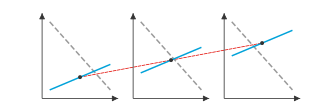

# Parameters, grids and animation

<span id="sec-parameters"></span>

## Parameters and expressions

A layer coordinate may be an expression in named parameters instead of a
number. The resulting scene describes a family of diagrams, one for each
set of parameter values. Binding selects one diagram from that family.

<!-- api: agora.mosaickit.guides_parameters_1 -->

A named placeholder. With `value_type` set, a bound value must be an
instance of it; every bound value must be hashable. `values(seq)` returns
`ParameterValues`, checking each value at once.

<!-- api: agora.mosaickit.guides_parameters_2 -->

Immutable expression trees. Parameters and constants combine with `+`,
`-`, `*`, `/`, `**`, unary `-` and the comparisons `<`, `<=`, `>`, `>=`,
and `equals()`; plain numbers are wrapped as constants. Expression
equality is structural: `==` compares trees, while `equals()` builds a
comparison expression. Using an expression as a truth value raises
`BindingError`; evaluate it first. `evaluate(bindings)` computes the value
from a mapping of parameters to values, and `free_parameters()` returns
the set of parameters in the tree.

<span id="def-binding"></span>

!!! abstract "Definition · Expressions and binding"

    An _expression_ is a constant, a parameter, or $e_1 \circ e_2$ for
    expressions $e_1, e_2$ and an operation $\circ$. Its free parameters
    are $\text{free}(c) = \emptyset$, $\text{free}(p) = \lbrace p\rbrace$ and
    $\text{free}(e_1 \circ e_2) = \text{free}(e_1) \cup \text{free}(e_2)$. A
    _binding_ $\beta$ is a finite map from parameters to values, and
    $\text{bind}(e, \beta)$ is: the value $e(\beta)$ if
    $\text{free}(e) \subseteq \text{dom} \beta$; otherwise $e$ itself if $e$ is a
    parameter; otherwise $\text{bind}(e_1, \beta) \circ \text{bind}(e_2, \beta)$.
    A plain value $v$ has no free parameters and evaluates to itself.

<span id="thm-binding"></span>

!!! abstract "Theorem · Partial binding"

    For every expression $e$ and binding $\beta$,
    (i) $\text{free}(\text{bind}(e, \beta)) = \text{free}(e) \setminus \text{dom} \beta$, and
    (ii) for every binding $\gamma$ with $\text{dom} \gamma \cap \text{dom} \beta = \emptyset$
    and $\text{dom} \gamma \supseteq \text{free}(e) \setminus \text{dom} \beta$,
    $\text{bind}(e, \beta)(\gamma) = e(\beta \cup \gamma)$.

<span id="cor-stages"></span>

!!! abstract "Corollary · Binding in stages"

    For bindings $\beta_1, \beta_2$ with disjoint domains, $\text{bind}(\text{bind}(e, \beta_1), \beta_2)$ and $\text{bind}(e, \beta_1 \cup \beta_2)$ have the same free
    parameters and the same value under every binding of them. In particular
    `canvas.bind(p, 1).bind(q, 2)` draws the same diagram as
    `canvas.bind({p: 1, q: 2})`.

`bind` walks through tuples, mappings and every `mosaickit` dataclass, so a
whole scene is bound at once; a layer's `model` is left alone. Rendering a
scene that still has free parameters raises `BindingError` naming them.

```python
from mosaickit import Canvas, Parameter, TextLayer

x = Parameter("x", value_type=float)
template = Canvas().add(TextLayer((x, 2 * x + 1), "moving"))
frame = template.bind(x, 3.0)
# (3.0, 7.0)
print(frame.snapshot().layers[0].position)
```

## Grids

<!-- api: agora.mosaickit.guides_parameters_3 -->

Places several canvases in one figure. `cells` is either a flat list of
canvases, `Span`s and `None`s (empty cells), filled row by row, or a list of rows,
where row spans are allowed and every row must account for every column.
`shape=(rows, cols)` is the same as passing both. Each canvas is copied,
so changing it afterwards does not change the grid. Overlapping spans,
spans past the edge, too many cells or mixed flat and nested cells raise
`ConfigurationError`. `render()` and `save()` work as on a canvas.

<span id="prop-grid-shape"></span>

!!! abstract "Proposition · Inferred grid shape"

    For a flat list of $n \ge 1$ plain cells with neither `rows` nor `cols`
    given, the grid has $c = \left\lceil \sqrt\lbrace n\rbrace \right\rceil$ columns and $r = \left\lceil n / c \right\rceil$
    rows. Then $r c \ge n$, $r \le c$, and fewer than $c$ cells are left empty,
    all in the last row.

With only `cols` given, $r = \left\lceil n / c \right\rceil$; with only `rows`,
$c = \left\lceil n / r \right\rceil$.

<!-- api: agora.mosaickit.guides_parameters_4 -->

Common arrangements: `SINGLE`, `STACKED` (two rows), `SIDE_BY_SIDE`,
`GRID_2X2`, `GRID_3X3`, and the three-canvas `TOP_TWO_BOTTOM_ONE` and
`TOP_ONE_BOTTOM_TWO`, whose single canvas spans both columns.

<!-- api: agora.mosaickit.guides_parameters_5 -->

Creates one cell for each value in the supplied `ParameterValues`, with the
template bound to that value.

<!-- api: agora.mosaickit.guides_parameters_6 -->

A straight line from `start` in one cell to `end` in another, each in its
own cell's data coordinates, drawn over the figure across the gaps between
cells. Cells are numbered in placement order. Its style is `role`
resolved in the start cell's theme, with `stroke` on top. A cell index out
of range raises `ConfigurationError` when the grid is built.

```python
from mosaickit import (
    Canvas,
    CanvasGrid,
    GridLink,
    MarkerLayer,
    Parameter,
    Stroke,
)

shift = Parameter("shift", value_type=float)
template = Canvas().add(MarkerLayer([(5, 2.5 + shift)]))
cells = [template.bind(shift, v) for v in (0.0, 2.0, 4.0)]
link = GridLink(
    0, (5, 2.5), 2, (5, 6.5), stroke=Stroke(dash="dashed")
)
CanvasGrid(cells, cols=3, links=[link]).save("sweep.pdf")
```

<span id="fig-sweep"></span>

{ .ev-figure-sm }

## Animation

<!-- api: agora.mosaickit.guides_parameters_7 -->

Creates one frame per value by binding the parameter in the template.
`frames()` yields the frames as renderer-neutral scenes; `save(path)`
writes a GIF (through Pillow) or an MP4 (through `ffmpeg`). The values are checked
against the parameter when the animation is created; an empty list or a
non-positive `fps` raises `ConfigurationError`.

```python
from mosaickit import Animation

values = shift.values([0.0, 1.0, 2.0, 3.0])
Animation.sweep(template, values, fps=4).save("sweep.gif")
```
