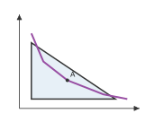

# Quick start

<span id="sec-quickstart"></span>

A diagram needs a canvas, its layers and a call to save it:

```python
from mosaickit import (
    Canvas,
    Fill,
    FillLayer,
    MarkerLayer,
    PathLayer,
    Stroke,
    TextLayer,
    quadrant_axes,
)

canvas = Canvas().extend(quadrant_axes(10, 10))
canvas.add(
    FillLayer(
        [(1, 1), (1, 7), (8, 1)],
        fill=Fill(color="#377EB8", opacity=0.12),
        z_index=-1,
    )
)
canvas.add(
    PathLayer(
        [(1, 8), (2, 5), (4, 3), (7, 1.5), (9, 1)],
        stroke=Stroke(color="#984EA3", width=2),
        id="curve",
    )
)
canvas.add(MarkerLayer([(4, 3)], id="point"))
canvas.add(TextLayer((4, 3), "A", offset=(6, 6)))
canvas.save("diagram.pdf")
```

<span id="fig-quickstart"></span>

{ .ev-figure-sm }

`quadrant_axes(10, 10)` returns ordinary layers: two arrowed paths and their
titles. The fill sits below everything else because `z_index=-1`. The path is
the straight polyline through its points. `mosaickit` constructs no
curves of its own, so a smooth curve must be supplied as a sequence of points
or built and sampled by a geometry package. The text is offset 6 pt up and to the right
of the point. Nothing is drawn until `save()`. That method renders the scene
with the canvas's renderer (Matplotlib unless configured otherwise), writes
the file and returns the paths it wrote.

The same canvas can be changed and saved again. `add()`, `extend()`,
`remove()` and `clear()` return the canvas, so calls can be chained, while
every earlier snapshot remains unchanged ([Canvases and scenes](guides/canvas.md#sec-canvas)). Labels that must not
cover anything are also layers: replace the `TextLayer` with
`PointLabelLayer((4, 3), "A")` and the renderer chooses the side
([Region and point labels](guides/labels.md#sec-labels)).
