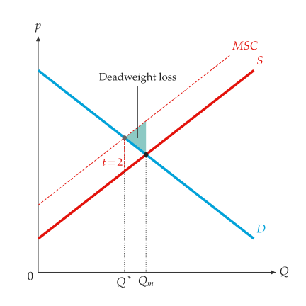
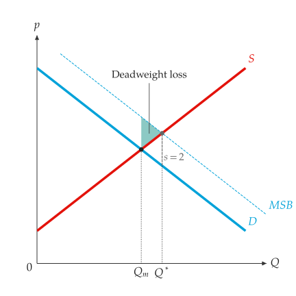
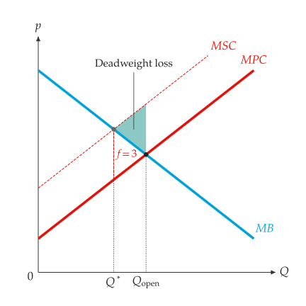
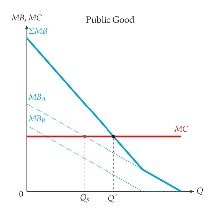

# Market failures

<span id="sec-failures"></span>

## Externalities

When production imposes a cost on third parties, or consumption confers a
benefit on them, the market quantity differs from the social optimum. A
Pigouvian tax or subsidy equal to the external effect at the optimum
restores the optimal quantity [Pigou (1920)](../project/references.md#pigou1920).

<!-- api: agora.principle_viz.guides_failures_1 -->

A constant marginal external cost, which adds to supply to give the
marginal social cost, and/or a marginal external benefit, which adds to
demand to give the marginal social benefit. Both must be non-negative.

<!-- api: agora.principle_viz.guides_failures_2 -->

The private and social outcomes: `private_equilibrium`,
`social_equilibrium`, `social_demand`, `social_supply`, `corrective_tax`,
`corrective_subsidy`, `quantity_distortion` and `deadweight_loss`.

```python
from principle_viz import (
    ExternalityScenario,
    analyze_externality,
)

demand = line_from_inverse(12.0, -1.0)
scenario = ExternalityScenario(marginal_external_cost=2)
result = analyze_externality(demand, supply, scenario)
print(
    result.private_equilibrium.q_star,
    result.social_equilibrium.q_star,
)
# 5.0 4.0
print(result.corrective_tax, result.deadweight_loss)
# 2.0 1.0
```

<!-- api: agora.principle_viz.guides_failures_3 -->

Draw the social curve, mark $Q_m$ (market) and $Q^*$ (optimum) on the
quantity axis, label the corrective tax $t$ or subsidy $s$ across the gap
at $Q^*$, and shade the deadweight loss (see [A negative externality.](failures.md#fig-neg-externality) and
[A positive externality.](failures.md#fig-pos-externality)).

<span id="fig-neg-externality"></span>

{ .ev-figure-sm }

<span id="fig-pos-externality"></span>

{ .ev-figure-sm }

## Common resources

<!-- api: agora.principle_viz.guides_failures_4 -->

Treat congestion or depletion as a marginal external cost: open access
uses the resource until marginal benefit equals private cost, beyond the
efficient level [Hardin (1968)](../project/references.md#hardin1968). The result has
`open_access_equilibrium`, `efficient_equilibrium`, `social_cost`,
`overuse`, `corrective_fee` and `deadweight_loss`.

With $M B = 12 - Q$, $M P C = 2 + Q$ and a congestion cost of 3, open access
uses 5 units, the efficient level is 3.5 and `corrective_fee` is 3.

<!-- api: agora.principle_viz.guides_failures_5 -->

Draw the social cost, mark $Q^*$ and $Q_\text{open}$, and shade the
deadweight loss. Name the curves $M B$ and $M P C$ in `add_curves()`. See
[Overuse of a common resource.](failures.md#fig-common-resource).

<span id="fig-common-resource"></span>

{ .ev-figure-sm }

## Public goods

<!-- api: agora.principle_viz.guides_failures_6 -->

Everyone consumes the whole quantity of a public good, so marginal
benefits add vertically. The efficient quantity sets their sum equal to
marginal cost [Samuelson (1954)](../project/references.md#samuelson1954); private provision stops where the
highest individual benefit meets marginal cost. The result has
`efficient_quantity`, `efficient_marginal_value`,
`private_provision_quantity`, `free_rider_gap` and the sampled `points`.

```python
from principle_viz import IndividualBenefit, analyze_public_good

result = analyze_public_good(
    (
        IndividualBenefit("$MB_A$", line_from_inverse(8, -1)),
        IndividualBenefit("$MB_B$", line_from_inverse(6, -1)),
    ),
    # constant marginal cost of 5
    line_from_inverse(5, 0),
)
print(
    result.efficient_quantity, result.private_provision_quantity
)
# 4.5 3.0
```

<!-- api: agora.principle_viz.guides_failures_7 -->

A `mosaickit` canvas, in `principle_viz.visuals.market_failures`,
with each marginal benefit, their vertical sum, marginal cost, and $Q_p$
and $Q^*$ on the quantity axis (see [The vertical sum of marginal benefits.](failures.md#fig-public-good)).

<span id="fig-public-good"></span>

{ .ev-figure-sm }
