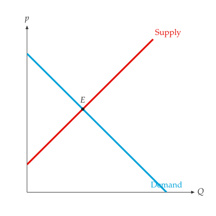

# Figures

<span id="sec-figures"></span>

Every figure in this manual is a `MarketFigure`, or a `mosaickit`
canvas built by a function such as `ppf_canvas()`. Both have a square plot
area and arrowed axes with no ticks or grid. Curves are named at their ends,
areas inside them and values on the axes, and no text covers a line, a
point, an area or other text.

## MarketFigure

<!-- api: agora.principle_viz.guides_figures_1 -->

A market diagram on a `mosaickit` canvas, with axes from 0 to
`x_max` and `y_max`. Axis titles are LaTeX math unless they are words; an
empty `title` draws none.

<!-- api: agora.principle_viz.guides_figures_2 -->

Draw demand and supply from $Q = 0$ to `q_max`, each named at its end, and
mark an equilibrium with a filled point and its label.

Each topic adds its own methods, described in its chapter (see
[Topic methods of `MarketFigure`](figures.md#tab-figure-methods)).

<span id="tab-figure-methods"></span>

| Method | Section |
| --- | --- |
| `add_comparative_statics` | [Comparative statics](markets.md#sec-shifts) |
| `add_discrete_curves`, `add_discrete_equilibrium` | [Discrete markets](discrete.md#sec-discrete) |
| `add_welfare`, `add_welfare_transition` | [Welfare](welfare.md#sec-welfare) |
| `add_tax_transform`, `add_tax_comparison`, `add_subsidy_comparison` | [Taxes and subsidies](taxes.md#sec-taxes) |
| `add_price_control` | [Price controls](controls.md#sec-controls) |
| `add_trade` | [International trade](trade.md#sec-trade) |
| `add_externality`, `add_common_resource` | [Market failures](failures.md#sec-failures) |
| `add_minimum_wage`, `add_loanable_funds` | [Labor and loanable funds](factor-markets.md#sec-factor) |

<!-- api: agora.principle_viz.guides_figures_3 -->

`finalize()` hides guide lines that would cut a shaded welfare region in
two (the value stays marked on its axis) and, only with `legend=True`,
adds a legend. `save()` writes PNG, SVG or PDF according to the extension
and creates missing directories. `close()` is a no-op kept for
compatibility.

<!-- api: agora.principle_viz.guides_figures_4 -->

Add any `mosaickit` layer, for annotations the topic methods do not
provide. An axis mark replaces an earlier mark at the same value. The
finished scene is available as `fig.scene`.

<!-- api: agora.principle_viz.guides_figures_5 -->

A text box of name--value pairs, for notebooks and debugging. Teaching
figures leave it out: the numbers belong in the text.

## Labels and layers

<span id="sec-labels"></span>

Every line, point, area and piece of text in a figure is a layer with a
stable id, such as `market.demand`, `market.demand.label` or
`market.welfare.dwl`. The ids follow the structure of the figure:
`axes.*` for the axes, `market.<part>` for each element, and a `.label`
suffix for the text that names it. `fig.layer_ids` lists every layer;
`fig.label_ids` lists the configurable text (labels, axis marks and
braces).

<!-- api: agora.principle_viz.guides_figures_6 -->

An override for one built-in label. Fields left as `None` keep the
package's default. An `offset` in points opts the label out of automatic
placement and moves it by exactly that much.

<!-- api: agora.principle_viz.guides_figures_7 -->

Rename, hide or move one label (the id may omit its final `.label`), or
show or hide any layer. `hide(*ids)` and `show(*ids)` toggle several at
once. Each returns the figure.

The same overrides can be passed when the figure is created, as `labels=`
and `visibility=` mappings; they then apply to layers added later as well.
Aggregation figures and the canvas functions (`ppf_canvas()`,
`public_good_canvas()`, ...) accept the same two arguments. See
[Renamed curves and equilibrium point.](figures.md#fig-labels):

```python
from principle_viz import Label, MarketFigure

fig = MarketFigure(
    x_max=12,
    y_max=12,
    labels={
        "market.demand.label": Label(text="Demand"),
        "market.supply.label": Label(text="Supply"),
    },
)
fig.add_curves(demand, supply, q_max=10)
fig.add_equilibrium(eq)
fig.configure_label("market.equilibrium", text="$E$")
fig.hide("axes.origin.label")
fig.finalize()
```

<span id="fig-labels"></span>

{ .ev-figure-sm }

## Palettes and themes

<span id="sec-palettes"></span>

A `ColorModel` assigns a colour to each economic role; a `PlotTheme` adds line
widths and axis options and compiles both into a `mosaickit` theme.
[Built-in colour models](figures.md#tab-palettes) lists the four built-in colour models.

<!-- api: agora.principle_viz.guides_figures_8 -->

Named colour roles: `axis_color`, `label_color`, `demand_color`,
`supply_color`, `baseline_color`, `shifted_color`, `tax_color`,
`control_color`, `cs_color`, `ps_color`, `tax_revenue_color`, `dwl_color`
and `arrow_color`. Each is `"#hex"` or a `mosaickit` palette name
such as `"blue"`.

<span id="tab-palettes"></span>

| Name | Character |
| --- | --- |
| `default` | `mosaickit` hues: demand blue, supply red, deadweight loss teal; surpluses in the curve hues at 15% opacity |
| `colorblind` | A colour-blind-friendly qualitative palette |
| `nord` | The Nord palette |
| `monochrome` | Black, white and greys, for print |

`list_color_models()` returns the names and `get_color_model(name)` the
model; the four are also exported as `DEFAULT_COLOR_MODEL`,
`COLORBLIND_COLOR_MODEL`, `NORD_COLOR_MODEL` and `MONOCHROME_COLOR_MODEL`.

<!-- api: agora.principle_viz.guides_figures_9 -->

A colour model with line widths (`demand_linewidth`,
`supply_linewidth`, `shifted_linewidth`, `tax_linewidth`,
`arrow_linewidth`, `dashed_linewidth`), `equilibrium_marker_size`, and
the switches `show_grid`, `show_ticks`, `show_axis_arrows` and
`show_origin_label`. `from_palette()` starts from a built-in colour model
and sets any of these fields.

The `palette` argument selects a colour model (see [The `monochrome` palette.](figures.md#fig-monochrome)):

```python
fig = MarketFigure(x_max=12, y_max=12, palette="monochrome")
```

<span id="fig-monochrome"></span>

{ .ev-figure-sm }

## Canvases

<!-- api: agora.principle_viz.guides_figures_10 -->

The `mosaickit` `Canvas` with the same `labels=`, `visibility=`,
`configure_label()`, `configure_layer()`, `hide()`, `show()`,
`layer_ids` and `label_ids` as `MarketFigure`. The canvas functions of
the PPF, public-good and revenue chapters return it; save it with
`save()`, or combine several with `mosaickit.CanvasGrid`.
