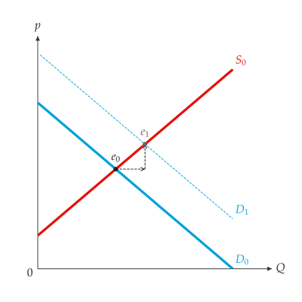
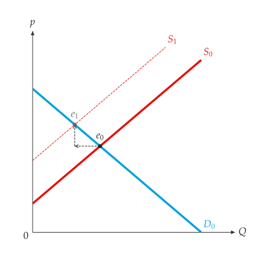

# Linear markets

<span id="sec-markets"></span>

## Lines

A demand or supply curve is a straight line in inverse form:

$$
p = a + b Q
$$

where $a$ is the price intercept and $b$ the slope ($b < 0$ for demand,
$b > 0$ for supply). Price is always on the vertical axis and quantity on the
horizontal one, following [Marshall (1890)](../project/references.md#marshall1890). Discrete unit schedules
([Discrete markets](discrete.md#sec-discrete)) and market curves summed from individual curves
([Market curves from individuals](aggregation.md#sec-aggregation)) are not single straight lines.

<!-- api: agora.principle_viz.guides_markets_1 -->

A straight line in the price--quantity plane, stored as
$A p + B Q + C = 0$ so that horizontal and vertical lines are allowed.
`from_inverse(a, b)` builds $p = a + b Q$; `from_standard(A, B, C)` builds
$A p + B Q + C = 0$. The package root also exports the two constructors as
`line_from_inverse()` and `line_from_standard()`.

```python
from principle_viz import line_from_inverse, line_from_standard

demand = line_from_inverse(10.0, -1.0)
# 6.0 7.0
print(demand.q_at(4), demand.p_at(3))
# 10.0 10.0
print(demand.p_intercept(), demand.q_intercept())
# (10.0, -1.0)
print(line_from_standard(1, 1, -10).to_inverse())
```

$(A, B, C) = (1, 1, -10)$ is equivalent to $p = 10 - Q$.

A horizontal line has no $Q(p)$ and a vertical line has no $p(Q)$; the
corresponding methods raise `NonInvertibleLineError`.

## Equilibrium

<!-- api: agora.principle_viz.guides_markets_2 -->

The intersection of two lines, returned as an `EquilibriumResult`
([Quick start](../quickstart.md#sec-quickstart)). Parallel lines raise `ParallelLinesError`, identical
lines `CoincidentLinesError`.

```python
from principle_viz import solve_equilibrium

eq = solve_equilibrium(demand, line_from_inverse(2.0, 1.0))
print(eq)
# EquilibriumResult(q_star=4.0, p_star=6.0,
#                   is_valid_market=True, notes=())
```

$10 - Q = 2 + Q$ gives an equilibrium quantity of 4 and an equilibrium price
of 6; `is_valid_market` is `True` and `notes` is empty.

## Comparative statics

<span id="sec-shifts"></span>

<!-- api: agora.principle_viz.guides_markets_3 -->

A shift of one curve in inverse form: `delta_intercept` moves it up
($> 0$) or down, `delta_slope` rotates it. A scenario shifts demand,
supply or both. Both live in `principle_viz.core.shifts`.

An increase in demand raises the demand intercept; an increase in supply
lowers the supply intercept, since sellers accept a lower price at every
quantity.

<!-- api: agora.principle_viz.guides_markets_4 -->

Solve the market before and after the shift. The result has these fields:

```python
from principle_viz import comparative_statics
from principle_viz.core.shifts import ShiftScenario, ShiftSpec

up = ShiftScenario(demand_shift=ShiftSpec(delta_intercept=3.0))
result = comparative_statics(demand, supply, up)
new = result.shifted_equilibrium
# 5.5 7.5
print(new.q_star, new.p_star)
# right up
print(result.direction_q, result.direction_p)
```

<!-- api: agora.principle_viz.guides_markets_5 -->

Draw the curve that moved, both equilibria and dashed arrows from the old
equilibrium to the new one. Name the original curves $D_0$ and $S_0$ in
`add_curves()`. An increase in demand is shown in [An increase in demand.](markets.md#fig-shifts) and a
decrease in supply in [A decrease in supply.](markets.md#fig-shift-supply).

```python
fig = MarketFigure(
    x_max=12, y_max=14, title="Increase in Demand"
)
fig.add_curves(
    demand,
    supply,
    q_max=10,
    demand_label="$D_0$",
    supply_label="$S_0$",
)
fig.add_comparative_statics(result, q_max=10)
fig.finalize()
```

<span id="fig-shifts"></span>

{ .ev-figure-sm }

<span id="fig-shift-supply"></span>

{ .ev-figure-sm }

## Errors

<span id="sec-errors"></span>

Every exception the package raises derives from `PrincipleVizError`, in
`principle_viz.exceptions`; catching it handles all of them.
`PrincipleEconError`, the name before 0.10.0, is the same class. [Exceptions](markets.md#tab-errors)
lists when each exception is raised.

<span id="tab-errors"></span>

| Exception | Raised when |
| --- | --- |
| `LineError` | A line cannot be built or transformed |
| `NonInvertibleLineError` | A horizontal line is asked for $Q(p)$, or a vertical one for $p(Q)$ |
| `ParallelLinesError` | Demand and supply never meet |
| `CoincidentLinesError` | Demand and supply are the same line |
| `PolicyError` | A tax, subsidy, control or trade scenario is invalid |
| `DiscreteMarketError` | A discrete schedule is invalid ([Discrete markets](discrete.md#sec-discrete)) |
| `AggregationError`, `PiecewiseLinearError` | Individual curves cannot be summed, or a price is outside a piecewise curve ([Market curves from individuals](aggregation.md#sec-aggregation)) |
| `PPFError` | A production possibilities frontier is invalid ([Production possibilities](ppf.md#sec-ppf)) |
