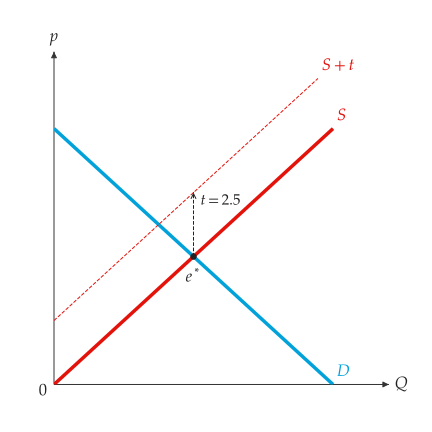
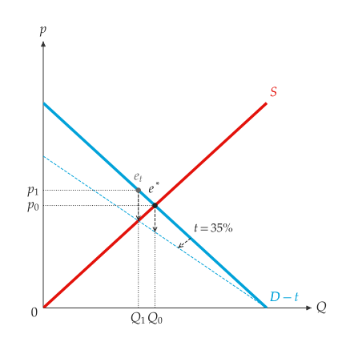
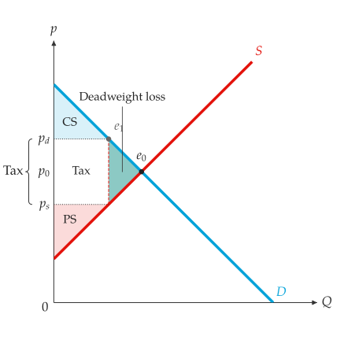
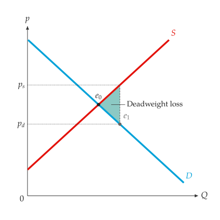

# Taxes and subsidies

<span id="sec-taxes"></span>

A tax drives a wedge between the price buyers pay and the price sellers
receive. The wedge, the quantity and both prices are the same whether the
tax is charged to buyers or to sellers [Mankiw (2021)](../project/references.md#mankiw2021).

## Scenarios

<!-- api: agora.principle_viz.guides_taxes_1 -->

One tax, from `principle_viz.policy.tax`.

## Solving

<!-- api: agora.principle_viz.guides_taxes_2 -->

The taxed market, as a `TaxEquilibriumResult`: `q_star`,
`consumer_price`, `producer_price`, `tax_wedge` (their difference) and
`tax_revenue` (wedge times quantity).

```python
from principle_viz import solve_tax_equilibrium
from principle_viz.policy.tax import TaxOn, TaxScenario, TaxType

tax = TaxScenario(TaxType.PER_UNIT_TAX, 3.0, TaxOn.PRODUCER)
print(solve_tax_equilibrium(demand, supply, tax))
# TaxEquilibriumResult(q_star=2.5, consumer_price=7.5,
#                      producer_price=4.5, tax_wedge=3.0,
#                      tax_revenue=7.5)
```

`TaxOn.CONSUMER` gives the same result. An ad valorem tax at rate $r$ sets
the consumer price to $(1 + r)$ times the producer price.

<!-- api: agora.principle_viz.guides_taxes_3 -->

The untaxed and taxed markets side by side: `baseline_equilibrium`,
`post_tax`, the changes `delta_q`, `delta_p_consumer`, `delta_p_producer`,
and their directions (`"left"`/`"right"`, `"up"`/`"down"`).

<!-- api: agora.principle_viz.guides_taxes_4 -->

The geometry of the taxed curve: `base_curve`, `taxed_curve`,
`curve_role` (`"supply"` or `"demand"`) and `transform_kind` (`"shift"`
or `"rotation"`). `add_tax_transform()` draws from it.

## Figures

<!-- api: agora.principle_viz.guides_taxes_5 -->

Draw the taxed curve, named $S + t$ or $D - t$, with a dashed arrow for
the shift or the rotation and the untaxed equilibrium (see
[A per-unit tax on sellers.](taxes.md#fig-tax-producer) and [An ad valorem tax on buyers.](taxes.md#fig-tax-consumer)).

<span id="fig-tax-producer"></span>

{ .ev-figure-sm }

<span id="fig-tax-consumer"></span>

{ .ev-figure-sm }

<!-- api: agora.principle_viz.guides_taxes_6 -->

Mark the wedge of a `compare_tax_scenario()` result: $p_d$ (buyers),
$p_0$ (before the tax) and $p_s$ (sellers) on the price axis, with a "Tax"
brace over $p_s$ to $p_d$.

It combines with the welfare regions of [Welfare](welfare.md#sec-welfare) (see
[Surplus and deadweight loss under a tax.](taxes.md#fig-tax-welfare)):

```python
from principle_viz import compare_tax_scenario
from principle_viz.welfare.surplus import (
    compare_surplus,
    outcome_from_equilibrium,
    outcome_from_tax,
)

eq = solve_equilibrium(demand, supply)
baseline = outcome_from_equilibrium(eq)
taxed = outcome_from_tax(
    solve_tax_equilibrium(demand, supply, tax)
)
delta = compare_surplus(demand, supply, baseline, taxed)
# 7.5 2.25
print(delta.policy.tax_revenue, delta.deadweight_loss)

fig = MarketFigure(
    x_max=12, y_max=12, title="Welfare Under a Tax"
)
fig.add_curves(demand, supply, q_max=10)
fig.add_welfare(delta.policy)
fig.add_tax_comparison(
    compare_tax_scenario(demand, supply, tax)
)
fig.finalize()
```

<span id="fig-tax-welfare"></span>

{ .ev-figure-sm }

## Subsidies

<!-- api: agora.principle_viz.guides_taxes_7 -->

A per-unit subsidy of `amount` (non-negative), paid to sellers
(`SubsidyTo.PRODUCER`) or buyers (`SubsidyTo.CONSUMER`), from
`principle_viz.policy.subsidy`.

<!-- api: agora.principle_viz.guides_taxes_8 -->

The subsidised market (`q_star`, `consumer_price`, `producer_price`,
`subsidy_wedge`, `government_expenditure`), and its comparison with the
free market (`baseline_equilibrium`, `post_subsidy`, `delta_q`,
`delta_p_consumer`, `delta_p_producer`). A subsidy of 2 in the market of
[Quick start](../quickstart.md#sec-quickstart) gives a quantity of 5; buyers pay 5, sellers receive 7 and
government expenditure is 10.

<!-- api: agora.principle_viz.guides_taxes_9 -->

Mark the subsidy wedge like the tax wedge, with a "Subsidy" brace, and
name the subsidy's cost. [A per-unit subsidy and its deadweight loss.](taxes.md#fig-subsidy) shades only the deadweight loss
(`regions=("dwl",)`) and hides some labels with `visibility`
([Labels and layers](figures.md#sec-labels)).

```python
from principle_viz import (
    SubsidyScenario,
    SubsidyTo,
    compare_subsidy_scenario,
)

demand = line_from_inverse(12.0, -1.0)
subsidy = SubsidyScenario(3.0, SubsidyTo.PRODUCER)
comparison = compare_subsidy_scenario(demand, supply, subsidy)
fig = MarketFigure(
    x_max=12,
    y_max=13,
    title="Per-Unit Subsidy",
    visibility={
        "market.subsidy.expenditure.label": False,
        "market.subsidy.wedge.label": False,
        "market.subsidy.wedge.mark.p_0": False,
        "market.subsidy.wedge.brace": False,
    },
)
```

<span id="fig-subsidy"></span>

{ .ev-figure-sm }
