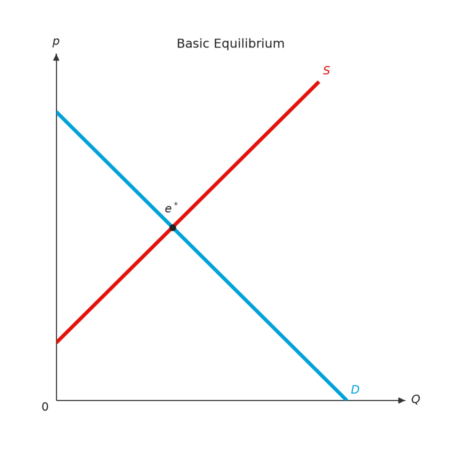

# principle-viz

`principle-viz` is a Python package for Principles of Economics market analysis and diagrams. It focuses on
**linear demand and supply** models, with separate modules for solving, policy, welfare decomposition and plotting.

{ width="360" }

| | |
|---|---|
| Documented version | 0.10.0 |
| Python | 3.10 or later |
| Depends on | [mosaickit](../mosaickit/index.md) (`>=0.5.1,<0.6.0`) |
| Command line | `principle-viz` |
| Source | [github.com/EconViz/principle-viz](https://github.com/EconViz/principle-viz) |
| License | MIT |

## What it covers

- Market equilibrium from linear demand and supply, or from discrete unit schedules
- Comparative statics: shifts of demand or supply, and the move from the old equilibrium to the new one
- Taxes (fixed, per-unit, ad valorem, on buyers or sellers) and subsidies
- Price ceilings, price floors and the minimum wage
- Welfare decomposition: consumer and producer surplus, tax revenue, deadweight loss
- International trade (free trade, tariffs, quotas), externalities, common resources, public goods, loanable funds,
  the production possibilities frontier and elasticity
- Market demand and supply as the horizontal sum of individual curves or schedules
- Textbook-style figures built on [mosaickit](../mosaickit/index.md)
- A command line interface with JSON output

## Next steps

-   :material-download: **Installation**

    Install the package with pip or uv.

    [:octicons-arrow-right-24: Installation](installation.md)

-   :material-rocket-launch-outline: **Quick start**

    Solve a market, compare a tax, and draw a figure.

    [:octicons-arrow-right-24: Quick start](quickstart.md)

