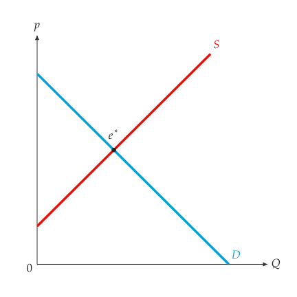

# Quick start

<span id="sec-quickstart"></span>

## A minimal example

This chapter uses one market, which later chapters reuse:

$$
\begin{aligned}\text{demand:} & \quad p = 10 - Q, \\ \text{supply:} & \quad p = 2 + Q.\end{aligned}
$$

```python
from principle_viz import (
    MarketFigure,
    line_from_inverse,
    solve_equilibrium,
)

# p = 10 - Q
demand = line_from_inverse(10.0, -1.0)
# p = 2 + Q
supply = line_from_inverse(2.0, 1.0)
eq = solve_equilibrium(demand, supply)
# 4.0 6.0
print(eq.q_star, eq.p_star)

fig = MarketFigure(
    x_max=12, y_max=12, title="Basic Equilibrium"
)
fig.add_curves(demand, supply, q_max=10)
fig.add_equilibrium(eq)
fig.finalize()
fig.save("basic_equilibrium.png")
```

<span id="fig-quickstart"></span>

{ .ev-figure-sm }

$10 - Q = 2 + Q$ gives $Q^* = 4$ and $p^* = 6$. The output is shown in
[The market of this chapter (title omitted).](quickstart.md#fig-quickstart).

## Step by step

Every figure goes through four steps: describe the market, solve, draw, and
finish and save.

<!-- api: agora.principle_viz.quickstart_1 -->

Describe the market. `line_from_inverse(a, b)` builds the line
$p = a + b Q$ ([Linear markets](guides/markets.md#sec-markets)).

<!-- api: agora.principle_viz.quickstart_2 -->

Solve. `solve_equilibrium()` and the other solvers return a frozen
dataclass of numbers. Nothing is drawn at this step.

<!-- api: agora.principle_viz.quickstart_3 -->

Draw. `MarketFigure` is a square diagram with a price axis and a quantity
axis. The axis ranges only set the visible area and do not enter any
calculation; when the equilibrium point is missing from the figure, check
whether `eq.q_star` and `eq.p_star` exceed the ranges, then raise the axis
limits.

<!-- api: agora.principle_viz.quickstart_4 -->

The `add_*` methods take curves and results and add the matching layers.
Each method returns the figure, so calls can be chained.

<!-- api: agora.principle_viz.quickstart_5 -->

Finish and save. `finalize()` hides guide lines that would cut a shaded
area in two; `save()` writes PNG, SVG or PDF according to the file
extension and creates missing directories ([Figures](guides/figures.md#sec-figures)).

Calculation and drawing are independent: a result can be printed, compared
or exported without drawing it, and the same result can be drawn on several
figures.

## Results

Results are immutable dataclasses whose fields are floats, strings and
tuples. `solve_equilibrium()` returns an `EquilibriumResult`:

## Input errors and solver failures

<!-- api: agora.principle_viz.quickstart_6 -->

Every exception the package raises derives from `PrincipleVizError` in
`principle_viz.exceptions`; catching it handles all of them (see
[Errors](guides/markets.md#sec-errors)).

Parallel lines have no equilibrium. `solve_equilibrium()` raises
`ParallelLinesError` and never returns an invalid result:

```python
from principle_viz import line_from_inverse, solve_equilibrium
from principle_viz.exceptions import PrincipleVizError

demand = line_from_inverse(10.0, -1.0)
# parallel to demand
supply = line_from_inverse(8.0, -1.0)

try:
    eq = solve_equilibrium(demand, supply)
except PrincipleVizError as error:
    print(type(error).__name__)
else:
    print(eq.q_star, eq.p_star)

# ParallelLinesError
```

A negative equilibrium quantity raises no exception; it sets
`is_valid_market` to `False`. Check `is_valid_market` and `notes` before
using a result.
