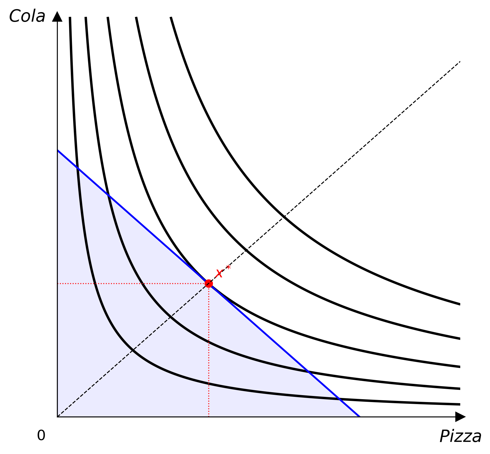
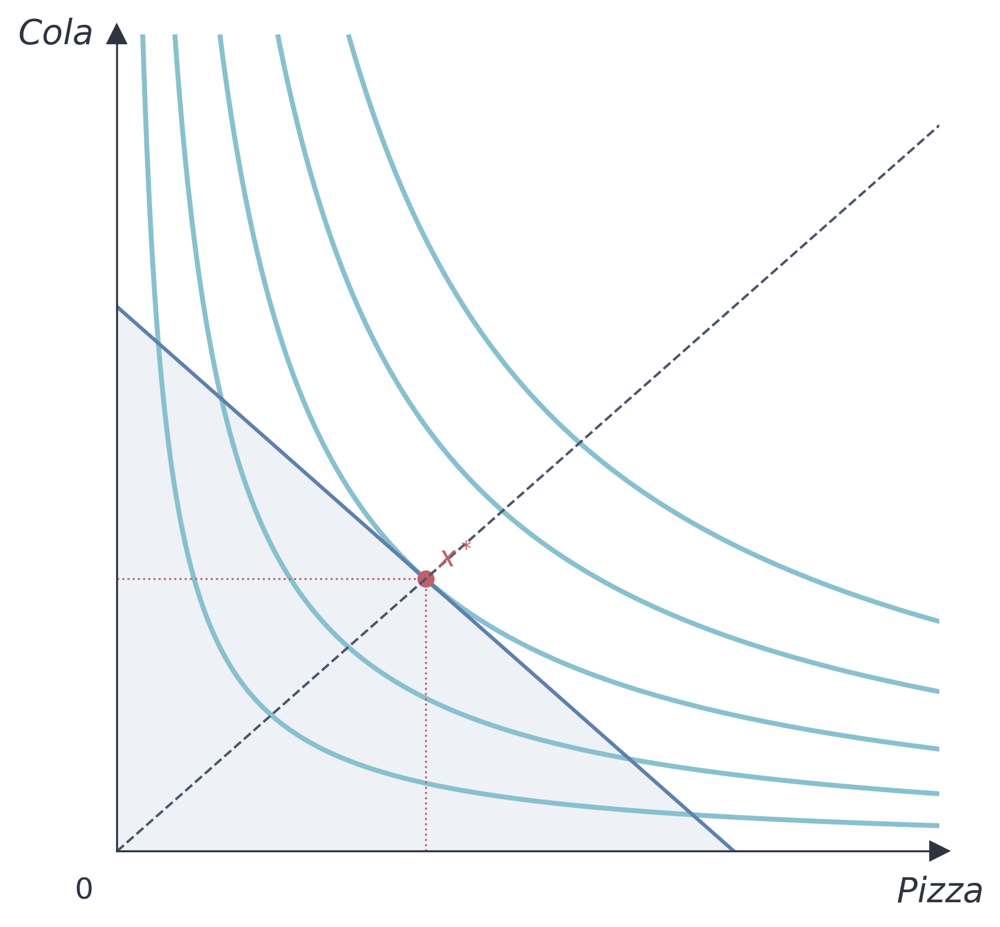

# Themes

Themes control all colours and stroke widths used by the Canvas.



## Built-in themes

### Default

```python
from econ_viz import Canvas, themes

cvs = Canvas(x_max=20, y_max=15, theme=themes.default)
```

### Nord

```python
cvs = Canvas(x_max=20, y_max=15, theme=themes.nord)
```

The Nord theme uses the [Nord colour palette](https://www.nordtheme.com/) — cool blues and muted tones suitable for academic presentations.



## Custom theme

```python
from econ_viz import Theme

my_theme = Theme(
    name="custom",
    axis_color="#333333",
    label_color="#333333",
    ic_color="#2563eb",
    ic_linewidth=1.5,
    budget_color="#dc2626",
    budget_linewidth=1.5,
    budget_fill_alpha=0.08,
    eq_color="#16a34a",
    eq_markersize=6.0,
    ray_color="#9ca3af",
    ray_linewidth=1.0,
    kink_color="#2563eb",
)

cvs = Canvas(x_max=20, y_max=15, theme=my_theme)
```

## Theme attributes

| Attribute | Description |
|-----------|-------------|
| `name` | Theme identifier |
| `axis_color` | Colour of axis spines and arrow tips |
| `label_color` | Colour of axis and origin labels |
| `ic_color` | Indifference curve stroke colour |
| `ic_linewidth` | Indifference curve stroke width |
| `budget_color` | Budget line stroke colour |
| `budget_linewidth` | Budget line stroke width |
| `budget_fill_alpha` | Opacity of the feasible-set shading |
| `eq_color` | Equilibrium marker and drop-line colour |
| `eq_markersize` | Equilibrium dot size |
| `ray_color` | Expansion-path ray colour |
| `ray_linewidth` | Expansion-path ray stroke width |
| `kink_color` | Kink-point marker colour |
