# Canvas

`Canvas` is the central drawing surface. It manages a single matplotlib figure styled in the convention of microeconomic textbook diagrams: first-quadrant axes, arrow tips, LaTeX-rendered labels, and no numeric tick marks.

## Constructor

<!-- api: canvas.constructor -->

??? example "View example"

    ```python
    from utility_viz import ArrowStyle, Axis, Canvas, Stroke, themes

    cvs = Canvas(
        x_max=20,
        y_max=15,
        title=r"Cobb-Douglas $x^{0.5} y^{0.5}$",
        dpi=300,
        font="DejaVu Sans",
        math_font="stix",
        axis_stroke=Stroke(width=1.0, arrow=ArrowStyle.TRIANGLE),
        # "top", "right", or "bottom"
        x_axis=Axis(label="x", label_position="right"),
        # "left", "top", or "right"
        y_axis=Axis(label="y", label_position="top"),
        theme=themes.default,
    )
    ```


When the same setting is given twice, the `Axis` field wins. For the axis
line, the order from highest to lowest is `Axis.stroke`, `x_axis_stroke`,
`axis_stroke`, `x_line_style` / `x_arrow_style`, and `theme.axis_stroke`.

## Methods

All drawing methods return `self`, so calls can be chained.

### Utility curves {#add_utility data-toc-label="Utility curves"}

Draws indifference curves for a utility model. Pass an integer to `levels` for automatically spaced curves, or a list of utility values, such as `levels.around(eq.utility, n=5)`, to place them around the optimum.

<!-- api: canvas.add_utility -->

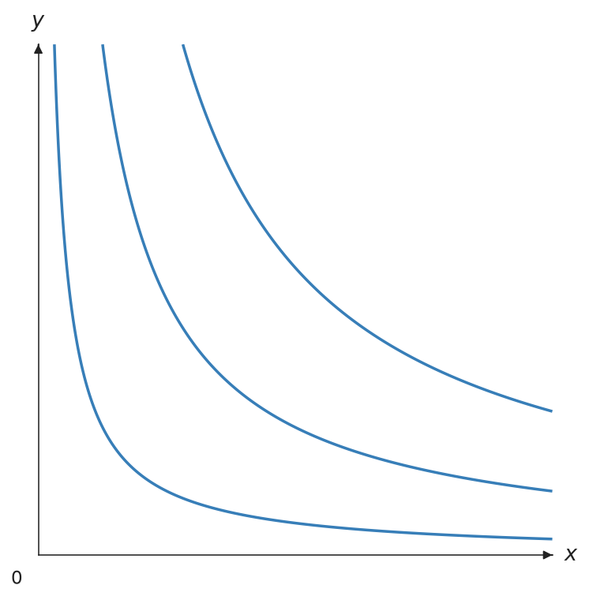{ .ev-figure-sm }

#### Focal and secondary curves

Pass the equilibrium utility to `highlight_level` to emphasize the nearest
available level without drawing a second contour set yourself. The other
levels use `theme.secondary_ic_stroke`, or an explicit `secondary_stroke`.

```python
from utility_viz import Canvas, Stroke, levels, solve
from utility_viz.models import CobbDouglas

model = CobbDouglas(0.5, 0.5)
eq = solve(model, px=2, py=3, income=30)
lvls = levels.around(eq.utility, n=5)

(
    Canvas(x_max=20, y_max=15)
    .add_utility(
        model,
        levels=lvls,
        highlight_level=eq.utility,
        secondary_stroke=Stroke(width=1, opacity=0.35),
        show_ic_labels=True,
        label_style="ordinal",
    )
    .add_budget(2, 3, 30, fill=True)
    .add_equilibrium(eq)
)
```

`label_style="numeric"` uses the formatted utility values; `"ordinal"`
produces textbook labels $u_1,u_2,\ldots$. Labels follow the local curve angle
and are kept away from the visible boundary.

<div class="grid cards" markdown>

- 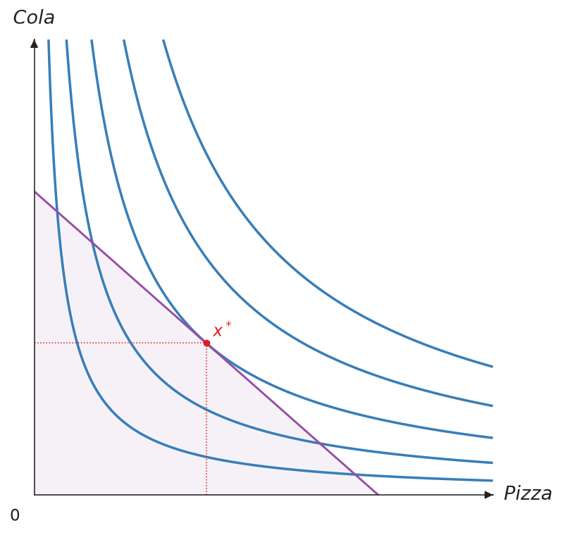
  **Before** — every level has the same visual weight.
- 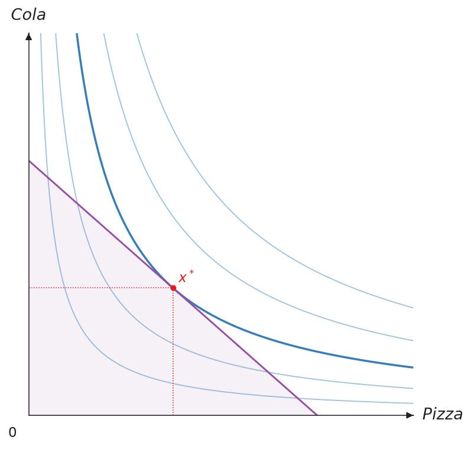
  **After** — the equilibrium level is focal.
- 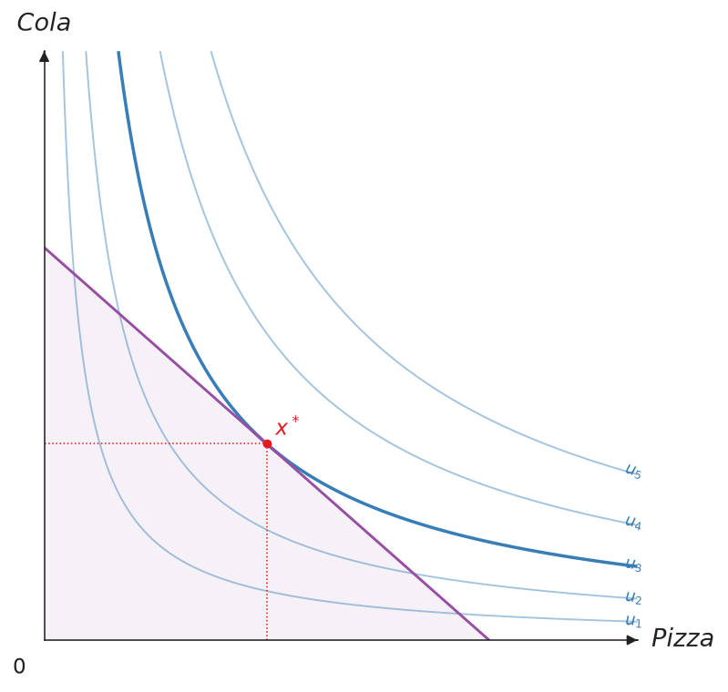
  **Ordinal labels** — curves are labelled $u_1,u_2,\ldots$.

</div>

### Budget line {#add_budget data-toc-label="Budget line"}

Draws the budget line $p_x x + p_y y = I$. Set `fill=True` to shade the feasible set below it.

<!-- api: canvas.add_budget -->

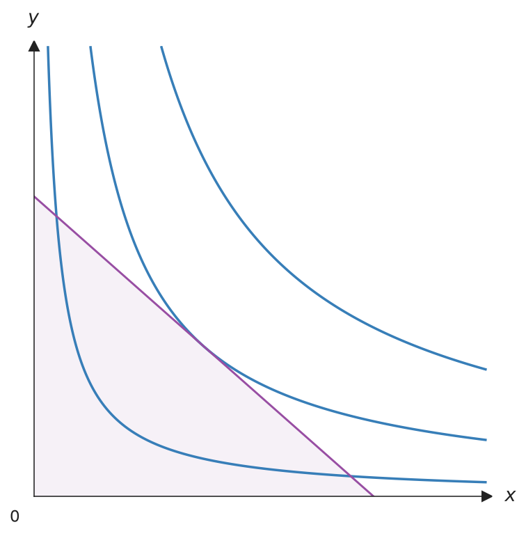{ .ev-figure-sm }

### Equilibrium {#add_equilibrium data-toc-label="Equilibrium"}

Marks the optimal bundle and drops dashed lines to both axes. Pass the result of `solve()` as `eq`; `show_ray=True` also draws the expansion path through the origin.

<!-- api: canvas.add_equilibrium -->

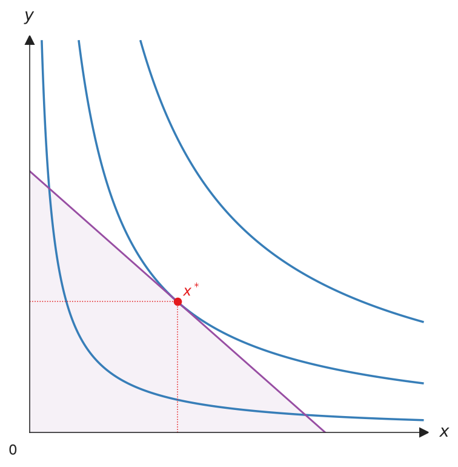{ .ev-figure-sm }

### Ray {#add_ray data-toc-label="Ray"}

Draws a dashed ray from the origin with slope `slope` ($\mathrm{d}y/\mathrm{d}x$), often used for an expansion path or a fixed consumption ratio.

<!-- api: canvas.add_ray -->

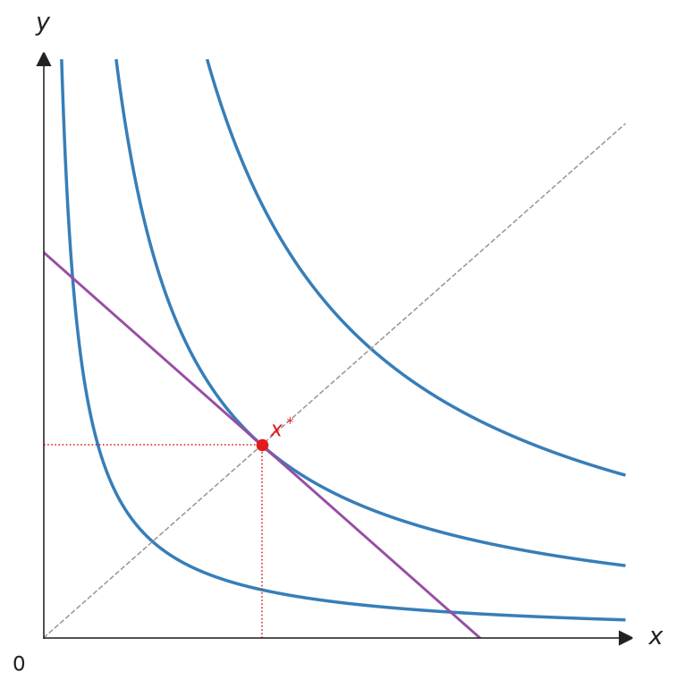{ .ev-figure-sm }

### Point {#add_point data-toc-label="Point"}

Marks any point, such as a bundle to compare with the optimum. `label` is rendered in LaTeX math mode; pass a `Label` to move or restyle it.

<!-- api: canvas.add_point -->

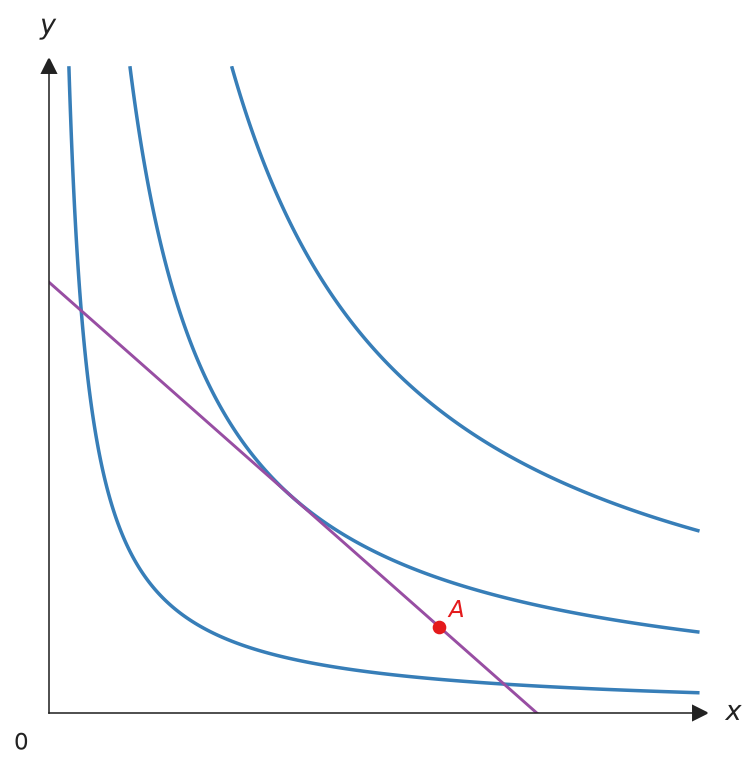{ .ev-figure-sm }

### Show and save {#show-save data-toc-label="Show and save"}

`show()` opens an interactive window. `save()` infers the format from the file extension: `.png`, `.pdf`, `.svg`, or `.tex` for TikZ. It also releases matplotlib resources, so call it last.

<!-- api: canvas.show -->

<!-- api: canvas.save -->

```python
# interactive window
cvs.show()
# .png / .pdf / .svg / .tex
cvs.save("figure.png")
```

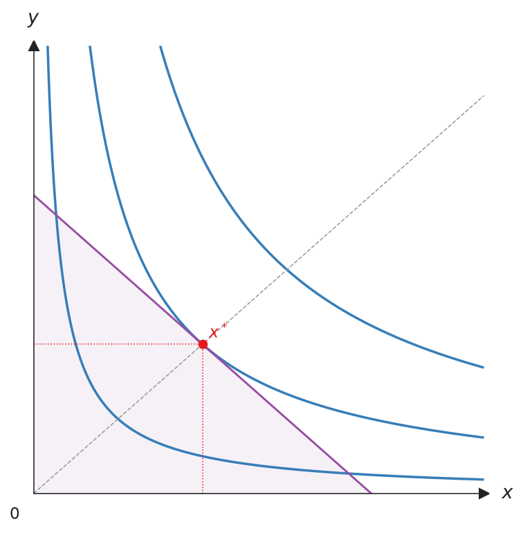{ .ev-figure-sm }

## Styles

Each kind of element has its own style object. Fields left as `None` keep the
theme default, so set only what you want to change.

| Object | Styles | Theme defaults |
|--------|--------|----------------|
| `Stroke` | Line width, line style, colour, arrowhead | `theme.budget_stroke`, `theme.ic_stroke`, … |
| `Marker` | Point colour, size, shape | `theme.eq_marker`, `theme.point_marker`, … |
| `Label` | Text, position, offset, colour, size, visibility | `theme.point_label`, `theme.axis_label`, … |
| `Legend` | Legend position, size, frame, columns | `theme.legend` |
| `Fill` | Shading colour and opacity | `theme.budget_fill` |
| `Axis` | One axis's label, label position, and stroke | none |

Every object also takes an `opacity` from 0 (transparent) to 1 (opaque).

```python
from utility_viz import Canvas, Fill, Label, Marker, Stroke

(
    Canvas(x_max=20, y_max=15)
    .add_utility(
        model,
        levels=lvls,
        ic_label=Label(text="U={:.1f}", position="top"),
    )
    .add_budget(
        2.0,
        3.0,
        30.0,
        stroke=Stroke(color="black"),
        fill=Fill(color="lightgrey", opacity=0.4),
    )
    .add_equilibrium(
        eq,
        marker=Marker(color="#C0392B", shape="s"),
        label=Label(position="bottom-left", offset=8),
    )
    .add_point(
        12.0, 2.0, label=Label(text="A", position="left")
    )
    .save("styles.png")
)
```

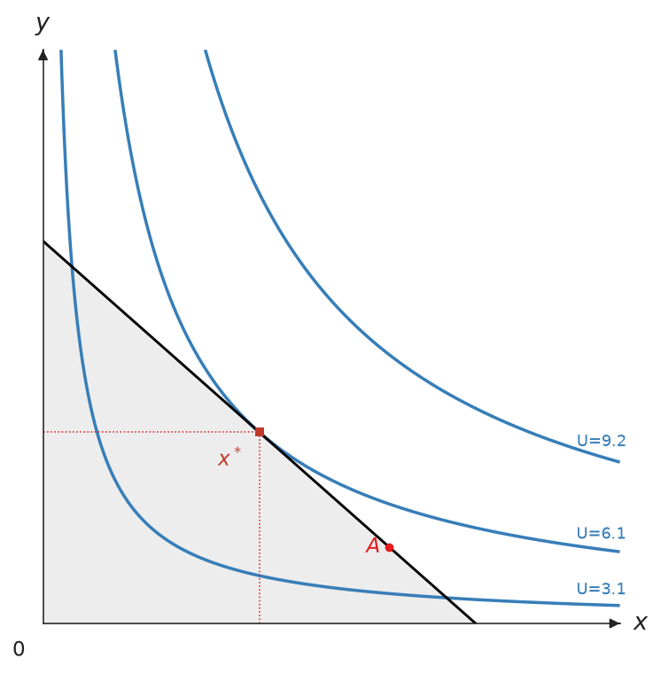{ .ev-figure-sm }

`Stroke` is the preferred way to style lines. The separate `color`,
`linewidth`, and `linestyle` arguments still work as shorthand and draw the
same thing. A label takes its point's `Marker` colour unless it sets its own;
label positions are `top`, `bottom`, `left`, `right`, and the four corners
such as `top-right`, and `Label(visible=False)` hides a label.

### Text and legend

Every piece of text takes a `Label`: axis labels through `Axis(label=...)`,
the origin through `origin_label`, and the title through `title`. Legends go
where they cover the least of the diagram, moving outside the plot area when
every corner is taken; a `Legend` chooses an inside corner (`"upper left"`,
…) or a side outside (`"top"`, `"bottom"`, `"left"`, `"right"`).

```python
from utility_viz import Axis, Canvas, Label, Legend

cvs = Canvas(
    title=Label(text="Cobb-Douglas", fontsize=13),
    x_axis=Axis(label=Label(text="x_1", fontsize=16)),
    origin_label=Label(visible=False),
)
cvs.show_legend(legend=Legend(position="bottom", fontsize=10))
```

The line and arrow styles below apply to the axes with the `x_*` and `y_*`
parameters, and to any other line through `Stroke`.

### Line styles

Use `LineStyle.SOLID`, `DASHED`, `DOTTED`, or `DASHDOT` for axis lines.
The equivalent strings—`solid`, `dashed`, `dotted`, and `dashdot`—are also
accepted. Use `Stroke(style=...)` to apply the same setting to any other line.

```python
import matplotlib.pyplot as plt

from utility_viz import Canvas, LineStyle

styles = [
    LineStyle.SOLID,
    LineStyle.DASHED,
    LineStyle.DOTTED,
    LineStyle.DASHDOT,
]

fig, axes = plt.subplots(2, 2, figsize=(7, 7))
for ax, style in zip(axes.flat, styles):
    Canvas(
        title=style.value,
        x_line_style=style,
        y_line_style=style,
        fig=fig,
        ax=ax,
    )

fig.tight_layout()
fig.savefig("line_styles.png", dpi=160, transparent=True)
```

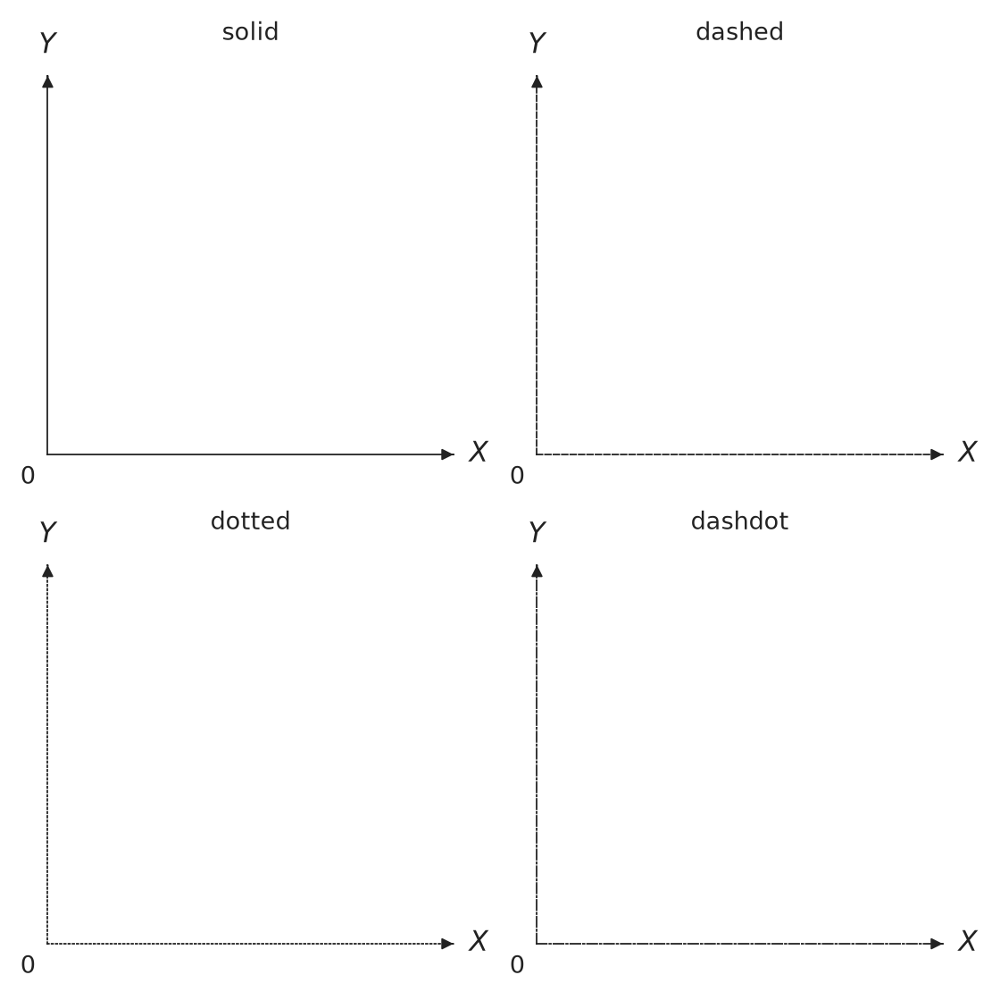

### Arrow styles

Use `ArrowStyle.SIMPLE`, `TRIANGLE`, `FANCY`, or `WEDGE` for axis arrowheads.
Use `Stroke(arrow=...)` to add the same arrowhead to another visible line.

```python
import matplotlib.pyplot as plt

from utility_viz import ArrowStyle, Canvas

styles = [
    ArrowStyle.SIMPLE,
    ArrowStyle.TRIANGLE,
    ArrowStyle.FANCY,
    ArrowStyle.WEDGE,
]

fig, axes = plt.subplots(2, 2, figsize=(7, 7))
for ax, style in zip(axes.flat, styles):
    Canvas(
        title=style.name.title(),
        x_arrow_style=style,
        y_arrow_style=style,
        fig=fig,
        ax=ax,
    )

fig.tight_layout()
fig.savefig("arrow_styles.png", dpi=160, transparent=True)
```

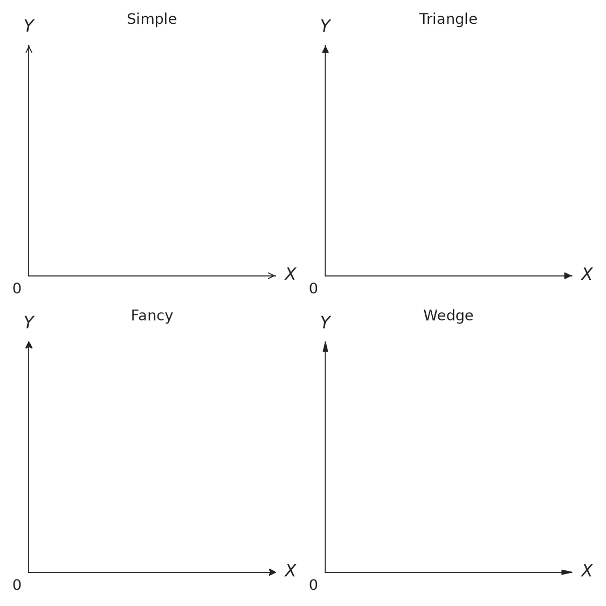

`Stroke` is also available for paths, decomposition diagrams,
`DemandDiagram`, `Figure`, and `EdgeworthBox`. Fields left as `None` inherit
from the active theme.

## Method chaining

```python
Canvas(x_max=20, y_max=15).add_utility(
    model, levels=lvls
).add_budget(2.0, 3.0, 30.0, fill=True).add_equilibrium(
    eq, show_ray=True
).save(
    "figure.png"
)
```
