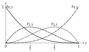
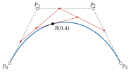

# Bézier 曲线

<span id="sec-curves"></span>

## Bernstein 基底

<span id="def-bernstein"></span>

!!! abstract "定义 · Bernstein 多项式"

    $n \ge 0$ 次 Bernstein 多项式为

    $$
    b_{i,n}(t) = \binom{n}{i} t^i (1-t)^{n-i}, \quad i = 0, \ldots, n.
    $$

    其他整数 $i$ 令 $b_{i,n} = 0$。

这组多项式出自 [Bernstein (1912)](../project/references.md#bernstein1912)；[Farouki (2012)](../project/references.md#farouki2012)回顾其历史与性质，三次的情形如[三次 Bernstein 多项式。](curves.md#fig-basis)。以下证明用到两个二项式系数恒等式。

<span id="lem-binomial"></span>

!!! abstract "引理 · 二项式恒等式"

    令 $n \ge 1$，$i$、$j$ 为整数，并约定 $k < 0$ 或 $k > m$ 时 $\binom{m}{k} = 0$。则

    $$
    \binom{n-1}{j} + \binom{n-1}{j-1} = \binom{n}{j}
    $$

    且

    $$
    i \binom{n}{i} = n \binom{n-1}{i-1}.
    $$

<span id="fig-basis"></span>

{ .ev-figure-sm }

<span id="prop-basis"></span>

!!! abstract "命题 · Bernstein 基底"

    对 $n \ge 0$，多项式 $b_{0,n}, \ldots, b_{n,n}$ 是次数不超过 $n$ 的实系数多项式向量空间的一组基底。

这是 [Floater (2025)](../project/references.md#floater2025) 的定理 1.1；[证明](../project/proofs.md#app-proofs)从头证明。

<span id="prop-unity"></span>

!!! abstract "命题 · 单位分解"

    对每个 $t \in [0, 1]$，所有 $b_{i,n}(t) \ge 0$，且

    $$
    \sum_{i=0}^n b_{i,n}(t) = 1.
    $$

<span id="def-curve"></span>

!!! abstract "定义 · Bézier 曲线"

    设 $P_0, \ldots, P_n \in \mathbb{R}^d$。以 $P_0, \ldots, P_n$ 为控制点的 $n$ 次 Bézier 曲线为

    $$
    B(t) = \sum_{i=0}^n b_{i,n}(t) P_i, \quad t \in [0, 1],
    $$

    其控制多边形为折线 $P_0 P_1 \ldots P_n$。

此定义依循 [B{\'e}zier (1966)](../project/references.md#bezier1966)，形式如 [Farin (2002)](../project/references.md#farin2002) 与 [Prautzsch (2002)](../project/references.md#prautzsch2002)。

<span id="prop-endpoints"></span>

!!! abstract "命题 · 端点"

    $b_{i,n}(0)$ 在 $i = 0$ 时为 1，其余为 0；$b_{i,n}(1)$ 在 $i = n$ 时为 1，其余为 0。因此 $B(0) = P_0$、$B(1) = P_n$。

<span id="cor-hull"></span>

!!! abstract "推论 · 凸包"

    每个 $B(t)$（$t \in [0, 1]$）都位于控制点 $P_0, \ldots, P_n$ 的凸包内。

<span id="prop-affine"></span>

!!! abstract "命题 · 仿射不变性"

    对每个仿射映射 $A(x) = M x + v$ 与每个 $t \in [0, 1]$，

    $$
    A(B(t)) = \sum_{i=0}^n b_{i,n}(t) A(P_i).
    $$

    变换曲线等同于变换其控制点。

[凸包](curves.md#cor-hull)让曲线不超出控制多边形所张的区域；[仿射不变性](curves.md#prop-affine)则是导出器与 Matplotlib 适配器只需移动控制点，就能平移、缩放或旋转曲线的原因。

<!-- api: agora.bezierkit.guides_curves_1 -->

某一次数的基底，位于 `bezierkit.bezier.basis`。在 $t$ 调用时，以数组返回 $i = 0, \ldots, n$ 的 $b_{i,n}(t)$；`matrix()` 对每个参数值返回一列。

## 曲线

<!-- api: agora.bezierkit.guides_curves_2 -->

不可变的 Bézier 曲线，次数 $n \ge 0$、维度 $d \ge 1$ 均不限，参数范围为 $[0, 1]$。`points` 可为 `Point` 序列、`PointSet`、$(n + 1) \times d$ 数组或 `ControlPolygon`；所有控制点必须同一维度。

曲线的运算 `derivative()`、`split()`、`segment()` 与 `reversed()` 详见[导数、反转与分割](operations.md#sec-operations)。

## 求值

*de Casteljau 算法*以反复的线性插值计算 $B(t)$。

<span id="def-casteljau"></span>

!!! abstract "定义 · de Casteljau 点"

    对参数 $t$，令 $P_i^{(0)} = P_i$，并对 $r = 1, \ldots, n$ 令

    $$
    P_i^{(r)} = (1 - t) P_i^{(r-1)} + t P_{i+1}^{(r-1)}, \quad i = 0, \ldots, n - r.
    $$

每一轮对相邻点取平均，多边形少一个点；$n$ 轮后只剩一点（参见[de Casteljau 算法，$t = 0.4$。](curves.md#fig-casteljau)）。此算法源自 Paul de Casteljau 约 1959 年在 Citroën 的工作 [M{\"u}ller (2024)](../project/references.md#mueller2024)。

<span id="thm-casteljau"></span>

!!! abstract "定理 · de Casteljau"

    对 $0 \le r \le n$ 与 $0 \le i \le n - r$，

    $$
    P_i^{(r)} = \sum_{j=0}^r b_{j,r}(t) P_{i+j}.
    $$

    特别地，$P_0^{(n)} = B(t)$。

此叙述见 [Floater (2025)](../project/references.md#floater2025) 的定理 1.6 与 1.7。

<span id="fig-casteljau"></span>

{ .ev-figure-sm }

每个中间点都是控制点的凸组合，算法不会产生互相抵消的大数，因此在高次数时数值稳定。每个参数的计算量为 $O(n^2)$。

<!-- api: agora.bezierkit.guides_curves_3 -->

默认的求值策略，位于 `bezierkit.bezier.evaluation`：以 NumPy 一次对整批参数运行上述算法。

<!-- api: agora.bezierkit.guides_curves_4 -->

以 Bernstein 矩阵乘上控制点。次数低、批量大时较快，但高次数时会求和可能互相抵消的项。根据[de Casteljau](curves.md#thm-casteljau)，两种策略计算的是同一个多项式。

```python
from bezierkit import BezierCurve
from bezierkit.bezier.evaluation import BernsteinEvaluator

fast = BezierCurve(
    curve.control_points, evaluator=BernsteinEvaluator()
)
# Point(coords=(2.0, 1.5)), as with the default
print(fast.at(0.5))
```

仓库的 `benchmarks/` 目录比较两者在 400、10,000 与 100,000 个参数值下的效能。

## 升阶

$n$ 次曲线也是 $n + 1$ 次曲线；新的控制点是旧控制点中相邻两点的凸组合。

<span id="lem-raise-identity"></span>

!!! abstract "引理 · 升阶恒等式"

    对 $n \ge 0$、$0 \le i \le n$ 与每个 $t$，

    $$
    b_{i,n}(t) = (n + 1 - i) / (n + 1) b_{i,n+1}(t) + (i + 1) / (n + 1) b_{i+1,n+1}(t).
    $$

<span id="prop-raise-degree"></span>

!!! abstract "命题 · 升阶"

    设 $B$ 的控制点为 $P_0, \ldots, P_n$。对 $k = 0, \ldots, n + 1$ 令

    $$
    Q_k = k / (n + 1) P_{k-1} + (1 - k / (n + 1)) P_k,
    $$

    其中 $P_{-1}$ 与 $P_{n+1}$ 可任意选取，因为它们的系数为零。则

    $$
    B(t) = \sum_{k=0}^{n+1} b_{k,n+1}(t) Q_k \quad \text{对所有} t.
    $$

    曲线及其参数化都不变。

此公式是标准结果 [Farin (2002)](../project/references.md#farin2002)[Prautzsch (2002)](../project/references.md#prautzsch2002)；[证明](../project/proofs.md#app-proofs)的证明不依赖它们。[直线与二次曲线的三次表示](paths.md#prop-elevation)把它用在直线与二次曲线，也就是本软件包需要的情形。
