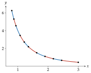
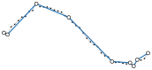

# 拟合

<span id="sec-fitting"></span>

拟合把平滑函数或一串采样点转为 `PiecewiseBezier`，并逐段量测、回报误差，单位与曲线坐标相同。相关函数位于 `bezierkit.fitting`。

## 自适应 Hermite 拟合

参数曲线 $C : [t_0, t_1] \to \mathbb{R}^d$ 在区间 $[a, b]$ 上的拟合，是逐一坐标取[三次 Hermite 插值多项式](construction.md#def-hermite)的三次 Hermite 插值多项式（详见[Hermite 插值](construction.md#prop-hermite)）。套件在 $q$ 个等距的量测参数 $\tau_j = a + j (b - a) / (q - 1)$（$j = 0, \ldots, q - 1$，$q$ 为 `error_samples`）上量测误差：

$$
e = \max_{0 \le j \le q-1} \left\lVert C(\tau_j) - H(\tau_j) \right\rVert_2.
$$

此实测误差是本套件的约定，绝不大于线段真实的最大误差。

<!-- api: agora.bezierkit.guides_fitting_1 -->

在 $[t_0, t_1]$ 上拟合参数曲线 $C(t)$；`function` 回传 `Point`，`derivative` 回传 `Vector`。算法为递归二分：

+ 以目前区间两端的 $C$ 与 $C'$ 创建 Hermite 线段（详见[Hermite 插值](construction.md#prop-hermite)）。
+ 量测误差 $e$。
+ $e$ 不超过 `tolerance` 时保留此线段，并将 $e$ 记为其 `fit_error`；否则将区间对半，两半各自拟合。

因此每个保留的线段在量测参数上都符合容许误差。若区间到了 `max_depth` 仍不合格，或保留它会超过 `max_segments`，就抛出 `ToleranceNotMet`，而不回传品质较差的路径。

<!-- api: agora.bezierkit.guides_fitting_2 -->

拟合图形 $y = f(x)$，$x \in [x_0, x_1]$：即以 $C(x) = (x, f(x))$、$C'(x) = (1, f'(x))$ 调用 `fit_parametric`，选项相同，误差为 $(x, y)$ 平面上的欧氏距离。

```python
from bezierkit.fitting import fit_graph

path = fit_graph(
    lambda x: 4 / x**2,
    lambda x: -8 / x**3,
    x0=0.8,
    x1=3,
    tolerance=1e-3,
)
# 10
print(len(path.segments))
# 0.000676
print(max(s.fit_error for s in path))
```

<span id="fig-adaptive"></span>

{ .ev-figure-sm }

曲线弯曲剧烈处线段较短，接近直线处线段较长（参见[$4 / x^2$ 的自适应拟合。](fitting.md#fig-adaptive)，相邻线段以不同颜色区分）。Hermite 误差界限可预估二分需要的深度：

<span id="cor-depth"></span>

!!! abstract "推论 · 自适应拟合的深度"

    设 $C$ 的每个坐标在 $[t_0, t_1]$ 上四阶连续可微且 $|C_k^{(4)}| \le M$，令 $L = |t_1 - t_0|$，$d$ 为维度，$\epsilon > 0$ 为容许误差。令

    $$
    k^* = \max(0, \left\lceil 1/4 \log_2 (\sqrt\lbrace d\rbrace M L^4 / (384 \epsilon)) \right\rceil),
    $$

    $M = 0$ 时 $k^* = 0$。深度 $k \ge k^*$ 的每个区间都能通过误差检查。因此若 `max_depth` $\ge k^*$ 且 `max_segments` $\ge 2^{k^*}$，`fit_parametric` 不会抛出 `ToleranceNotMet`，也不会产生深度大于 $k^*$ 的区间。

实测误差是线段真实最大误差的下界，因为只在量测参数上检查。若曲线可能在量测点之间起伏，请增加 `error_samples`。

## 折线简化

<span id="def-segment-distance"></span>

!!! abstract "定义 · 点到线段的距离"

    对 $x, a, b \in \mathbb{R}^d$，$x$ 到线段 $[a, b]$ 的距离为

    $$
    \text{dist}(x, [a, b]) = \min_{\lambda \in [0, 1]} \left\lVert x - a - \lambda (b - a) \right\rVert_2.
    $$

以递归分割简化折线，就是 Ramer–Douglas–Peucker 算法 [Ramer (1972)](../project/references.md#ramer1972)[Douglas (1973)](../project/references.md#douglas1973)。`fit_polyline` 全程使用[点到线段的距离](fitting.md#def-segment-distance)的距离。

<!-- api: agora.bezierkit.guides_fitting_3 -->

把采样点简化为由直线弦组成的路径，每条弦以精确的三次曲线表示（详见[直线与二次曲线的三次表示](paths.md#prop-elevation)）。步骤如下：

+ 删除与前一点距离在 `duplicate_tolerance` 以内的点。封闭折线另外删除结尾重复的起点，并旋转为从字典序最小的点开始，使结果与采样起点无关。
+ 保留两端点；激活 `preserve_corners` 时，另保留方向转折至少 `corner_angle` 弧度的顶点。
+ 在相邻的保留顶点之间套用递归步骤：若离弦最远的顶点距离不超过 `tolerance`，以弦取代整段；否则保留该顶点，两侧递归处理。

每条弦的 `fit_error` 是被它取代的顶点到弦的最大距离（参见[以容许误差 $0.08$ 简化 41 个噪声样本。](fitting.md#fig-polyline)）。

递归最多有与顶点数相同的层数，每层对每个顶点至多扫描一次，因此最坏情况下与顶点数成平方关系。[Hershberger (1994)](../project/references.md#hershberger1994) 给出此算法的 $O(n \log n)$ 实作。

<span id="prop-rdp"></span>

!!! abstract "命题 · 折线容许误差"

    设 $v_0, \ldots, v_N$ 为通过步骤 1 的顶点（封闭折线有 $v_N = v_0$），$0 = a_0 < \ldots < a_m = N$ 为输出保留的顶点指针，$\epsilon$ 为 `tolerance`。对每个 $j$ 与每个满足 $a_j \le i \le a_{j+1}$ 的 $i$，

    $$
    \text{dist}(v_i, [v_{a_j}, v_{a_{j+1}}]) \le \epsilon.
    $$

    特别地，每个输出线段的 `fit_error` 都不超过 $\epsilon$。

<span id="cor-rdp-path"></span>

!!! abstract "推论 · 与折线的偏差"

    沿用[折线容许误差](fitting.md#prop-rdp)的记号：
    + 折线 $v_0 v_1 \ldots v_N$ 上的每个点，都与输出的某条弦 $[v_{a_j}, v_{a_{j+1}}]$ 相距不超过 $\epsilon$。
    + 每个输入点与某条弦相距不超过 $\epsilon + \delta$，其中 $\delta$ 为 `duplicate_tolerance`；通过步骤 1 的点相距不超过 $\epsilon$。

<span id="fig-polyline"></span>

{ .ev-figure-sm }

<!-- api: agora.bezierkit.guides_fitting_4 -->

各点到路径中最近之弦 $P_0 P_3$ 的最大距离：可用来检查[折线容许误差](fitting.md#prop-rdp)与[与折线的偏差](fitting.md#cor-rdp-path)，也涵盖步骤 1 删除的点。

如同所有只看得到样本的方法，`fit_polyline` 限制的是与样本的偏差，而非与样本之间未知连续曲线的偏差；需要更贴近时请加密采样。
