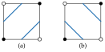
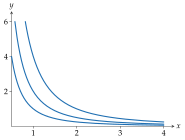

# 等值线

<span id="sec-implicit"></span>

无异曲线、等产量曲线与等高线，都是二元函数的等值集。

## 等值集与切线

<span id="def-level-set"></span>

!!! abstract "定义 · 等值集"

    对 $F : \mathbb{R}^2 \to \mathbb{R}$ 与水平 $c \in \mathbb{R}$，等值集为

    $$
    L_c = \lbrace (x, y) : F(x, y) = c\rbrace .
    $$

对连续可微的 $F$，以 $F_x$、$F_y$ 表示偏导数，$\nabla F = (F_x, F_y)$ 为梯度。在 $\nabla F \ne 0$ 的点附近，等值集是一条曲线，这由隐函数定理得出；以下引述所需的形式。

<span id="thm-ift"></span>

!!! abstract "定理 · 隐函数定理"

    设 $\Omega \subset \mathbb{R}^2$ 为开集，$F : \Omega \to \mathbb{R}$ 连续可微，$p \in \Omega$，$F(p) = c$ 且 $F_y (p) \ne 0$。则存在开区间 $I$、$J$ 满足 $p_x \in I$、$p_y \in J$、$I \times J \subset \Omega$，以及连续可微的 $\phi : I \to J$、$\phi(p_x) = p_y$，使得对 $(x, y) \in I \times J$，

    $$
    F(x, y) = c \quad \text{若且唯若} \quad y = \phi(x).
    $$

此定理对任意个变量都成立，见 [Rudin (1976)](../project/references.md#rudin1976) 的定理 9.28、[Apostol (1974)](../project/references.md#apostol1974) 第二版的定理 13.7 与 [Munkres (1991)](../project/references.md#munkres1991) 的定理 9.2。此处不予证明。

<span id="thm-gradient"></span>

!!! abstract "定理 · 等值集的切线"

    设 $F$ 在开集 $\Omega \subset \mathbb{R}^2$ 上连续可微，$p \in \Omega$，$F(p) = c$ 且 $\nabla F(p) \ne 0$。则存在 $p$ 的开邻域 $N$ 与开区间 $I$ 上的连续可微曲线 $\gamma : I \to \mathbb{R}^2$，满足 $\gamma(I) = L_c \cap N$、某个 $u_0 \in I$ 使 $\gamma(u_0) = p$、对所有 $u \in I$ 有 $\gamma'(u) \ne 0$，且 $\gamma'(u)$ 平行于 $\gamma(u)$ 处的 $(F_y, -F_x)$。矢量 $(F_y, -F_x)$ 与 $\nabla F$ 正交。

切线 $(F_y, -F_x)$ 不需除法，因此垂直切线（$F_y = 0$）与其他情况一样容易处理；图形形式的斜率 $\mathrm{d} y / \mathrm{d} x = -F_x / F_y$ 在该处则为无穷大。

## 描绘

`trace_implicit` 不需解出 $y$ 就能把等值集转为三次路径，因此可以处理会折返、封闭或分成数段的曲线。

<!-- api: agora.bezierkit.guides_implicit_1 -->

在矩形 `viewport` $= (x_{\min}, x_{\max}, y_{\min}, y_{\max})$ 内，描绘每个水平 $c$ 的 $F(x, y) = c$，位于 `bezierkit.implicit`。

算法是行进方格法，即 [Lorensen (1987)](../project/references.md#lorensen1987) 行进立方体法的二维模拟。网格单元的角点为 $v_{00}, v_{10}, v_{11}, v_{01}$，由左下角起逆时针排列，$F$ 的值分别为 $f_{00}, f_{10}, f_{11}, f_{01}$。角点的值不小于水平 $c$ 时称为高。

<span id="def-crossing"></span>

!!! abstract "定义 · 边上的交点"

    设网格的一条边由 $p$ 到 $q$，且 $F(p) \ge c > F(q)$ 或 $F(q) \ge c > F(p)$。其交点为 $p + \lambda (q - p)$，其中

    $$
    \lambda = (c - F(p)) / (F(q) - F(p)),
    $$

    即 $F - c$ 沿该边的线性插值之零点。

一条边有交点，若且唯若它的两个角点高低不同。

+ *采样。*在 viewport 的规则网格上计算 $F$。
+ *行进。*在每个网格单元中找出四条边的交点（详见[边上的交点](implicit.md#def-crossing)）。有两个交点的单元格贡献一条线段。有四个交点的单元格是鞍点：两个对角角点为高、另两个为低，由下述规则决定如何连接（参见[鞍点单元格：(a) 中心高、(b) 中心低；实心角点的 $F \ge c$。](implicit.md#fig-saddle)）。
+ *缝合。*把端点相同的线段串成链。回到起点的链是封闭的；抵达 viewport 边界或分支点的链是开放的。互不相连的部分保持为不同的路径。
+ *简化。*以 `tolerance` 对每条链调用 `fit_polyline`（详见[拟合](fitting.md#sec-fitting)），不保留转角。
+ *弯曲*（提供 `gradient` 时）。把每条直线段换成端点切线沿等值集方向的三次曲线（详见[等值集的切线](implicit.md#thm-gradient)），控制柄长为弦长的三分之一。只有当三次曲线与弦的距离不超过 `tolerance` 时才采用；任一端 $\nabla F = 0$ 时维持直线。

<span id="fig-saddle"></span>

{ .ev-figure-sm }

鞍点规则使用四个角点值的双线性插值

$$
u(s, t) = (1 - s)(1 - t) f_{00} + s (1 - t) f_{10} + s t f_{11} + (1 - s) t f_{01}, \quad (s, t) \in [0, 1]^2.
$$

<span id="prop-center"></span>

!!! abstract "命题 · 双线性插值的中心值"

    插值 $u$ 在角点取角点值，在单元格中心的值等于四个角点值的平均：

    $$
    u(1/2, 1/2) = (f_{00} + f_{10} + f_{11} + f_{01}) / 4.
    $$

此平均值不小于 $c$ 时，套件将中心视为高。在鞍点单元格中，与中心同侧的两个角点在格内相连，另外两个角点各自被一条线段切开（参见[鞍点单元格：(a) 中心高、(b) 中心低；实心角点的 $F \ge c$。](implicit.md#fig-saddle)）。这就是中点决定法（midpoint decider）[Athawale (2019)](../project/references.md#athawale2019)。[Nielson (1991)](../project/references.md#nielson1991) 的渐近决定法（asymptotic decider）则比较 $u$ 在其鞍点的值

$$
u^* = (f_{00} f_{11} - f_{10} f_{01}) / (f_{00} - f_{10} - f_{01} + f_{11}),
$$

两种规则只在 $u^*$ 与平均值落在 $c$ 两侧时才不同。

```python
from bezierkit.implicit import trace_implicit

contours = trace_implicit(
    lambda x, y: x**2 * y,
    levels=[1, 2, 4],
    viewport=(0.5, 4, 0, 6),
    resolution=(121, 121),
    tolerance=0.01,
    gradient=lambda x, y: (2 * x * y, x**2),
)
# (1.0, 2.0, 4.0)
print(contours.level_values)
# 15
print(len(contours.for_level(4)[0].segments))
```

<span id="fig-contours"></span>

{ .ev-figure-sm }

## 结果

<!-- api: agora.bezierkit.guides_implicit_2 -->

`trace_implicit` 回传 `ContourSet`，其 `contours` 依给定顺序为每个水平保存一个 `LevelContours`。`level_values` 列出各水平，`paths` 汇集所有路径，`for_level(c)` 回传某一水平的路径（未描绘的水平抛出 `KeyError`）。

<!-- api: agora.bezierkit.guides_implicit_3 -->

水平值 `level` 与路径 `paths`，每个连通部分一条 `PiecewiseBezier`。

## 限制

描绘出的曲线只在网格交点上精确；交点之间是行进方格法得到的折线，再于 `tolerance` 内简化与弯曲。需要更贴近时，请提高 `resolution` 并降低 `tolerance`。比网格单元小的特征可能遗漏，鞍点规则也只会选择两种可能连接方式之一。Leontief 无异曲线的折角等尖点会在网格间距内被圆滑化，因为网格看不到精确的转角。
