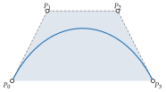

# 快速开始

<span id="sec-quickstart"></span>

## 一条三次曲线

本手册通篇使用的曲线，是控制点为 $(0, 0)$、$(1, 2)$、$(3, 2)$、$(4, 0)$ 的三次曲线（参见[三次曲线及其控制凸包。](quickstart.md#fig-quickstart)）。

```python
from bezierkit import BezierCurve, PiecewiseBezier, Point
from bezierkit.bezier import to_cubic
from bezierkit.export.tikz import to_tikz

curve = BezierCurve.cubic(
    Point(0, 0), Point(1, 2), Point(3, 2), Point(4, 0)
)
# Point(coords=(2.0, 1.5))
print(curve.at(0.5))
# Point(coords=(4.5, 0.0))
print(curve.derivative().at(0.5))
# two cubics that together trace curve
left, right = curve.split(0.4)

path = PiecewiseBezier([to_cubic(curve)])
print(to_tikz(path, precision=2, options="thick"))
# \draw[thick] (0.00,0.00) .. controls (1.00,2.00) and (3.00,2.00) .. (4.00,0.00);
```

<span id="fig-quickstart"></span>

{ .ev-figure-sm }

曲线由 $P_0$ 出发、在 $P_3$ 结束，离开 $P_0$ 时朝向 $P_1$，抵达 $P_3$ 时来自 $P_2$ 的方向，且始终位于控制点的凸包内（详见[凸包](guides/curves.md#cor-hull)）。最后一行是这条曲线的 TikZ 路径，可直接粘贴到 LaTeX 文档。

## 主要元件

- *数值对象。*`Point`、`Vector` 与 `PointSet` 不可变，并检查维度（详见[几何数值对象](guides/geometry.md#sec-geometry)）。
- *曲线。*`BezierCurve` 可为任意次数与维度；`CubicBezierSegment` 是绘图端使用的三次曲线；`PiecewiseBezier` 将三次曲线连接成路径（详见[Bézier 曲线](guides/curves.md#sec-curves)、[三次线段与路径](guides/paths.md#sec-paths)）。
- *构造。*把端点条件、斜率、导数或 Hermite 数据转为控制点（详见[建构与 Hermite 插值](guides/construction.md#sec-construction)）。
- *近似。*把平滑函数、采样点与等值线 $F(x, y) = c$ 转为误差已知的三次路径（详见[拟合](guides/fitting.md#sec-fitting)、[等值线](guides/implicit.md#sec-implicit)）。
- *输出。*采样、JSON、SVG 路径数据、TikZ，以及 Matplotlib 路径（详见[采样与导出](guides/export.md#sec-export)）。
