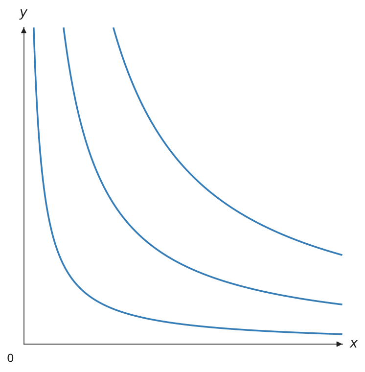
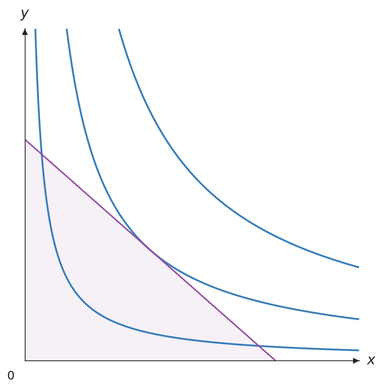
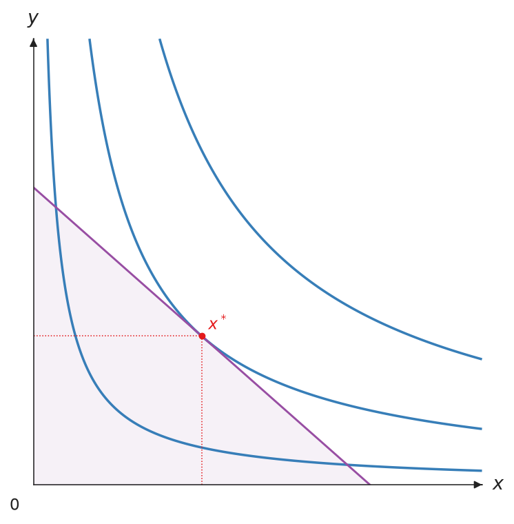
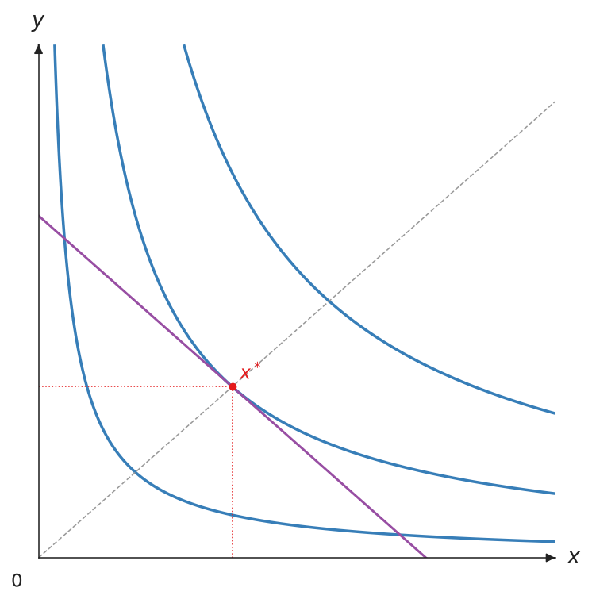
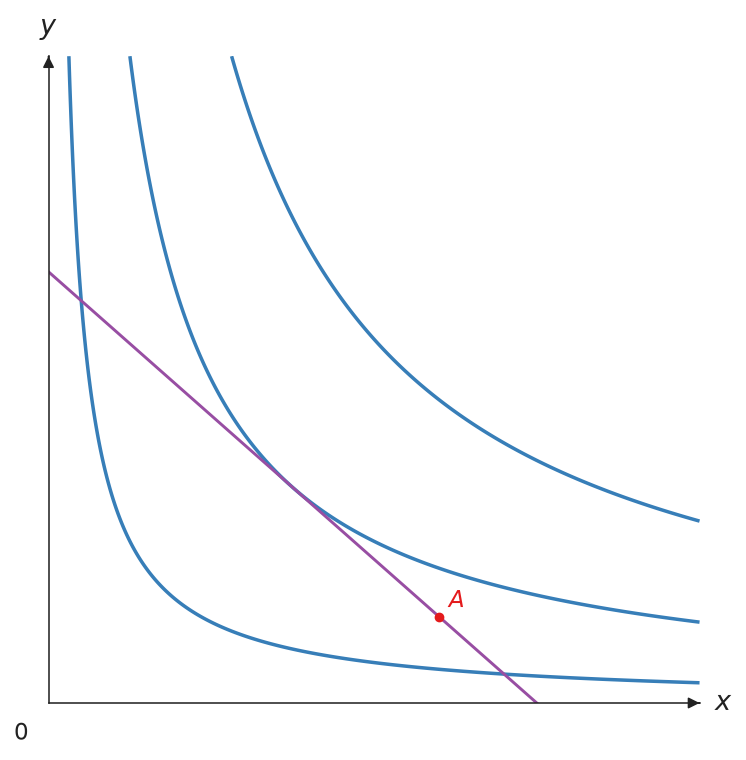
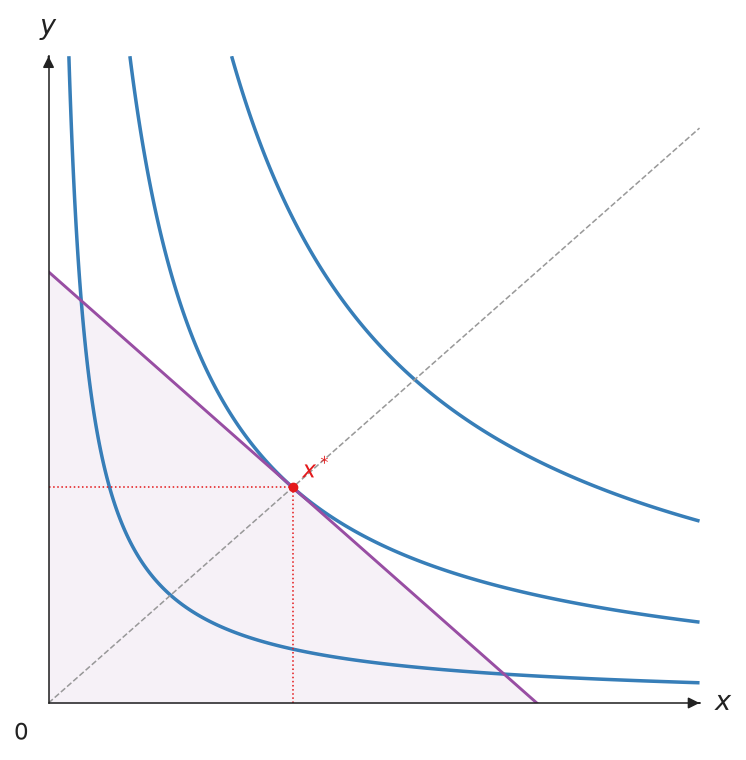
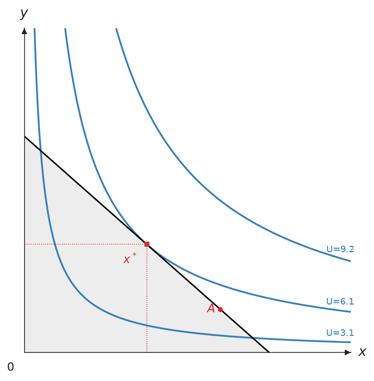
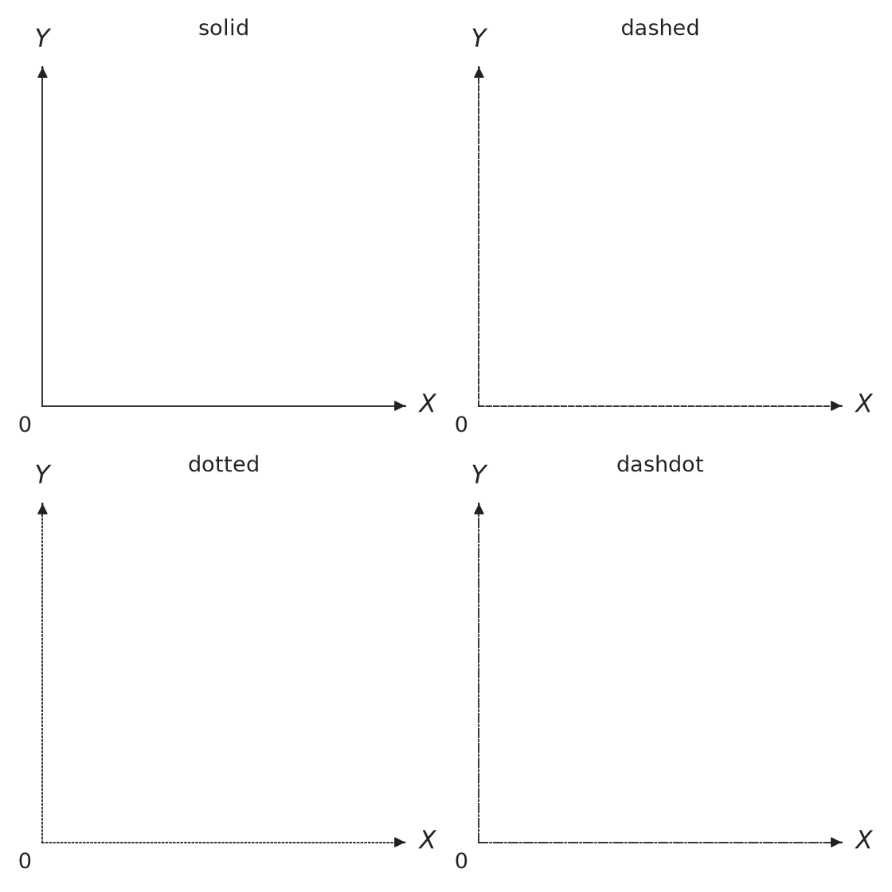
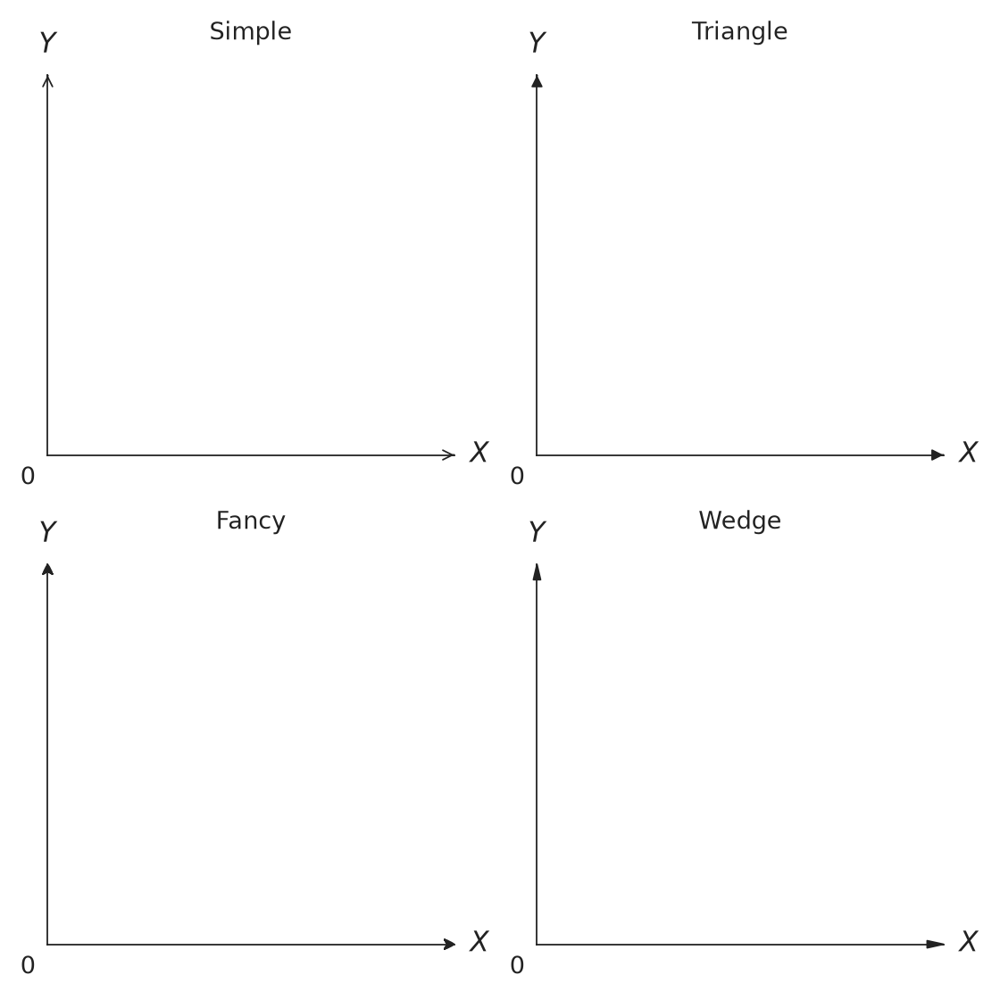

# Canvas 画布

`Canvas` 是核心的绘图画布。它管理一张 matplotlib 图，样式遵循微观经济学教科书的惯例：**只画第一象限**、坐标轴末端有箭头、标签用 LaTeX 绘制、**不显示数字刻度**。

## 构造函数

```python
from econ_viz import ArrowStyle, Axis, Canvas, Stroke, themes

cvs = Canvas(
    x_max=20,
    y_max=15,
    title=r"Cobb-Douglas $x^{0.5} y^{0.5}$",
    dpi=300,
    font="DejaVu Sans",
    math_font="stix",
    axis_stroke=Stroke(width=1.0, arrow=ArrowStyle.TRIANGLE),
    x_axis=Axis(label="x", label_position="right"),  # "top"、"right" 或 "bottom"
    y_axis=Axis(label="y", label_position="top"),    # "left"、"top" 或 "right"
    theme=themes.default,
)
```

| 参数 | 类型 | 默认值 | 说明 |
|-----------|------|---------|-------------|
| `x_max` | float | 10 | 横轴上限 |
| `y_max` | float | 10 | 纵轴上限 |
| `x_axis` | `Axis` | None | 横轴的标签、标签位置与线条 |
| `y_axis` | `Axis` | None | 纵轴的标签、标签位置与线条 |
| `x_label` | str | `"X"` | 横轴 `Axis(label=...)` 的简写 |
| `y_label` | str | `"Y"` | 纵轴 `Axis(label=...)` 的简写 |
| `title` | str 或 None | None | 图形标题 |
| `dpi` | int | 300 | 位图导出分辨率（限制在 1–1200） |
| `x_label_pos` | str 或 `LabelPosition` | `"right"` | `Axis(label_position=...)` 的简写：箭头上方、右侧或下方 |
| `y_label_pos` | str 或 `LabelPosition` | `"top"` | `Axis(label_position=...)` 的简写：箭头左侧、上方或右侧 |
| `font` | str 或序列 | None | 所有文字使用的字体或候选字体列表 |
| `math_font` | str | None | 数学字体：`dejavusans`、`dejavuserif`、`cm`、`stix` 或 `stixsans` |
| `axis_stroke` | `Stroke` | 主题默认值 | 同时设置两轴的粗细、线条样式、颜色与箭头样式 |
| `x_axis_stroke` | `Stroke` | None | 横轴的单独覆盖，是 `Axis(stroke=...)` 的简写 |
| `y_axis_stroke` | `Stroke` | None | 纵轴的单独覆盖，是 `Axis(stroke=...)` 的简写 |
| `theme` | Theme | `themes.default` | 配色与样式主题 |

同一项设置给了两次时，以 `Axis` 的字段为准。坐标轴线条的优先顺序由高到低是 `Axis.stroke`、`x_axis_stroke`、`axis_stroke`、`x_line_style` / `x_arrow_style`、`theme.axis_stroke`。

## 方法

所有绘图方法都会返回 `self`，所以可以串接调用。

### 效用曲线 {#add_utility data-toc-label="效用曲线"}

画出效用函数的无差异曲线。`levels` 传入整数会自动决定曲线的间距，也可以传入一组效用值，例如用 `levels.around(eq.utility, n=5)` 让曲线分布在最优点周围。

```python
cvs.add_utility(
    func,
    levels=3,          # 曲线数或效用值列表
    stroke=None,       # 默认 theme.ic_stroke
    ray_stroke=None,
    show_rays=False,
    show_kinks=False,
    kink_radius=1.0,
    show_bliss=True,   # 标出极乐点（Satiation）
    kink_marker=None,  # 默认 theme.kink_marker
    bliss_marker=None, # 默认 theme.bliss_marker
    ic_label=None,     # 曲线末端效用值的 Label
    bliss_label=None,  # str 或 Label
)
```

{ .ev-figure-sm }

### 预算线 {#add_budget data-toc-label="预算线"}

画出预算线 $p_x x + p_y y = I$。设置 `fill=True` 会在预算线下方的可行集加上阴影。

```python
cvs.add_budget(
    px, py, income,
    stroke=None,       # 默认 theme.budget_stroke
    label=None,        # 图例标签（LaTeX）
    fill=False,        # True 或 Fill；默认 theme.budget_fill
)
```

{ .ev-figure-sm }

### 均衡点 {#add_equilibrium data-toc-label="均衡点"}

在最优消费组合画上均衡点，并画出到两轴的垂直虚线。`eq` 传入 `solve()` 的返回值；`show_ray=True` 会同时画出通过原点的扩展路径。

```python
cvs.add_equilibrium(
    eq,                # solve() 的返回值
    label="x^*",       # str 或 Label
    marker=None,       # 默认 theme.eq_marker
    drop_dashes=True,  # 到两轴的虚线
    show_ray=False,    # 扩展路径
    drop_stroke=None,
    ray_stroke=None,
)
```

{ .ev-figure-sm }

### 射线 {#add_ray data-toc-label="射线"}

从原点画一条斜率为 `slope`（dy/dx）的虚线射线，常用来表示扩展路径或固定的消费比例。

```python
cvs.add_ray(
    slope,             # dy/dx
    stroke=None,       # 默认 theme.ray_stroke
)
```

{ .ev-figure-sm }

### 标记点 {#add_point data-toc-label="标记点"}

标记任意一点，例如要与最优点比较的消费组合。`label` 会以 LaTeX 数学模式显示；要移动标签或改样式时，传入 `Label`。

```python
cvs.add_point(
    x, y,
    label=None,        # str 或 Label
    marker=None,       # 默认 theme.point_marker
)
```

{ .ev-figure-sm }

### 显示与保存 {#show-save data-toc-label="显示与保存"}

`show()` 会打开交互窗口。`save()` 根据扩展名决定格式，支持 `.png`、`.pdf`、`.svg`，以及输出 TikZ 的 `.tex`。`save()` 也会释放 matplotlib 的资源，所以要放在最后调用。

```python
cvs.show()               # 交互窗口
cvs.save("figure.png")   # .png / .pdf / .svg / .tex
```

{ .ev-figure-sm }

## 样式

每一类元素都有自己的样式对象。没有指定的字段会沿用主题默认值，所以只需设置想改的部分。

| 对象 | 控制项目 | 主题默认值 |
|------|----------|------------|
| `Stroke` | 线条粗细、线条样式、颜色、箭头 | `theme.budget_stroke`、`theme.ic_stroke` 等 |
| `Marker` | 点的颜色、大小、形状 | `theme.eq_marker`、`theme.point_marker` 等 |
| `Label` | 标签文字、位置、偏移、颜色、大小、是否显示 | `theme.point_label`、`theme.ic_label` 等 |
| `Fill` | 阴影颜色与透明度 | `theme.budget_fill` |
| `Axis` | 单个坐标轴的标签、标签位置与线条 | 无 |

```python
from econ_viz import Canvas, Fill, Label, Marker, Stroke

(
    Canvas(x_max=20, y_max=15)
    .add_utility(model, levels=lvls, ic_label=Label(text="U={:.1f}", position="top"))
    .add_budget(2.0, 3.0, 30.0, stroke=Stroke(color="black"),
                fill=Fill(color="lightgrey", alpha=0.4))
    .add_equilibrium(eq, marker=Marker(color="#C0392B", shape="s"),
                     label=Label(position="bottom-left", offset=8))
    .add_point(12.0, 2.0, label=Label(text="A", position="left"))
    .save("styles.png")
)
```

{ .ev-figure-sm }

**建议用 `Stroke` 设置线条样式**。另外的 `color`、`linewidth`、`linestyle` 参数仍可作为简写使用，画出来的结果相同。标签默认沿用所属点的 `Marker` 颜色，除非另外指定；位置可用 `top`、`bottom`、`left`、`right` 与 `top-right` 等四个角落，`Label(visible=False)` 可隐藏标签。

下方的线条样式与箭头样式，坐标轴通过 `x_*` 与 `y_*` 参数设置，其他线条则通过 `Stroke` 应用。

### 线条样式

坐标轴可使用 `LineStyle.SOLID`、`DASHED`、`DOTTED` 或 `DASHDOT`。也可以直接传入对应的 `solid`、`dashed`、`dotted` 或 `dashdot` 字符串。其他线条则通过 `Stroke(style=...)` 设置。

```python
import matplotlib.pyplot as plt

from econ_viz import Canvas, LineStyle

styles = [
    LineStyle.SOLID,
    LineStyle.DASHED,
    LineStyle.DOTTED,
    LineStyle.DASHDOT,
]

fig, axes = plt.subplots(2, 2, figsize=(7, 7))
for ax, style in zip(axes.flat, styles):
    Canvas(
        title=style.value,
        x_line_style=style,
        y_line_style=style,
        fig=fig,
        ax=ax,
    )

fig.tight_layout()
fig.savefig("line_styles.png", dpi=160, transparent=True)
```



### 箭头样式

坐标轴可使用 `ArrowStyle.SIMPLE`、`TRIANGLE`、`FANCY` 或 `WEDGE`。其他可见线条则通过 `Stroke(arrow=...)` 添加相同的箭头样式。

```python
import matplotlib.pyplot as plt

from econ_viz import ArrowStyle, Canvas

styles = [
    ArrowStyle.SIMPLE,
    ArrowStyle.TRIANGLE,
    ArrowStyle.FANCY,
    ArrowStyle.WEDGE,
]

fig, axes = plt.subplots(2, 2, figsize=(7, 7))
for ax, style in zip(axes.flat, styles):
    Canvas(
        title=style.name.title(),
        x_arrow_style=style,
        y_arrow_style=style,
        fig=fig,
        ax=ax,
    )

fig.tight_layout()
fig.savefig("arrow_styles.png", dpi=160, transparent=True)
```



路径、效应分解、`DemandDiagram`、`Figure` 与 `EdgeworthBox` 也可以使用 `Stroke`。未指定的字段会沿用当前主题。

## 串接调用

```python
Canvas(x_max=20, y_max=15) \
    .add_utility(model, levels=lvls) \
    .add_budget(2.0, 3.0, 30.0, fill=True) \
    .add_equilibrium(eq, show_ray=True) \
    .save("figure.png")
```
