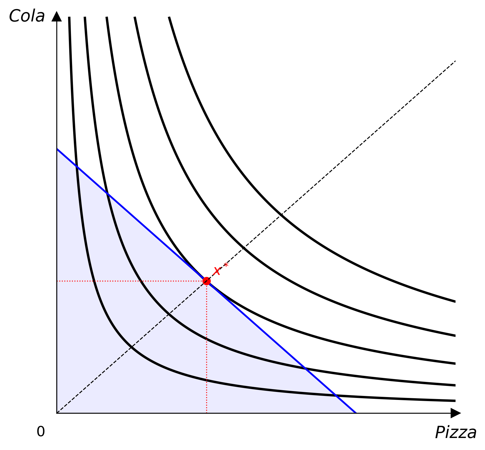
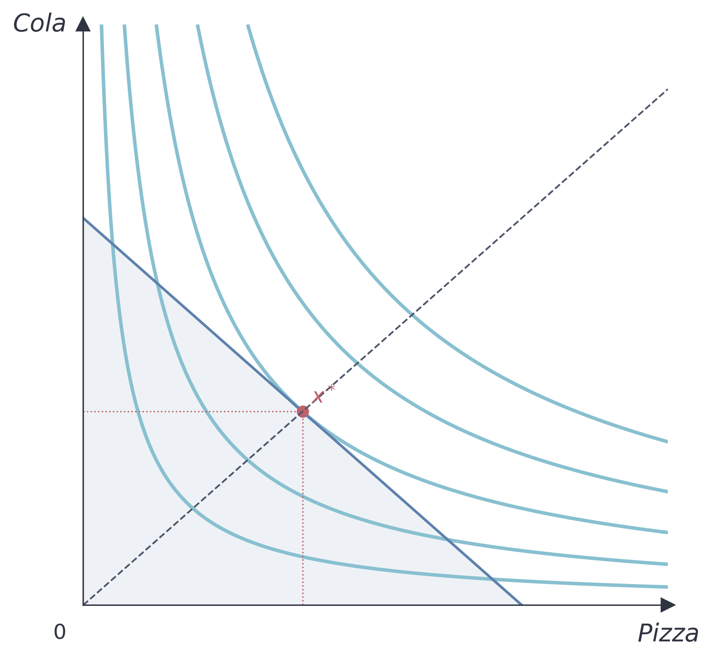

# 主题

主题控制 Canvas 使用的所有颜色与线条粗细。



## 内置主题

### Default

```python
from econ_viz import Canvas, themes

cvs = Canvas(x_max=20, y_max=15, theme=themes.default)
```

### Nord

```python
cvs = Canvas(x_max=20, y_max=15, theme=themes.nord)
```

Nord 主题使用 [Nord 配色](https://www.nordtheme.com/)，以冷色蓝与低饱和色调为主，适合学术演示文稿。



## 自定义主题

```python
from econ_viz import Theme

my_theme = Theme(
    name="custom",
    axis_color="#333333",
    label_color="#333333",
    ic_color="#2563eb",
    ic_linewidth=1.5,
    budget_color="#dc2626",
    budget_linewidth=1.5,
    budget_fill_alpha=0.08,
    eq_color="#16a34a",
    eq_markersize=6.0,
    ray_color="#9ca3af",
    ray_linewidth=1.0,
    kink_color="#2563eb",
)

cvs = Canvas(x_max=20, y_max=15, theme=my_theme)
```

## 主题属性

| 属性 | 说明 |
|-----------|-------------|
| `name` | 主题名称 |
| `axis_color` | 坐标轴与箭头的颜色 |
| `label_color` | 坐标轴标签与原点标签的颜色 |
| `ic_color` | 无差异曲线的颜色 |
| `ic_linewidth` | 无差异曲线的线宽 |
| `budget_color` | 预算线的颜色 |
| `budget_linewidth` | 预算线的线宽 |
| `budget_fill_alpha` | 可行集阴影的不透明度 |
| `eq_color` | 均衡点与垂直虚线的颜色 |
| `eq_markersize` | 均衡点的大小 |
| `ray_color` | 扩张路径射线的颜色 |
| `ray_linewidth` | 扩张路径射线的线宽 |
| `kink_color` | 折点标记的颜色 |
