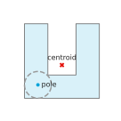
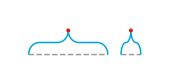

# 布局几何

标签会等其他内容全部绘制完毕后再放置，并采用以像素为单位、$y$ 向上递增的显示坐标。`mosaickit.layout` 软件包收录布局所需的几何功能；它不导入任何渲染器，因此可单独测试及重复使用。本章的函数位于 `mosaickit.layout.geometry`；`Rect` 与 `polylabel` 也会从 `mosaickit.layout` 导出。点是数对 `(x, y)`，线段由一对点组成，多边形则是一串首尾相连的点。

## 矩形

<!-- api: agora.mosaickit.guides_geometry_1 -->

闭合的轴对齐矩形 $[x_0, x_1] \times [y_0, y_1]$。`Rect.centered(center, width, height)` 以指定点为中心创建矩形。它提供 `width`、`height`、`center`、`inflate(pad)`、`corners()`（从 $(x_0, y_0)$ 开始逆时针排列）、`edges()`、`contains(point)`（包含边界）、`within(other)`、`intersects(other)`（相切也算）与 `nearest_point(point)`。

!!! abstract "引理 · 矩形上的最近点"

    对矩形 $R$ 与点 $p$，`nearest_point` 返回的点

    $$
    q = (\min(\max(p_x, x_0), x_1), \min(\max(p_y, y_0), y_1))
    $$

    是 $R$ 上离 $p$ 最近的唯一点。

引线标注的引线会终止于这一点，因此标签位置一旦确定，引线便是最短的。

## 方向与线段

!!! abstract "定义 · 方向"

    对平面上的点 $a, b, c$，

    $$
    \text{orient}(a, b, c) = (b_x - a_x)(c_y - a_y) - (b_y - a_y)(c_x - a_x),
    $$

    即 $b - a$ 与 $c - a$ 的外积。

!!! abstract "引理 · 方向测试"

    当 $c$ 位于从 $a$ 指向 $b$ 的有向直线左侧（$a \to b \to c$ 为逆时针转向）时，$\text{orient}(a, b, c)$ 为正；位于右侧时为负；$a$、$b$、$c$ 共线时为零。它在循环置换下不变，交换两个参数时变号。

<!-- api: agora.mosaickit.guides_geometry_2 -->

判断闭线段 $[a, b]$ 与 $[c, d]$ 是否有共同点。令 $d_1 = \text{orient}(c, d, a)$、$d_2 = \text{orient}(c, d, b)$、$d_3 = \text{orient}(a, b, c)$、$d_4 = \text{orient}(a, b, d)$；如果 $d_1 d_2 < 0$ 且 $d_3 d_4 < 0$，或某个 $d_i$ 为零且其对应点落在另一线段的外接矩形（包住该线段的最小轴对齐矩形）内，便判定两者相交 [Cormen (2009)](../project/references.md#cormen2009)。

!!! abstract "定理 · 线段相交"

    在精确算术下，`segments_intersect(a, b, c, d)` 为真当且仅当 $[a, b] \cap [c, d] \ne \emptyset$。

<!-- api: agora.mosaickit.guides_geometry_3 -->

线段是否碰到矩形：有端点在矩形内，或线段与矩形四边之一相交。

!!! abstract "引理 · 线段与矩形"

    `rect_hits_segment(R, a, b)` 为真当且仅当 $[a, b] \cap R \ne \emptyset$。

## 多边形

!!! abstract "定义 · 简单多边形"

    若多边形 $P = (p_0, \ldots, p_{m-1})$（$m \ge 3$）的边 $[p_i, p_{i+1}]$（下标取模 $m$）只在相邻边的共同端点相交，且顶点不全共线，则称 $P$ 为*简单多边形*。其边界 $\partial P$ 是各边的联集；由 Jordan 曲线定理，$\partial P$ 的补集恰有一个有界连通分量，即*内部* $\text{int} P$，以及一个无界分量，即*外部*。记 $\overline{P} = \text{int} P \cup \partial P$。

<!-- api: agora.mosaickit.guides_geometry_4 -->

前者返回多边形的所有边（包括最后一点到第一点），后者计算指定点到最近边的欧氏距离。计算每条边的距离时，会先将点投影到该边所在的直线，再把参数限制在 $[0, 1]$。

!!! abstract "引理 · 到线段的距离"

    设 $a \ne b$，令

    $$
    t^* = \text{clamp}((p - a) \cdot (b - a) / |b - a|^2, 0, 1)
    $$

    则 $a + t^* (b - a)$ 是 $[a, b]$ 上离 $p$ 最近的点。

<!-- api: agora.mosaickit.guides_geometry_5 -->

奇偶规则：从该点向右作水平射线，计算它穿过的边数。当一条边恰有一个端点严格位于射线所在直线上方，且交点在该点右侧时，该边计入 [Haines (1994)](../project/references.md#haines1994)。

!!! abstract "命题 · 奇偶规则"

    设 $P$ 为简单多边形且 $p \notin \partial P$。则 `point_in_polygon(p, P)` 为真当且仅当 $p \in \text{int} P$。

<!-- api: agora.mosaickit.guides_geometry_6 -->

在内部：四个角都通过奇偶测试，且多边形没有任何边碰到矩形。重叠：有一个角通过测试，或有一条边碰到矩形（这也涵盖多边形整个位于矩形内的情形）。

!!! abstract "定理 · 多边形内的矩形"

    设 $P$ 为简单多边形、$R$ 为矩形。则 `rect_inside_polygon(R, P)` 为真当且仅当 $R \subset \text{int} P$。

!!! abstract "推论 · 与多边形重叠的矩形"

    设 $P$ 为简单多边形、$R$ 为矩形。则 `rect_overlaps_polygon(R, P)` 为真当且仅当 $R \cap \overline{P} \ne \emptyset$。

<!-- api: agora.mosaickit.guides_geometry_7 -->

射线 $o + t r$ 与不平行于它的边相交处的最大 $t \ge 0$；没有这样的边时为 $0$。引线标注以它作为搜索起点，也就是射线离开区域之处。

!!! abstract "命题 · 永久离开多边形"

    设 $P$ 为简单多边形、$r \ne 0$，且 $T =$ `ray_exit(o, r, P)`。则对每个 $t > T$，$o + t r \notin \overline{P}$。

## 区域的视觉中心

区域的形心，也就是将区域视为均匀薄片时的质心，可能落在区域外（参见[极点、最大圆盘与形心。](geometry.md#fig-polylabel)）。标签应放在区域最深处，也就是离边界最远的点。

!!! abstract "定义 · 有符号距离与不可及极点"

    对简单多边形 $P$，*有符号距离*定义为：当 $p \in \overline{P}$ 时 $f(p) = d(p, \partial P)$，否则 $f(p) = -d(p, \partial P)$。$P$ 的*不可及极点*是 $f$ 获取最大值 $f^*$ 之处；$f^*$ 即 $P$ 内最大圆盘的半径。

!!! abstract "引理 · 有符号距离为 1-Lipschitz"

    对所有点 $p, q$，$|f(p) - f(q)| \le |p - q|$。

<!-- api: agora.mosaickit.guides_geometry_8 -->

在正方形单元上的最佳优先搜索 [Agafonkin (2016)](../project/references.md#agafonkin2016)。外接矩形先以边长等于其短边的正方形覆盖。中心为 $c$、半边长为 $h$ 的单元得到上界 $f(c) + h \sqrt{2}$，放入优先队列，上界最大者先取出。程序记住目前最佳的中心，起始值为外接矩形的中心；取出的单元若上界比最佳值多出 `precision` 以上，就分成四格，否则舍弃。外接矩形宽或高为零的多边形返回其第一个顶点。

!!! abstract "定理 · 不可及极点"

    设 $P$ 为简单多边形，外接矩形的宽与高皆为正，并设精度 $\epsilon > 0$。则 `polylabel` 必定结束，且返回的点 $q$ 满足 $f(q) \ge f^* - \epsilon$。特别地，当 $f^* > \epsilon$ 时，$q$ 位于 $\text{int} P$。

{ .ev-figure-sm }

三角形的极点就是内心，也就是三条角平分线的交点。布局时会以默认的一像素精度调用 `polylabel`，这比任何文字的放置精度都更细。

## 大括号外形

<!-- api: agora.mosaickit.guides_geometry_9 -->

覆盖 `start`..`end` 的大括号，以 `Brace(points, tip)` 表示。两端位于直线 `base`（固定的横向坐标），尖端位于跨距中点，在 `direction`（$\pm 1$）一侧距 `base` 为 `depth`。轴为 `"y"` 时各点为（横向, 纵向）；为 `"x"` 时为（纵向, 横向）。每段四分之一圆弧以 `samples` 段采样。空跨距、非正的深度，或其他方向与轴，引发 `ValueError`。

外形先在局部坐标中构造，$u$ 为横向、$v$ 为沿轴方向：四段半径 $r = \min(\text{depth}/2, (\text{end} - \text{start})/4)$ 的四分之一圆，以两段直线相连，再沿横向拉伸 $\text{depth} / 2r$ 倍。因此短跨距的圆弧较小，但尖端仍达到完整深度（参见[大括号外形；右侧跨距小于 $2 \delta$。](geometry.md#fig-brace)）。

!!! abstract "命题 · 大括号的形状"

    设 $\ell < h$ 为跨距两端、$m = (\ell + h) / 2$ 为中点、$\delta$ 为深度。在局部坐标中、采样之前，外形是从 $(0, \ell)$ 经尖端 $(\delta, m)$ 到 $(0, h)$ 的曲线，且
    (i) 位于带状区 $0 \le u \le \delta$ 内；(ii) 在 $v |\to \ell + h - v$ 下对称；(iii) 除尖端外处处切线连续，尖端处曲线折返（尖点）。

{ .ev-figure-sm }
