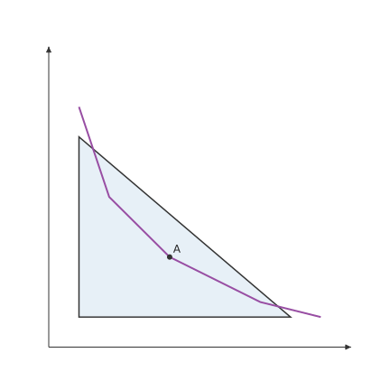

# mosaickit

`mosaickit` 是与领域无关的工具包，用可复用的场景、图层、样式、参数与渲染器组合出二维图形。

领域包负责定义自己的模型与语义角色，mosaickit 则负责组合它们的视觉图层并完成渲染。
mosaickit 对任何领域一无所知，也不依赖模型包或曲线拟合包。

{ width="360" }

| | |
|---|---|
| 本文档对应版本 | 0.5.1 |
| Python | 3.10 以上（项目支持 3.10 至 3.13） |
| 依赖 | numpy、matplotlib（Python 3.10 另需 tomli） |
| 被谁使用 | [utility-viz](../utility-viz/index.md)、[principle-viz](../principle-viz/index.md) |
| 源代码 | [github.com/EconViz/mosaickit](https://github.com/EconViz/mosaickit) |
| 许可证 | MIT |

## 功能范围

- 精简的场景图：`PathLayer`、`FillLayer`、`MarkerLayer`、`TextLayer`、`ArrowLayer`、`LegendLayer` 与 `GroupLayer`
- 不会盖住其他元素的标签（`RegionLabelLayer`、`PointLabelLayer`），以及坐标轴上的标注
  （`AxisMarkLayer`、`AxisNoteLayer`、`BraceLayer`、`SpanBraceLayer`）
- 坐标轴辅助函数，例如 `quadrant_axes()`、`crosshair_axes()` 与 `box_frame()`
- 样式、主题与调色板，颜色可以用名称指定
- 参数与表达式、`CanvasGrid` 网格布局，以及 `Animation` 动画扫描
- 内置的 Matplotlib 渲染器（输出 PNG、SVG、PDF），并提供 `Renderer` 协议以接入其他后端

## 范围

mosaickit 负责与领域无关的场景组合、样式、主题、参数绑定、网格布局、动画帧、渲染器接口，
以及静态与动态输出。领域语义则属于构造在它之上的包。曲线构造与原生 TikZ 路径生成，
属于 [bezierkit](../bezierkit/index.md) 这类几何包的工作。

## 接下来

-   :material-download: **安装**

    用 pip 或 uv 安装包。

    [:octicons-arrow-right-24: 安装](installation.md)

-   :material-rocket-launch-outline: **快速开始**

    用图层组出画布，并保存为 SVG。

    [:octicons-arrow-right-24: 快速开始](quickstart.md)

