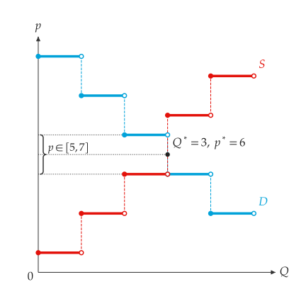

# 离散市场

<span id="sec-discrete"></span>

离散市场逐一列出每个单位：买方对多一单位的愿付价格，以及卖方多生产一单位的成本。需求与供给都是阶梯函数；均衡是整数个单位，并由一段价格区间支持。

## 逐单位表

<!-- api: agora.principle_viz.guides_discrete_1 -->

需求表存放边际愿付价格，由第一单位到最后一单位弱递减；供给表存放边际成本，弱递增。顺序不符时抛出 `DiscreteMarketError`。

## 均衡

<!-- api: agora.principle_viz.guides_discrete_2 -->

交易所有价值不低于成本的单位，并找出恰好使该数量成交的价格区间。结果包含下列字段：

`solve_discrete_market(demand_values, supply_values)` 直接由 tuple 创建两张表并求解。需求表的值由高到低、供给表的值由低到高，各单位的价值与成本才能依序配对。

```python
from principle_viz import (
    DiscreteDemand,
    DiscreteSupply,
    solve_discrete_equilibrium,
)

demand = DiscreteDemand((11, 9, 7, 5, 3))
supply = DiscreteSupply((1, 3, 5, 8, 10))
eq = solve_discrete_equilibrium(demand, supply)
print(eq.q_star, eq.price_low, eq.price_high, eq.price)
# 3 5.0 7.0 6.0
print(eq.gains_from_trade)
# (10.0, 6.0, 2.0)
```

成交 3 单位，价格区间为 5 到 7，中点规则给出 6。交易利得合计 $10 + 6 + 2 = 18$。

<!-- api: agora.principle_viz.guides_discrete_3 -->

所选价格下的消费者剩余与生产者剩余，包含总额与逐单位数值（`consumer_surplus_by_unit`、`producer_surplus_by_unit`）。上例价格为 6 时，两者皆为 $5 + 3 + 1 = 9$。

## 图形

<!-- api: agora.principle_viz.guides_discrete_4 -->

每个单位画成区间 $[q, q + 1)$ 的一阶：起点为实心点（包含），终点为空心点（不包含），并以虚线连到下一阶。可只传入其中一张表。均衡在坐标轴上标出 $Q^*$ 与价格区间。

```python
fig = MarketFigure(
    x_max=5.5,
    y_max=12,
    title="Discrete Demand and Supply",
)
fig.add_discrete_curves(demand, supply)
fig.add_discrete_equilibrium(eq)
fig.finalize()
```

上例的图形参见[离散需求与供给。](discrete.md#fig-discrete)。

<span id="fig-discrete"></span>

{ .ev-figure-sm }
