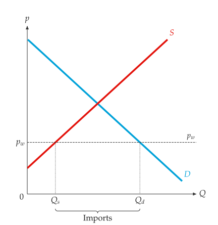
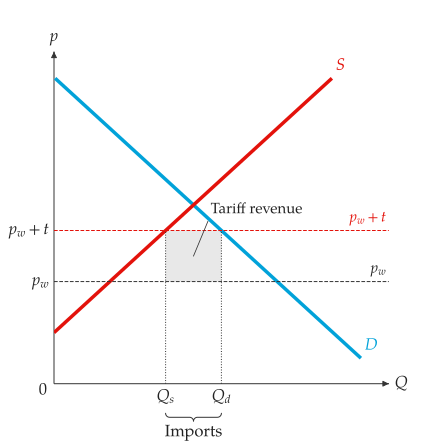
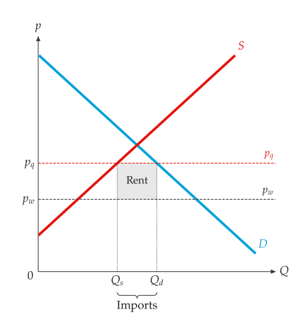

# 国际贸易

<span id="sec-trade"></span>

小型开放经济体接受既定的世界价格 $p_w$。世界价格低于自给自足价格时，进口国内需求与供给的差额；高于自给自足价格时则出口。关税或进口配额会提高国内价格并减少进口。

<!-- api: agora.principle_viz.guides_trade_1 -->

世界价格与至多一项政策：每单位 `tariff` 或 `import_quota`，两者不可同时设置（`PolicyError`）。

<!-- api: agora.principle_viz.guides_trade_2 -->

比较自给自足、自由贸易与政策三种情况。`TradeComparisonResult` 包含三个 `TradeOutcome`（`autarky`、`free_trade`、`policy`），以及政策相对于自由贸易的 `deadweight_loss`。

```python
from principle_viz import TradeScenario, analyze_trade

# autarky price 7
demand = line_from_inverse(12.0, -1.0)
scenario = TradeScenario(world_price=4, tariff=2)
result = analyze_trade(demand, supply, scenario)
print(result.free_trade.imports, result.policy.imports)
# 6.0 2.0
print(result.policy.government_revenue, result.deadweight_loss)
# 4.0 4.0
```

关税 2 时，国内价格为 6，政府收入为 $2 \times 2 = 4$。配额 2 单位时价格同为 6，配额租 4 归 `quota_rent_recipient` 指定的一方。

<!-- api: agora.principle_viz.guides_trade_3 -->

画出世界价格线并命名为 $p_w$，标出政策价格（$p_w + t$ 或 $p_q$），在数量轴上标 $Q_s$ 与 $Q_d$ 并于下方加上 "Imports" 或 "Exports" 括号，再以命名的矩形表示关税收入或配额租（参见[自由贸易下的进口。](trade.md#fig-free-trade)、[进口关税。](trade.md#fig-tariff)、[有约束的进口配额。](trade.md#fig-quota)）。

<span id="fig-free-trade"></span>

{ .ev-figure-sm }

<span id="fig-tariff"></span>

{ .ev-figure-sm }

<span id="fig-quota"></span>

{ .ev-figure-sm }
