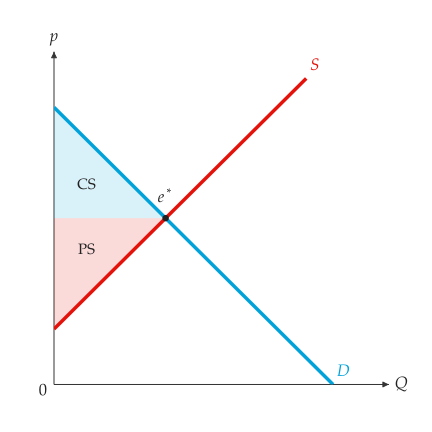

# 福利

<span id="sec-welfare"></span>

福利分析比较某个市场结果与其他可能结果：消费者剩余、生产者剩余、政府收入，以及无谓损失。

## 市场结果

<!-- api: agora.principle_viz.guides_welfare_1 -->

一个数量，加上买方支付与卖方收到的价格。征税或补贴时两个价格不同，价差乘以数量就是政府收入（补贴为负）。此类别位于 `principle_viz.welfare.surplus`，同模块也提供由各种结果创建市场结果的函数：

## 剩余

<!-- api: agora.principle_viz.guides_welfare_2 -->

`outcome` 下的福利分解。传入 `baseline_outcome` 时，以其为基准衡量无谓损失。返回的 `SurplusResult` 包含下列字段：

```python
from principle_viz import compute_surplus, solve_equilibrium
from principle_viz.welfare.surplus import (
    outcome_from_equilibrium,
)

eq = solve_equilibrium(demand, supply)
outcome = outcome_from_equilibrium(eq)
surplus = compute_surplus(demand, supply, outcome)
# 8.0 8.0
print(surplus.consumer_surplus, surplus.producer_surplus)
```

$(10 - 6) \times 4 / 2 = (6 - 2) \times 4 / 2 = 8$；自由市场的无谓损失为 0。

<!-- api: agora.principle_viz.guides_welfare_3 -->

两个福利分解及其差异：`baseline`、`policy`、`delta_consumer_surplus`、`delta_producer_surplus`、`delta_tax_revenue`、`delta_total_surplus` 与 `deadweight_loss`。[税收与补贴](taxes.md#sec-taxes)以税收为例使用此函数。

## 图形

<!-- api: agora.principle_viz.guides_welfare_4 -->

为消费者剩余、生产者剩余、税收与无谓损失填色并命名：名称放得下时写在区块内，只放得下缩写时写 CS、PS、Tax、DWL，否则以引线标示，且不遮住任何线、点或其他文字。

```python
fig = MarketFigure(x_max=12, y_max=12)
fig.add_curves(demand, supply, q_max=10)
fig.add_welfare(surplus)
fig.add_equilibrium(eq)
fig.finalize()
```

输出参见[均衡下的消费者与生产者剩余。](welfare.md#fig-welfare)。

<span id="fig-welfare"></span>

{ .ev-figure-sm }

<!-- api: agora.principle_viz.guides_welfare_5 -->

同样的区块，再加上基准与政策下数量及价格的辅助线，用于比较前后差异。

## 无谓损失报表

<!-- api: agora.principle_viz.guides_welfare_6 -->

将 `(名称, 基准, 政策)` 三元组（皆为 `SurplusResult`）转为报表列（`DWLScenarioRow`），包含数量变动、各项剩余变动与无谓损失。`principle_viz.welfare.report` 中的 `save_dwl_report_csv()` 与 `save_dwl_report_json()` 可将报表写成文件。
