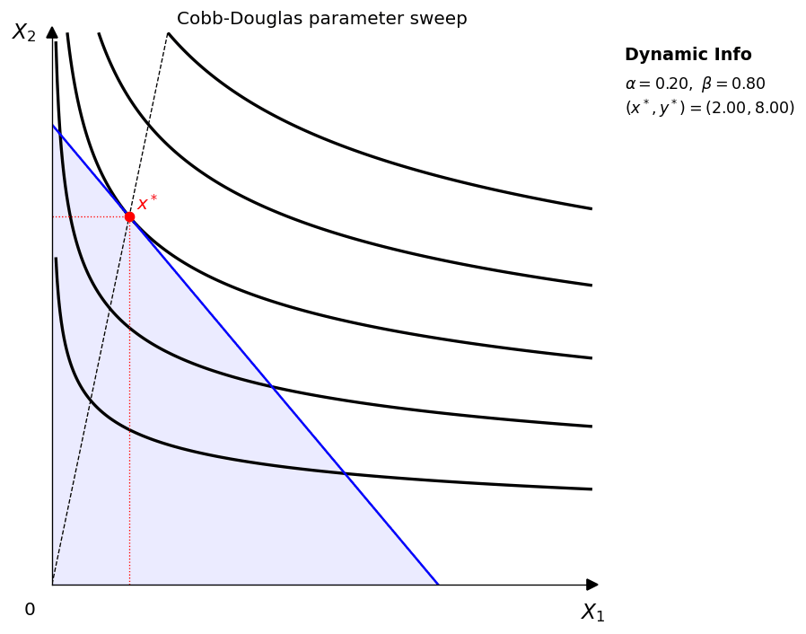
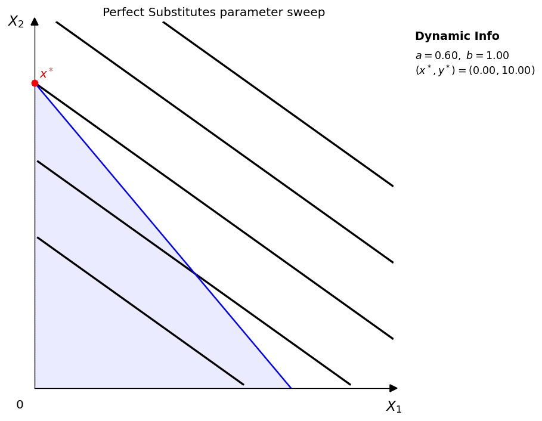
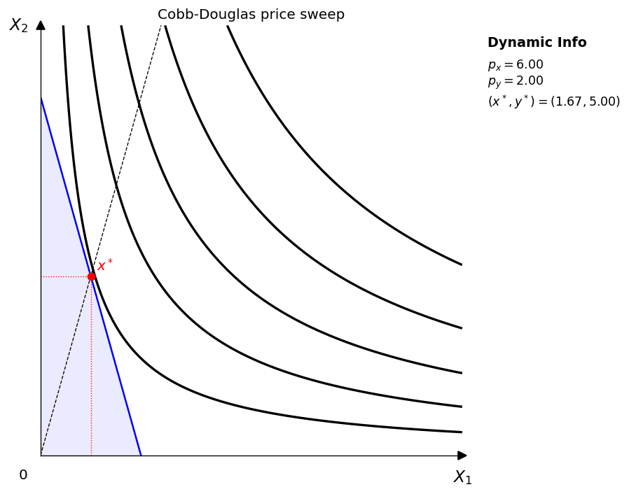
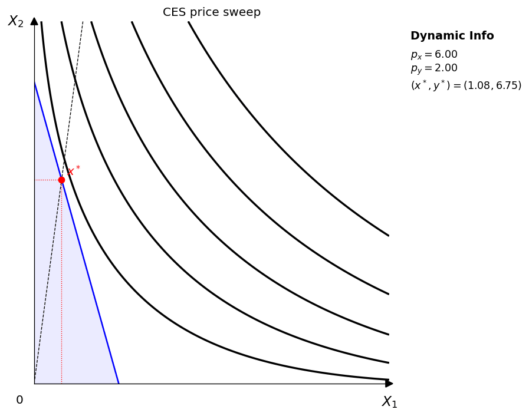
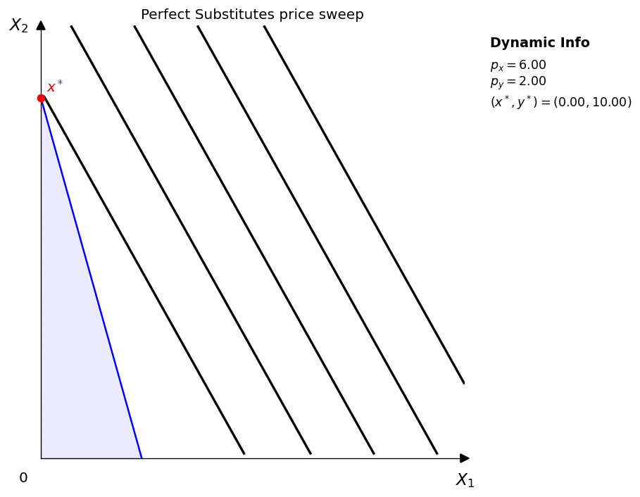
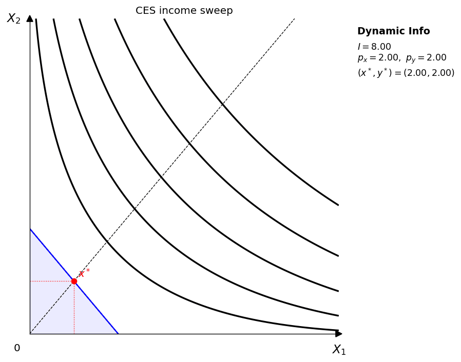
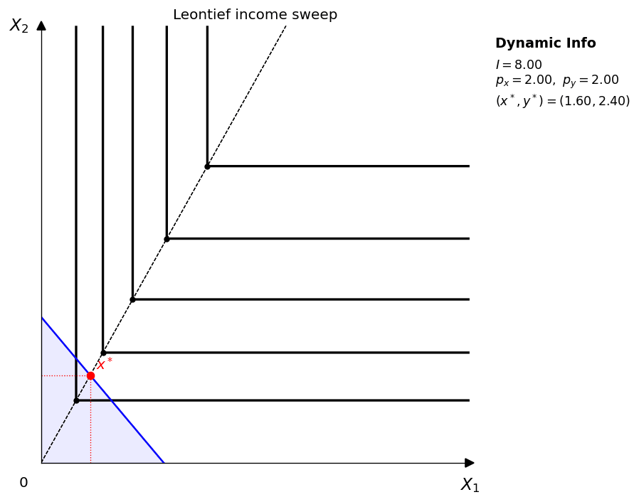

# 動畫

`econ-viz` v1.4.0 新增了以 `Animator` 為核心的輕量 GIF 流程。API 跟一般繪圖差不多：寫一個**frame factory**，每次回傳一個新的 `Canvas` 或 `Figure`，再掃過一串數值影格，最後存成 GIF。

## 安裝

```bash
uv add "econ-viz[animation]"
```

如果也要筆記本互動元件，就安裝：

```bash
uv add "econ-viz[all]"
```

## 最簡範例

```python
import numpy as np

from econ_viz import Canvas, levels, solve
from econ_viz.animation import Animator
from econ_viz.models import CobbDouglas

def draw(px: float) -> Canvas:
    model = CobbDouglas(alpha=0.5, beta=0.5)
    eq = solve(model, px=px, py=2.0, income=20.0)
    lvls = levels.around(eq.utility, n=5)

    return (
        Canvas(x_max=14, y_max=12, x_label="X_1", y_label="X_2", title="Price sweep")
        .add_utility(model, levels=lvls)
        .add_budget(px=px, py=2.0, income=20.0, fill=True)
        .add_equilibrium(eq, show_ray=True, drop_dashes=True)
    )

Animator(draw, frames=np.linspace(1.0, 6.0, 45)).save(
    "price_sweep.gif",
    fps=12,
    dpi=120,
)
```

## 教學用動畫

範例腳本 `examples/animation.py` 會產生以下幾類動畫：

- **參數變動**：價格與所得固定，只改變效用函數的某個參數。
- **價格變動**：效用函數與 `p_y` 固定，只改變 `p_x`。
- **所得變動**：效用函數與價格固定，只改變所得。
- **只有預算線**：完全拿掉效用圖層，讓學生專心觀察預算線怎麼移動。

文件網站直接嵌入同一批 GIF，所以這裡看到的就是本機產生的結果。

## 參數變動

這組動畫回答的問題是：**偏好圖本身怎麼變？**

<div class="media-grid" markdown>
  <figure class="gif-card">
    
    <figcaption>Cobb-Douglas：改變 <code>alpha</code>，並令 <code>beta = 1 - alpha</code>。</figcaption>
  </figure>
  <figure class="gif-card">
    
    <figcaption>CES：改變 <code>rho</code>，調整曲率與替代程度。</figcaption>
  </figure>
  <figure class="gif-card">
    
    <figcaption>完全替代：固定 <code>b</code>，改變 <code>a</code>。</figcaption>
  </figure>
  <figure class="gif-card">
    
    <figcaption>Leontief：固定 <code>b</code>，改變 <code>a</code>，讓拗折點的路徑移動。</figcaption>
  </figure>
</div>

## 價格變動

這組動畫回答的問題是：**預算線旋轉時，均衡怎麼移動？** `v1.4.0` 的關鍵設計是：效用函數固定，背景無異曲線的效用水準也固定。

<div class="media-grid" markdown>
  <figure class="gif-card">
    
    <figcaption>Cobb-Douglas 價格變動，<code>p_y</code> 固定。</figcaption>
  </figure>
  <figure class="gif-card">
    
    <figcaption>CES 價格變動，效用曲面固定。</figcaption>
  </figure>
  <figure class="gif-card">
    
    <figcaption>完全替代，預算線旋轉。</figcaption>
  </figure>
  <figure class="gif-card">
    
    <figcaption>Leontief 價格變動，直角無異曲線固定。</figcaption>
  </figure>
  <figure class="gif-card">
    
    <figcaption>只畫預算線的價格變動，單獨呈現限制式的旋轉。</figcaption>
  </figure>
</div>

## 所得變動

這組動畫回答的問題是：**預算線平行移動時，均衡怎麼移動？**

<div class="media-grid" markdown>
  <figure class="gif-card">
    
    <figcaption>Cobb-Douglas 所得變動，價格固定。</figcaption>
  </figure>
  <figure class="gif-card">
    
    <figcaption>CES 所得變動，價格與效用函數固定。</figcaption>
  </figure>
  <figure class="gif-card">
    
    <figcaption>完全替代所得變動。</figcaption>
  </figure>
  <figure class="gif-card">
    
    <figcaption>Leontief 所得變動，價格固定。</figcaption>
  </figure>
  <figure class="gif-card">
    
    <figcaption>只畫預算線的所得變動，單獨呈現限制式的平行移動。</figcaption>
  </figure>
</div>

## 匯出說明

- `Animator.save()` 使用 Pillow，**不需要** `ffmpeg`。
- 匯出前，每一格都會先疊在白色背景上，避免影格殘影堆疊。
- 每個動畫都可以分別設定 `fps`、`dpi` 與 `loop`。
