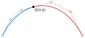

# 導數、反轉與分割

<span id="sec-operations"></span>

每項運算只作用於控制點，並回傳沿用原曲線求值策略的新曲線。

## 導數

Bézier 曲線的導數 $B'(t)$ 是其座標函數（$t$ 的多項式）的導數，為 $\mathbb{R}^d$ 中的向量。

<span id="lem-bernstein-derivative"></span>

!!! abstract "引理 · Bernstein 多項式的導數"

    對 $n \ge 1$ 與每個整數 $i$，

    $$
    b'_{i,n}(t) = n [b_{i-1,n-1}(t) - b_{i,n-1}(t)].
    $$

此為 [Floater (2025)](../project/references.md#floater2025) 的引理 1.4。

<span id="thm-hodograph"></span>

!!! abstract "定理 · 速端曲線"

    $n$ 次 Bézier 曲線（$n \ge 1$）的導數是 $n - 1$ 次 Bézier 曲線

    $$
    B'(t) = \sum_{i=0}^{n-1} b_{i,n-1}(t) \cdot n (P_{i+1} - P_i).
    $$

控制點為 $n(P_{i+1} - P_i)$ 的曲線稱為 $B$ 的速端曲線（[Floater (2025)](../project/references.md#floater2025) 的定理 1.8；另見 [Farin (2002)](../project/references.md#farin2002)）。

<span id="cor-end-tangents"></span>

!!! abstract "推論 · 端點切線"

    $B'(0) = n(P_1 - P_0)$，$B'(1) = n(P_n - P_{n-1})$。

這說明了曲線為何朝 $P_1$ 的方向離開 $P_0$，並從 $P_{n-1}$ 的方向抵達 $P_n$。

<!-- api: agora.bezierkit.guides_operations_1 -->

以 `BezierCurve` 回傳 `order` 階導數，即套用[速端曲線](operations.md#thm-hodograph) `order` 次。常數（0 次）的導數是 0 次的零曲線；`order=0` 回傳曲線本身。

```python
d = curve.derivative()
print(list(d.control_points))
# [Point(coords=(3.0, 6.0)), Point(coords=(6.0, 0.0)), Point(coords=(3.0, -6.0))]
# Point(coords=(4.5, 0.0)): the tangent at the top is horizontal
print(d.at(0.5))
```

## 反轉

<span id="lem-symmetry"></span>

!!! abstract "引理 · 對稱性"

    對所有 $i$ 與 $t$，$b_{i,n}(1 - t) = b_{n-i,n}(t)$。

<span id="prop-reversal"></span>

!!! abstract "命題 · 反轉"

    控制點為 $P_n, \ldots, P_0$ 的曲線就是 $t |\to B(1 - t)$。

<!-- api: agora.bezierkit.guides_operations_2 -->

依[反轉](operations.md#prop-reversal)，回傳反向走訪的曲線。

## 分割

在 $t = c$ 執行 de Casteljau 演算法不只得到曲線值：每一輪的第一個點構成 $c$ 之前那段曲線的控制多邊形，最後一個點構成 $c$ 之後那段的控制多邊形（參見[在 $t = 0.4$ 分割三次曲線。](operations.md#fig-split)）。

<span id="thm-subdivision"></span>

!!! abstract "定理 · 分割"

    令 $c \in [0, 1]$，並在 $t = c$ 計算[de Casteljau 點](curves.md#def-casteljau)的各點。令 $L_j = P_0^{(j)}$、$R_j = P_j^{(n-j)}$，$j = 0, \ldots, n$。則對每個 $s \in [0, 1]$

    $$
    B(c s) = \sum_{j=0}^n b_{j,n}(s) L_j
    $$

    且

    $$
    B(c + (1 - c) s) = \sum_{j=0}^n b_{j,n}(s) R_j.
    $$

這是經典結果，見 [Floater (2025)](../project/references.md#floater2025)（第 8.4 節，由 blossom 導出）與 [Farin (2002)](../project/references.md#farin2002)。

<span id="fig-split"></span>

{ .ev-figure-sm }

<!-- api: agora.bezierkit.guides_operations_3 -->

`split(c)` 回傳[分割](operations.md#thm-subdivision)的兩條曲線，次數不變，參數範圍都是 $[0, 1]$。`segment(t0, t1)` 回傳曲線在 $t_0$ 與 $t_1$ 之間的部分，重新參數化到 $[0, 1]$；$t_0 = t_1$ 時回傳單點 $B(t_0)$，即 0 次曲線。參數超出 $[0, 1]$ 或 $t_0 > t_1$ 時拋出例外。

`segment()` 分割兩次：先在 $t_1$ 分割並保留左段，再在 $t_0 / t_1$ 分割該段並保留右段。

<span id="cor-segment"></span>

!!! abstract "推論 · 截取"

    對 $0 \le t_0 < t_1 \le 1$，`segment(t0, t1)` 回傳的曲線為 $s |\to B(t_0 + (t_1 - t_0) s)$。

```python
left, right = curve.split(0.4)
# both B(0.4) = (1.552, 1.44)
print(left.at(1.0), right.at(0.0))
# B(0.5) = (2.0, 1.5)
print(curve.segment(0.25, 0.75).at(0.5))
```
