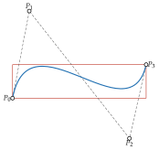

# 三次線段與路徑

<span id="sec-paths"></span>

繪圖端畫的是三次曲線：TikZ 的 `.. controls ..`、SVG 的 `C` 與 Matplotlib 的 `CURVE4` 都接收四個控制點。`CubicBezierSegment` 就是以數值物件表示的三次曲線，`PiecewiseBezier` 則把三次曲線連接成路徑。

## 三次線段

<!-- api: agora.bezierkit.guides_paths_1 -->

不可變的三次曲線，四個控制點即欄位 `p0`、`p1`、`p2`、`p3`（亦可用 `control_points` 或逐一取出）。求值、微分、分割、截取與反轉的方式與 `BezierCurve` 相同，但 `split()`、`segment()` 與 `reversed()` 仍回傳三次線段。`segment(t, t)` 回傳四個控制點都是 $B(t)$ 的退化三次曲線。

## 緊密邊界框

<span id="def-bbox"></span>

!!! abstract "定義 · 軸對齊邊界框"

    非空有界集合 $K \subset \mathbb{R}^d$ 的軸對齊邊界框，是包含 $K$ 的最小方框

    $$
    [\alpha_1, \beta_1] \times \ldots \times [\alpha_d, \beta_d],
    $$

    其中 $\alpha_k = \inf \lbrace x_k : x \in K\rbrace$、$\beta_k = \sup \lbrace x_k : x \in K\rbrace$。

控制點凸包包含曲線（詳見[凸包](curves.md#cor-hull)），但可能比曲線大得多。`bounding_box` 回傳曲線本身的[軸對齊邊界框](paths.md#def-bbox)所定義的方框（參見[三次曲線的緊密邊界框。](paths.md#fig-bbox)），其候選點來自各座標導數的根。

<span id="prop-bbox"></span>

!!! abstract "命題 · 三次曲線的邊界框"

    設 $B$ 是控制點為 $P_0, \ldots, P_3 \in \mathbb{R}^d$ 的三次曲線，令

    $$
    a = -P_0 + 3P_1 - 3P_2 + P_3, \quad b = 3P_0 - 6P_1 + 3P_2, \quad c = 3(P_1 - P_0).
    $$

    則 $B(t) = a t^3 + b t^2 + c t + P_0$。對每個座標 $k$，令 $T_k$ 由 $0$、$1$ 與下式在 $(0, 1)$ 內的根組成

    $$
    B'_k (t) = 3a_k t^2 + 2 b_k t + c_k
    $$

    （此多項式不恆為零時）；若它恆為零，則 $T_k = \lbrace 0, 1\rbrace$。於是 $B([0, 1])$ 的邊界框座標為

    $$
    \alpha_k = \min_{t \in T_k} B_k (t), \quad \beta_k = \max_{t \in T_k} B_k (t).
    $$

<!-- api: agora.bezierkit.guides_paths_2 -->

回傳 `(low, high)` 兩點，分別為曲線在各軸的最小值與最大值，由[三次曲線的邊界框](paths.md#prop-bbox)的候選參數求值而得。

<span id="fig-bbox"></span>

{ .ev-figure-sm }

## 升階

升階（詳見[升階](curves.md#prop-raise-degree)）把 $n$ 次曲線寫成參數化相同的 $n + 1$ 次曲線。本套件用它把直線與二次曲線寫成三次曲線，使每個繪圖端都收到四個控制點。對[升階](curves.md#prop-raise-degree)套用一次或兩次，即得下列控制點。

<span id="prop-elevation"></span>

!!! abstract "命題 · 直線與二次曲線的三次表示"

    由 $P_0$ 到 $P_3$、參數化為 $(1 - t) P_0 + t P_3$ 的直線，是控制點為

    $$
    P_0, \quad P_0 + 1/3 (P_3 - P_0), \quad P_0 + 2/3 (P_3 - P_0), \quad P_3
    $$

    的三次曲線。控制點為 $P_0, C, P_3$ 的二次曲線，是控制點為

    $$
    P_0, \quad P_0 + 2/3 (C - P_0), \quad P_3 + 2/3 (C - P_3), \quad P_3
    $$

    的三次曲線。兩種情形下曲線與其參數化都不變。

<!-- api: agora.bezierkit.guides_paths_3 -->

位於 `bezierkit.bezier`。依[直線與二次曲線的三次表示](paths.md#prop-elevation)將一次、二次或三次 `BezierCurve` 轉為 `CubicBezierSegment`（傳入線段時原樣回傳）；更高次數拋出 `DegreeError`。

<!-- api: agora.bezierkit.guides_paths_4 -->

由 `p0` 到 `p3` 的直線的三次表示。

<!-- api: agora.bezierkit.guides_paths_5 -->

控制點如給定的二次曲線的三次表示。

```python
from bezierkit.bezier import to_cubic

q = BezierCurve.quadratic(Point(0, 0), Point(3, 6), Point(9, 0))
print(to_cubic(q).control_points)
# (Point(coords=(0.0, 0.0)), Point(coords=(2.0, 4.0)),
#  Point(coords=(5.0, 4.0)), Point(coords=(9.0, 0.0)))
```

## 分段路徑

<!-- api: agora.bezierkit.guides_paths_6 -->

由三次線段組成的路徑。相鄰線段必須相接：每段的 `p3` 與下一段的 `p0` 距離不得超過 `continuity_tolerance`，封閉路徑最後的 `p3` 與第一個 `p0` 亦然，否則拋出 `ValueError`。`closed` 是給匯出器的資訊（SVG 的 `Z`、TikZ 的 `cycle`），不會額外加入封閉線段。

本套件以均勻方式將路徑參數化。這是本套件的約定，並非通用概念：由 $m$ 段 $S_0, \ldots, S_{m-1}$ 組成的路徑是映射

$$
P(t) = S_k (m t - k), \quad k = \min(\left\lfloor m t \right\rfloor, m - 1), \quad t \in [0, 1].
$$

不論長短，每段都占 $[0, 1]$ 的 $1 / m$。

```python
from bezierkit import CubicBezierSegment, PiecewiseBezier

path = PiecewiseBezier(
    [
        CubicBezierSegment.from_line(Point(0, 0), Point(2, 0)),
        CubicBezierSegment.from_line(Point(2, 0), Point(2, 4)),
    ]
)
# Point(coords=(2.0, 2.0))
print(path.at(0.75))
# Point(coords=(2.0, 2.0))
print(path.segment(0.25, 0.75).at(1.0))
```

`compound()` 把多條路徑合為一條，各子路徑保持分開，例如有洞的形狀。複合路徑沒有單一的參數化：求值、分割或截取會拋出 `ValueError`；反轉與匯出則可正常使用。分割或截取封閉路徑也會拋出例外（整條路徑或單點除外），因為封閉路徑沒有可保留的起點與終點。

## 連續性

兩條曲線在接點相接。設 $h_S, h_T > 0$，$S : [u_0 - h_S, u_0] \to \mathbb{R}^d$ 與 $T : [u_0, u_0 + h_T] \to \mathbb{R}^d$ 具有所需階數的連續導數（區間端點取單邊導數），$C$ 為在前一區間等於 $S$、在後一區間等於 $T$ 的曲線。

<span id="def-continuity"></span>

!!! abstract "定義 · 參數連續性"

    對 $k \ge 0$，若 $S^{(j)}(u_0) = T^{(j)}(u_0)$ 對 $j = 0, \ldots, k$ 成立，稱曲線 $C$ 在 $u_0$ 為 $C^k$。

<span id="def-geometric-continuity"></span>

!!! abstract "定義 · 幾何連續性 $G^1$"

    若 $S(u_0) = T(u_0)$，切向量 $S'(u_0)$ 與 $T'(u_0)$ 皆非零，且存在 $\lambda > 0$ 使 $T'(u_0) = \lambda S'(u_0)$，稱曲線 $C$ 在 $u_0$ 為 $G^1$；也就是兩側的單位切向量相同。

參數連續性與幾何連續性是連接曲線的標準概念 [Farin (2002)](../project/references.md#farin2002)[Prautzsch (2002)](../project/references.md#prautzsch2002)；任意階 $k$ 的幾何連續性見 [Barsky (1989)](../project/references.md#barsky1989)。本手冊只用到 $C^0$、$C^1$ 與 $G^1$。切向量非零的 $C^1$ 接點必為 $G^1$。

<span id="prop-continuity"></span>

!!! abstract "命題 · 三次曲線接點的連續性"

    設 $S$、$T$ 是控制點分別為 $P_0, \ldots, P_3$ 與 $Q_0, \ldots, Q_3$ 的三次曲線，並分別在 $(u - u_0 + h_S) / h_S$ 與 $(u - u_0) / h_T$ 求值。
    + $C$ 在 $u_0$ 為 $C^0$，若且唯若 $P_3 = Q_0$。
    + 若 $P_3 = Q_0$，則 $C$ 在 $u_0$ 為 $C^1$，若且唯若

    $$
    (P_3 - P_2) / h_S = (Q_1 - Q_0) / h_T.
    $$

    + 若 $P_3 = Q_0$、$P_3 \ne P_2$ 且 $Q_1 \ne Q_0$，則 $C$ 在 $u_0$ 為 $G^1$，若且唯若存在 $\mu > 0$ 使 $Q_1 - Q_0 = \mu (P_3 - P_2)$。
    + 在 `PiecewiseBezier` 的均勻參數化下 $h_S = h_T$，因此第 2 項的條件即為 $P_3 - P_2 = Q_1 - Q_0$。

`PiecewiseBezier` 只要求 $C^0$，也就是端點相接。接點是否也要平滑由呼叫端決定：無異曲線的折角或折線的轉角本來就該保留。
