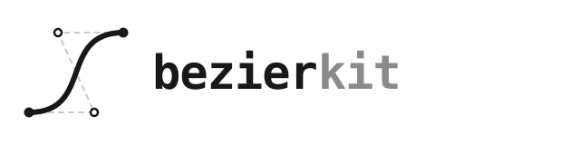

<h1 class="ev-visually-hidden">bezierkit：Python 貝茲曲線工具組</h1>

<p align="center">
  
</p>

<p align="center"><em>小巧且與渲染器無關的貝茲曲線 Python 工具組。</em></p>

<p align="center">
  <a href="https://pypi.org/project/bezierkit/"></a>
  <a href="https://pypi.org/project/bezierkit/"></a>
  <a href="https://opensource.org/licenses/MIT"></a>
</p>

```python
from bezierkit import BezierCurve, Point
from bezierkit.sampling import UniformSampler

curve = BezierCurve.cubic(
    Point(0, 0),
    Point(1, 2),
    Point(3, 2),
    Point(4, 0),
)

# Point(coords=(2.0, 1.5))
print(curve.at(0.5))

# cut the curve in two
left, right = curve.split(0.3)

sample = UniformSampler(200).sample(curve)
print(len(sample.points), "sample points")
```

## 功能特色

<div class="grid cards" markdown>

-   :material-vector-bezier: **任意次數的曲線**

    `BezierCurve`、`CubicBezierSegment` 與 `PiecewiseBezier`，搭配不可變的 `Point`、`Vector` 與 `PointSet` 值物件。

    [:octicons-arrow-right-24: Bézier 曲線](guides/curves.md)

-   :material-function-variant: **求值與分割**

    以 de Casteljau 演算法求值，並對曲線求導、分割、截取與反轉。

    [:octicons-arrow-right-24: 導數、分割與反轉](guides/operations.md)

-   :material-chart-bell-curve: **由斜率建構**

    用 `PlanarSlopes` 由端點與端點斜率建構三次曲線，或由 Hermite 資料建構。

    [:octicons-arrow-right-24: 建構與 Hermite 插值](guides/construction.md)

-   :material-vector-polyline: **擬合與等值線**

    函數圖形的自適應擬合與實測誤差、折線簡化，以及隱函數等值線的描繪。

    [:octicons-arrow-right-24: 擬合](guides/fitting.md)

-   :material-export: **原生匯出**

    具版本的 JSON 格式、SVG 三次路徑資料與 TikZ `controls` 指令，不會攤平成折線。

    [:octicons-arrow-right-24: 取樣與匯出](guides/export.md)

-   :material-console: **選用功能**

    Matplotlib 路徑轉接器與命令列工具。

    [:octicons-arrow-right-24: 命令列](cli.md)

</div>

## 數學與證明

指南把演算法所依據的性質寫成定理：Bernstein 基底的保證、de Casteljau 演算法為何能求值並分割曲線、Hermite 插值最多偏離多少，以及匯出器因四捨五入損失多少精度。每個證明都摺疊在定理下方，點開才會展開，因此頁面平常讀起來就是 API 文件。標準參考書為 Farin (2002) 與 Prautzsch 等人 (2002)，見[參考文獻](project/references.md)。

!!! abstract "符號"

    點位於某個維度 $d \ge 1$ 的 $\mathbb{R}^d$ 中；多數圖使用 $d = 2$。$n$ 次 Bézier 曲線有 $n + 1$ 個控制點
    $P_0, \dots, P_n$，定義為映射

    $$
    B(t) = \sum_{i=0}^{n} b_{i,n}(t)\, P_i, \qquad t \in [0, 1],
    $$

    其中 $b_{i,n}(t) = \binom{n}{i} t^i (1-t)^{n-i}$ 為 Bernstein 多項式。套件中每條曲線的參數範圍都是 $[0, 1]$；
    超出範圍的參數會拋出 `ParameterOutOfDomain`。

## 閱讀指引

| 主題 | 頁面 |
|---|---|
| 點、向量、參數、例外 | [幾何數值物件](guides/geometry.md) |
| Bernstein 基底、曲線、求值 | [Bézier 曲線](guides/curves.md) |
| 導數、分割、反轉 | [導數、分割與反轉](guides/operations.md) |
| 三次線段與分段路徑 | [三次線段與路徑](guides/paths.md) |
| 建構與 Hermite 插值 | [建構與 Hermite 插值](guides/construction.md) |
| 擬合函數與折線 | [擬合](guides/fitting.md) |
| 描繪等值線 | [等值線](guides/implicit.md) |
| 取樣、JSON、SVG、TikZ、Matplotlib | [取樣與匯出](guides/export.md) |
| 命令列 | [命令列](cli.md) |

初次使用時，先讀[快速開始](quickstart.md)與 [Bézier 曲線](guides/curves.md)。

!!! warning "範圍"

    繪圖樣式與圖形語意刻意不在這個套件的範圍內：它本身不繪圖。交點、B 樣條與 NURBS 屬於未來的工作。

## 安裝

```bash
uv add bezierkit
```

需要 Python 3.10 以上。選用功能與開發環境請見[安裝](installation.md)，或直接看[快速入門](quickstart.md)。

<!-- agora-navigation -->

## 文件導覽

以下章節涵蓋 bezierkit 1.0.0。

- [簡介](guides/introduction.md)
- [安裝](installation.md)
- [快速開始](quickstart.md)
- [幾何數值物件](guides/geometry.md)
- [Bézier 曲線](guides/curves.md)
- [導數、反轉與分割](guides/operations.md)
- [三次線段與路徑](guides/paths.md)
- [建構與 Hermite 插值](guides/construction.md)
- [擬合](guides/fitting.md)
- [等值線](guides/implicit.md)
- [取樣與匯出](guides/export.md)
- [命令列介面](cli.md)
- [證明](project/proofs.md)
- [近似方法的證明](project/proofs-approximation.md)
- [更新紀錄](project/changelog.md)

<!-- /agora-navigation -->
