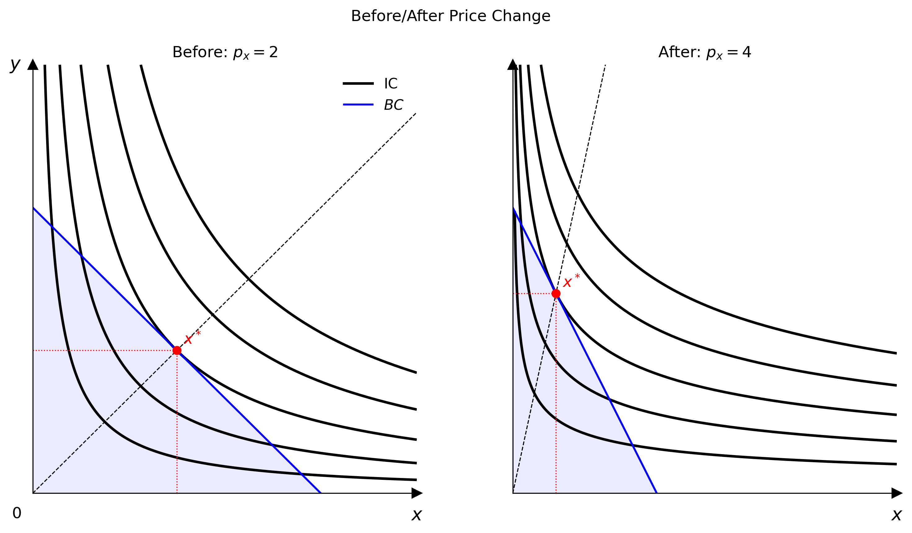
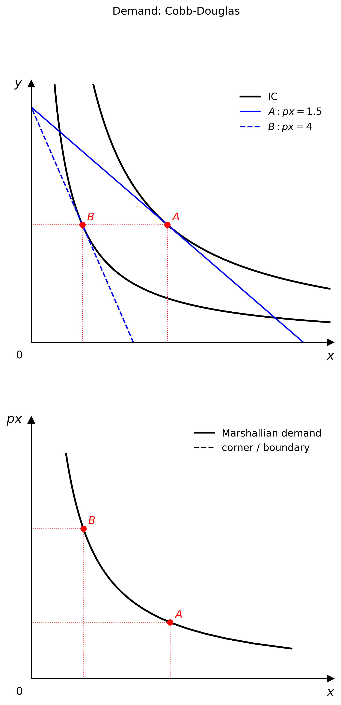

# 多面板圖與需求圖

`econ-viz` 在 `Canvas` 之上提供更高階的教學元件：

- `Figure`：多面板版面
- `PricePath` 與 `IncomePath`：讓預算與均衡隨參數移動
- `DemandDiagram`：連動的商品空間圖與 Marshall 需求圖

## 多面板 `Figure`

一個面板不夠用時就用 `Figure`，例如變動前後的比較、效果分解圖或課堂簡報。

```python
from econ_viz import Figure, Layout, levels, solve
from econ_viz.models import CobbDouglas

fig = Figure(
    Layout.SIDE_BY_SIDE,
    x_max=20,
    y_max=15,
    x_label="x",
    y_label="y",
    title="Before / After Price Change",
    shared_y=True,
)

cases = [
    (CobbDouglas(alpha=0.5, beta=0.5), 2.0, 3.0, 30.0, r"Before: $p_x=2$"),
    (CobbDouglas(alpha=0.3, beta=0.7), 4.0, 3.0, 30.0, r"After: $p_x=4$"),
]

for idx, (model, px, py, income, title) in enumerate(cases):
    eq = solve(model, px=px, py=py, income=income)
    panel = fig[idx]
    panel.ax.set_title(title)
    panel.add_utility(model, levels=levels.around(eq.utility, n=5), label="IC")
    panel.add_budget(px, py, income, fill=True, label="BC")
    panel.add_equilibrium(eq, show_ray=True)

fig[0].show_legend(loc="upper right")
fig.save("figure_side_by_side.png")
```



### 可用的版面

- `Layout.SINGLE`
- `Layout.STACKED`
- `Layout.SIDE_BY_SIDE`
- `Layout.TOP_TWO_BOTTOM_ONE`
- `Layout.TOP_ONE_BOTTOM_TWO`
- `Layout.GRID_2X2`
- `Layout.GRID_3X3`

`Figure[idx]` 會回傳一個面板 `Canvas`，所以版面建好之後，繪圖 API 完全相同。

## 路徑工具

路徑物件會讓某一個預算參數逐步變動，並在每一步重新求解消費者問題。

```python
from econ_viz import IncomePath, LinearBudget, PricePath
from econ_viz.models import CobbDouglas

model = CobbDouglas(alpha=0.5, beta=0.5)
budget = LinearBudget(px=2.0, py=2.0, income=40.0)

price_path = PricePath(model, budget=budget, price="px", price_range=(0.8, 6.0), n=40)
income_path = IncomePath(model, budget=budget, income_range=(20.0, 80.0), n=30)
```

這些路徑可以用來：

- 用 `Canvas.add_path(...)` 畫出 PCC / ICC 形式的均衡軌跡
- 傳入 `DemandDiagram`
- 觀察價格或所得變動時，消費組合如何移動

## `DemandDiagram`

`DemandDiagram` 會建立上下兩個面板的圖：

- **上方面板**：無異曲線、預算線與均衡點
- **下方面板**：對應的 Marshall 需求曲線

```python
from econ_viz import DemandDiagram, LinearBudget, PricePath
from econ_viz.models import CobbDouglas

model = CobbDouglas(alpha=0.5, beta=0.5)
budget = LinearBudget(px=2.0, py=2.0, income=40.0)
path = PricePath(model, budget=budget, price="px", price_range=(0.8, 6.0), n=40)

fig = DemandDiagram(path, title="Demand: Cobb-Douglas")
fig.add_marshallian_panel(
    price_markers=[1.5, 4.0],
    show_pcc=False,
    show_demand_guides=True,
)
fig.save("demand_cobb_douglas.png")
```



### 注意事項

- `DemandDiagram` 目前只接受 `PricePath`
- 平滑、拗折與角解的需求情況會分別處理，讓下方面板在經濟意義上保持正確
- `show_pcc=True` 會在商品空間面板上疊加價格消費曲線

## `Canvas.add_path(...)`

不需要完整的需求圖時，也可以直接在 `Canvas` 上畫出路徑。

```python
from econ_viz import Canvas, levels

eq = price_path.equilibria[len(price_path.equilibria) // 2]
lvls = levels.around(eq.utility, n=5)

Canvas(x_max=25, y_max=20) \
    .add_utility(model, levels=lvls) \
    .add_path(price_path, label="PCC") \
    .save("price_path.png")
```
