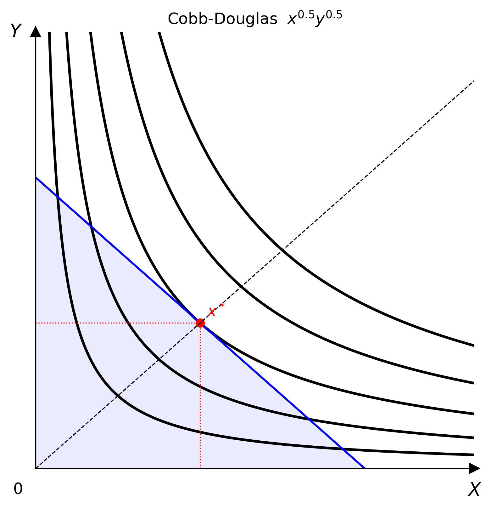

# 快速開始

## 最簡範例

```python
from econ_viz import Canvas, levels, solve
from econ_viz.models import CobbDouglas

model = CobbDouglas(alpha=0.5, beta=0.5)
eq    = solve(model, px=2.0, py=3.0, income=30.0)
lvls  = levels.around(eq.utility, n=5)

cvs = Canvas(x_max=20, y_max=15, x_label="x", y_label="y",
             title=r"Cobb-Douglas $x^{0.5} y^{0.5}$")
cvs.add_utility(model, levels=lvls)
cvs.add_budget(2.0, 3.0, 30.0, fill=True)
cvs.add_equilibrium(eq, show_ray=True)
cvs.save("cobb_douglas.png")
```



## 逐步說明

### 選擇模型

從 `econ_viz.models` 挑一個效用函數。完整清單請見[模型目錄](../models/index.md)。

```python
from econ_viz.models import CobbDouglas
model = CobbDouglas(alpha=0.5, beta=0.5)
```

### 求解均衡

`solve()` 會回傳一個 `Equilibrium` named tuple，欄位有 `x`、`y`、`utility` 與 `bundle_type`。

```python
from econ_viz import solve
eq = solve(model, px=2.0, py=3.0, income=30.0)
print(eq.x, eq.y, round(eq.utility, 3))

# 7.5 5.0 6.124
```

### 效用水準

```python
from econ_viz import levels
lvls = levels.around(eq.utility, n=5)   # 以最適點為中心的 5 條曲線
```

### 建立畫布

```python
from econ_viz import Canvas
cvs = Canvas(x_max=20, y_max=15)
```

### 加入圖層

`Canvas` 的方法都會回傳 `self`，所以可以串接呼叫：

```python
cvs.add_utility(model, levels=lvls)
cvs.add_budget(2.0, 3.0, 30.0, fill=True)
cvs.add_equilibrium(eq, show_ray=True)
```

### 匯出

=== "點陣 / 向量"

    ```python
    cvs.save("figure.png")    # PNG
    cvs.save("figure.pdf")    # PDF
    cvs.save("figure.svg")    # SVG
    ```

=== "互動"

    ```python
    cvs.show()   # 互動視窗
    ```

## LaTeX 解析

```python
from econ_viz import parse_latex, Canvas, levels, solve

model = parse_latex(r"x^{0.4} y^{0.6}")
eq    = solve(model, px=2.0, py=3.0, income=30.0)
lvls  = levels.around(eq.utility, n=5)

Canvas(x_max=20, y_max=15) \
    .add_utility(model, levels=lvls) \
    .add_budget(2.0, 3.0, 30.0) \
    .add_equilibrium(eq) \
    .save("figure.png")
```

## 多面板圖

`Figure` 可以把多個 `Canvas` 面板組合成一張圖。

```python
from econ_viz import Figure, Layout, levels, solve
from econ_viz.models import CobbDouglas

fig = Figure(
    Layout.SIDE_BY_SIDE,
    x_max=20,
    y_max=15,
    x_label="x",
    y_label="y",
    title="Before / After Price Change",
    shared_y=True,
)

cases = [
    (CobbDouglas(alpha=0.5, beta=0.5), 2.0, 3.0, 30.0, r"Before: $p_x=2$"),
    (CobbDouglas(alpha=0.3, beta=0.7), 4.0, 3.0, 30.0, r"After: $p_x=4$"),
]

for idx, (model, px, py, income, title) in enumerate(cases):
    eq = solve(model, px=px, py=py, income=income)
    panel = fig[idx]
    panel.ax.set_title(title)
    panel.add_utility(model, levels=levels.around(eq.utility, n=5))
    panel.add_budget(px, py, income, fill=True)
    panel.add_equilibrium(eq, show_ray=True)

fig.save("comparison.png")
```

## 需求圖

用 `PricePath` 搭配 `DemandDiagram`，把商品空間中的最適點與**Marshall 需求**連結起來。

```python
from econ_viz import DemandDiagram, LinearBudget, PricePath
from econ_viz.models import CobbDouglas

model = CobbDouglas(alpha=0.5, beta=0.5)
budget = LinearBudget(px=2.0, py=2.0, income=40.0)
path = PricePath(
    model,
    budget=budget,
    price="px",
    price_range=(0.8, 6.0),
    n=40,
)

fig = DemandDiagram(path, title="Demand: Cobb-Douglas")
fig.add_marshallian_panel(price_markers=[1.5, 4.0])
fig.save("demand.png")
```


