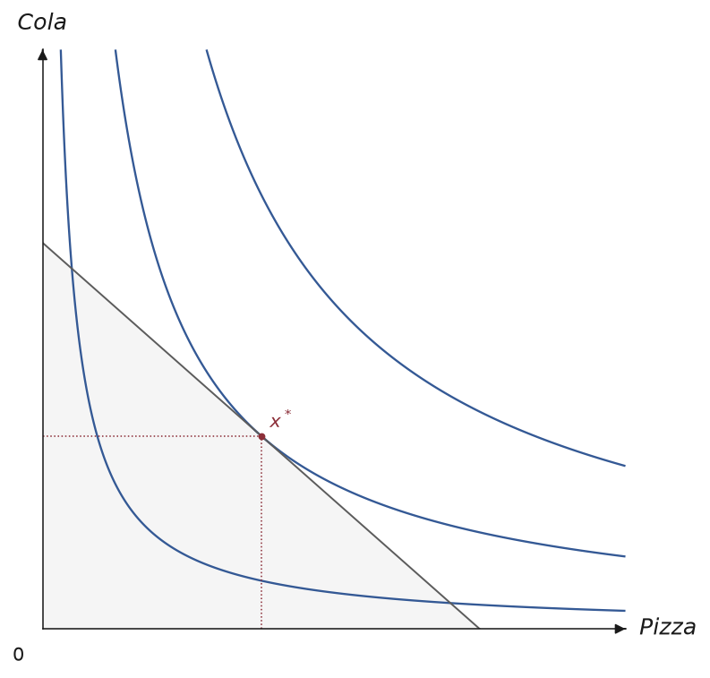
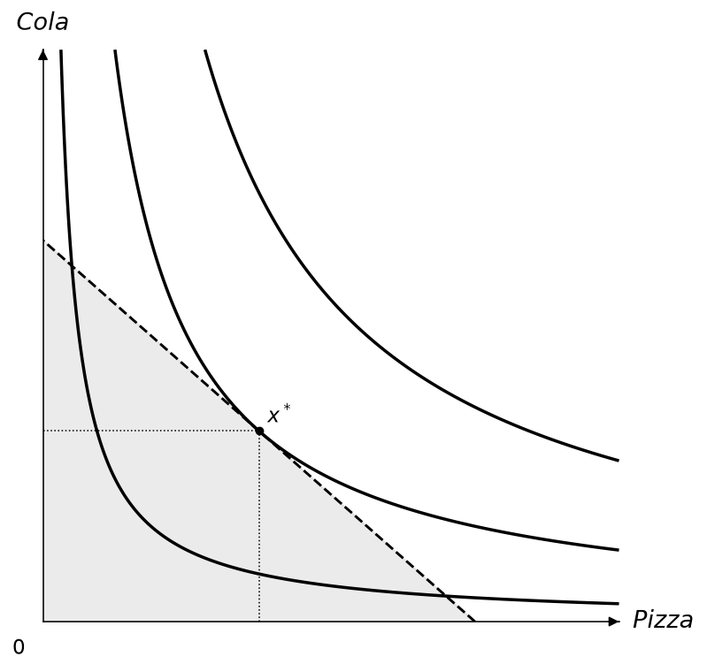
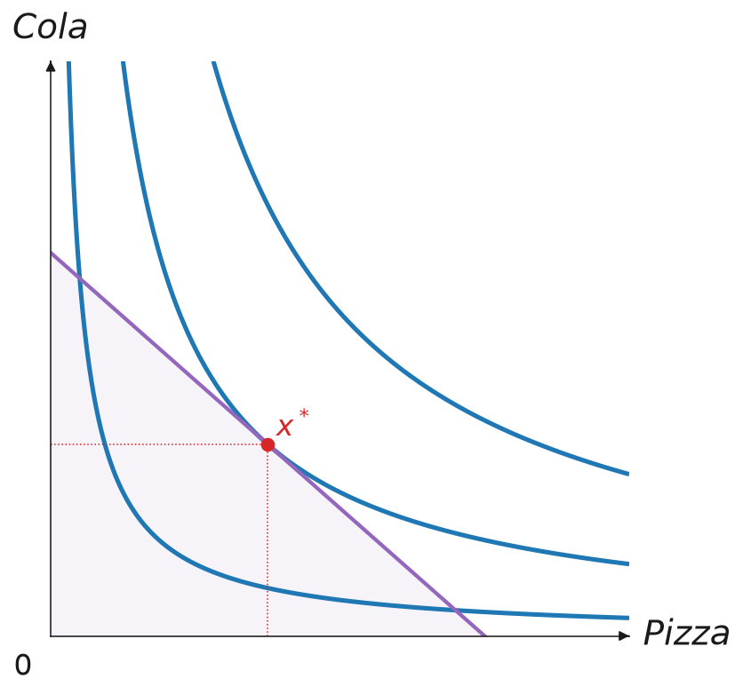
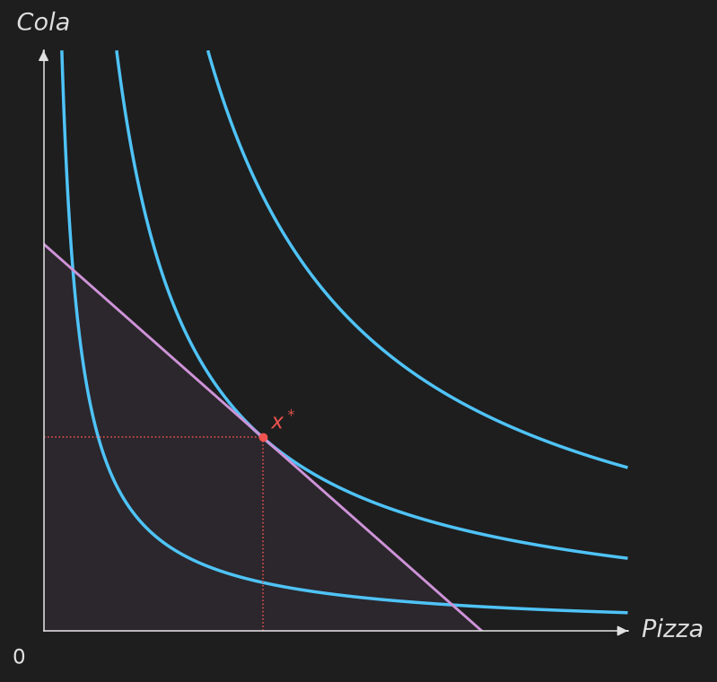

# 主題

主題控制 Canvas 使用的所有顏色與線條粗細。


## 內建主題

### Default

```python
from econ_viz import Canvas, themes

cvs = Canvas(x_max=20, y_max=15, theme=themes.default)
```

預設主題的顏色取自一組**色盲友善**的配色\citep{thriveth2014}，可從 `themes.COLORBLIND_CYCLE_HEX` 與 `themes.COLORBLIND_CYCLE_RGB` 取得。經濟學教學大量依賴圖形，因此不應只靠顏色傳達意義，以免視覺障礙的學生無法辨識\citep{kugler1996}。

### Nord

```python
cvs = Canvas(x_max=20, y_max=15, theme=themes.nord)
```

Nord 主題使用 [Nord 配色](https://www.nordtheme.com/)，以冷色藍與低飽和色調為主，適合學術簡報。


### Paper

```python
cvs = Canvas(x_max=20, y_max=15, theme=themes.paper)
```

Paper 主題使用較細的線條、較小的標記，以及節制的字級，背景透明，適合印刷或期刊排版對墨量與版面較敏感的場合。



### Monochrome

```python
cvs = Canvas(x_max=20, y_max=15, theme=themes.monochrome)
```

Monochrome 主題完全不使用顏色，所有元素都是灰階，改以**線條樣式**區分曲線、預算線與射線，並以**標記形狀**區分不同的點。適合黑白列印，或需要完全不依賴顏色辨識的色盲友善場合。



### Presentation

```python
cvs = Canvas(x_max=20, y_max=15, theme=themes.presentation)
```

Presentation 主題使用較大的文字、較粗的線條與較大的標記，適合投影幕或演講廳等需要遠距離辨識的場合。



### Dark

```python
cvs = Canvas(x_max=20, y_max=15, theme=themes.dark)
```

Dark 主題使用深色背景搭配淺色前景，適合深色模式的投影片或網站。



## 自訂主題

建構子可以只傳入想改的欄位，其他保留內建預設值：

```python
from econ_viz import Theme

my_theme = Theme(
    name="custom",
    axis_color="#333333",
    label_color="#333333",
    ic_color="#2563eb",
    ic_linewidth=1.5,
    budget_color="#dc2626",
    eq_color="#16a34a",
    eq_markersize=6.0,
)

cvs = Canvas(x_max=20, y_max=15, theme=my_theme)
```

圖上每一條線、每一種標記、填色、標籤與 legend，也都有一個由上面欄位組成的整體預設值，例如 `theme.ic_stroke`、`theme.eq_marker`、`theme.point_label`。如果想整組改（例如讓 Edgeworth 箱形圖的 core 段除了顏色，還要有箭頭），可以繼承 `Theme` 並覆寫該屬性：

```python
from econ_viz import ArrowStyle, Stroke, Theme

class MyTheme(Theme):
    @property
    def core_stroke(self) -> Stroke:
        return Stroke(width=3.0, color="#C0392B", arrow=ArrowStyle.TRIANGLE)

cvs = EdgeworthBox(..., theme=MyTheme(name="my-theme"))
```

方法明確傳入的參數（例如 `add_core(stroke=...)`）仍然優先於主題，主題則優先於內建預設值，跟[設定檔](config.md)的優先順序一致。

## 主題欄位

| 欄位 | 說明 |
|------|------|
| `name` | 主題名稱 |
| `axis_color` | 座標軸與箭頭的顏色 |
| `label_color` | 座標軸標籤與原點標籤的顏色 |
| `ic_color`、`ic_linewidth` | 無異曲線的顏色與線寬 |
| `secondary_ic_color`、`secondary_ic_linewidth`、`secondary_ic_opacity` | 強調主要效用水準時，其餘淡化曲線的顏色、線寬與不透明度 |
| `path_color`、`path_linewidth` | PCC / ICC 路徑的顏色與線寬 |
| `budget_color`、`budget_linewidth` | 預算線的顏色與線寬 |
| `budget_fill_alpha` | 可行集合陰影的不透明度 |
| `eq_color`、`eq_markersize` | 均衡點的顏色與大小 |
| `ray_color`、`ray_linewidth` | 擴張路徑射線的顏色與線寬 |
| `kink_color` | 拗折點標記的顏色 |
| `sub_effect_color`、`inc_effect_color` | 替代效果、所得效果箭頭的顏色 |
| `effect_arrow_linewidth` | 效果箭頭的線寬 |
| `compensated_budget_color`、`compensated_budget_linewidth`、`compensated_budget_linestyle` | 分解圖中補償後預算線的樣式 |
| `subsistence_color`、`subsistence_linewidth` | Stone-Geary 最低消費參考線 |
| `contract_color`、`contract_linewidth` | Edgeworth 契約曲線 |
| `core_color`、`core_linewidth` | Edgeworth core |
| `price_color`、`price_linewidth` | Edgeworth 價格線 |
| `walrasian_color`、`walrasian_markersize` | Edgeworth Walrasian 均衡點標記 |
| `axis_stroke`、`drop_stroke`、`projection_stroke`、`guide_stroke`、`box_stroke` | 沒有各自顏色／線寬欄位的線條 |

## 樣式屬性

以下每個屬性都是由上面的欄位組成的 [`Stroke`](canvas.md#styles)、[`Marker`](canvas.md#styles)、[`Label`](canvas.md#styles)、[`Fill`](canvas.md#styles) 或 [`Legend`](canvas.md#styles)。在子類別中覆寫某個屬性，會影響所有沒有另外傳入該項目參數的圖形；[設定檔](config.md)的 `[stroke.<name>]`、`[marker.<name>]`、`[label.<name>]`、`[fill.<name>]` 段落設定的正是同一批屬性。

| 種類 | 屬性 |
|------|------|
| Stroke | `ic_stroke`、`secondary_ic_stroke`、`budget_stroke`、`ray_stroke`、`path_stroke`、`compensated_budget_stroke`、`final_budget_stroke`、`substitution_stroke`、`income_stroke`、`subsistence_stroke`、`contract_stroke`、`core_stroke`、`price_stroke`、`axis_stroke`、`drop_stroke`、`projection_stroke`、`guide_stroke`、`box_stroke` |
| Marker | `eq_marker`、`point_marker`、`kink_marker`、`bliss_marker`、`path_marker`、`core_marker`、`endowment_marker`、`walrasian_marker` |
| Label | `axis_label`、`origin_label`、`title_label`、`box_label`、`effect_label`、`point_label`、`bundle_label`、`bliss_label`、`ic_label`、`edgeworth_label` |
| Fill | `budget_fill` |
| Legend | `legend` |
