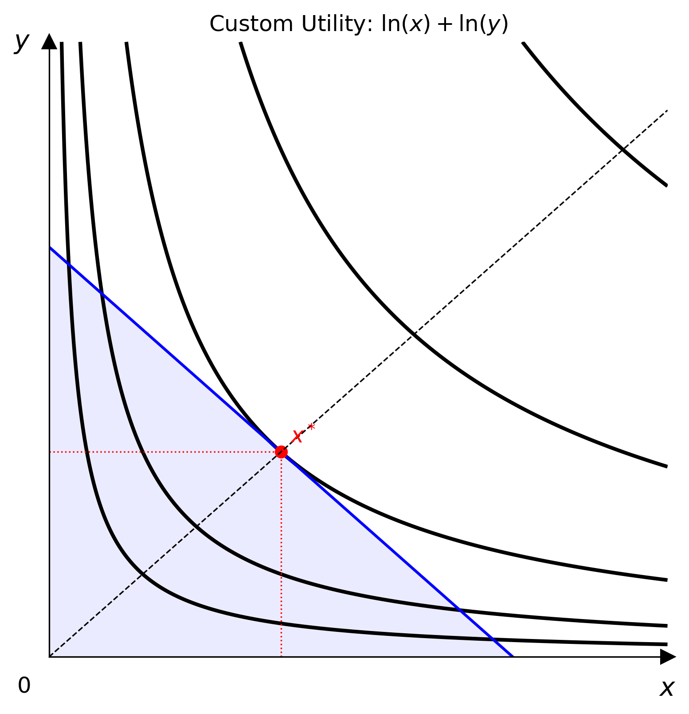
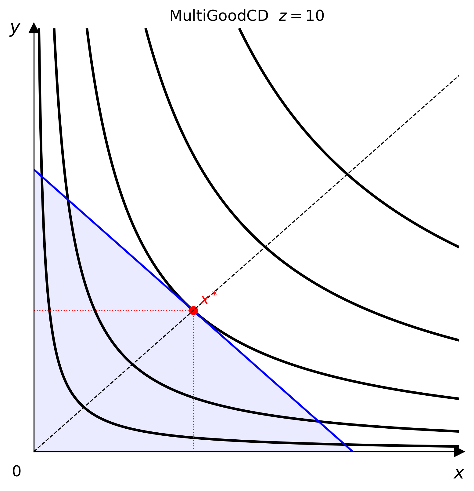

# 進階模型



## 自訂效用函數 {#custom-utility}

把任何向量化的 Python 可呼叫函數，包裝成完整的效用模型。

```python
import numpy as np
from econ_viz.models import CustomUtility

model = CustomUtility(
    func=lambda x, y: np.log(x) + np.log(y),
    name="log+log",
)
```

建立模型時，會用一組隨機的 NumPy 網格檢查這個函數。它必須接受兩個陣列參數，並回傳形狀相同的陣列。

### 完整範例

```python
import numpy as np
from econ_viz import Canvas, levels, solve
from econ_viz.models import CustomUtility

model = CustomUtility(func=lambda x, y: np.log(x) + np.log(y), name="log+log")
eq    = solve(model, px=2.0, py=3.0, income=30.0)
lvls  = levels.around(eq.utility, n=5)

Canvas(x_max=20, y_max=15, title="Custom: $\\ln x + \\ln y$") \
    .add_utility(model, levels=lvls) \
    .add_budget(2.0, 3.0, 30.0) \
    .add_equilibrium(eq) \
    .save("custom.png")
```

---

## 多商品 Cobb-Douglas {#multi-good-cobb-douglas}

描述 $N$ 種商品的偏好，並把 x 與 y 以外的商品全部固定，投影到 2 維畫布上。

```python
from econ_viz.models import MultiGoodCD

m3   = MultiGoodCD({'x': 0.3, 'y': 0.3, 'z': 0.4})
flat = m3.freeze(z=10.0)   # returns a CustomUtility ready for Canvas
```

`freeze()` 接受 `x`、`y` 以外每種商品的關鍵字參數，把它們固定在給定的數值，並回傳一個以 x 和 y 為變數的 `CustomUtility`。



### 完整範例

```python
from econ_viz import Canvas, levels, solve
from econ_viz.models import MultiGoodCD

m3   = MultiGoodCD({'x': 0.3, 'y': 0.3, 'z': 0.4})
flat = m3.freeze(z=10.0)

eq   = solve(flat, px=2.0, py=3.0, income=30.0)
lvls = levels.around(eq.utility, n=5)

Canvas(x_max=20, y_max=15, title=r"MultiGoodCD $z=10$") \
    .add_utility(flat, levels=lvls) \
    .add_budget(2.0, 3.0, 30.0, fill=True) \
    .add_equilibrium(eq) \
    .save("multigood.png")
```
