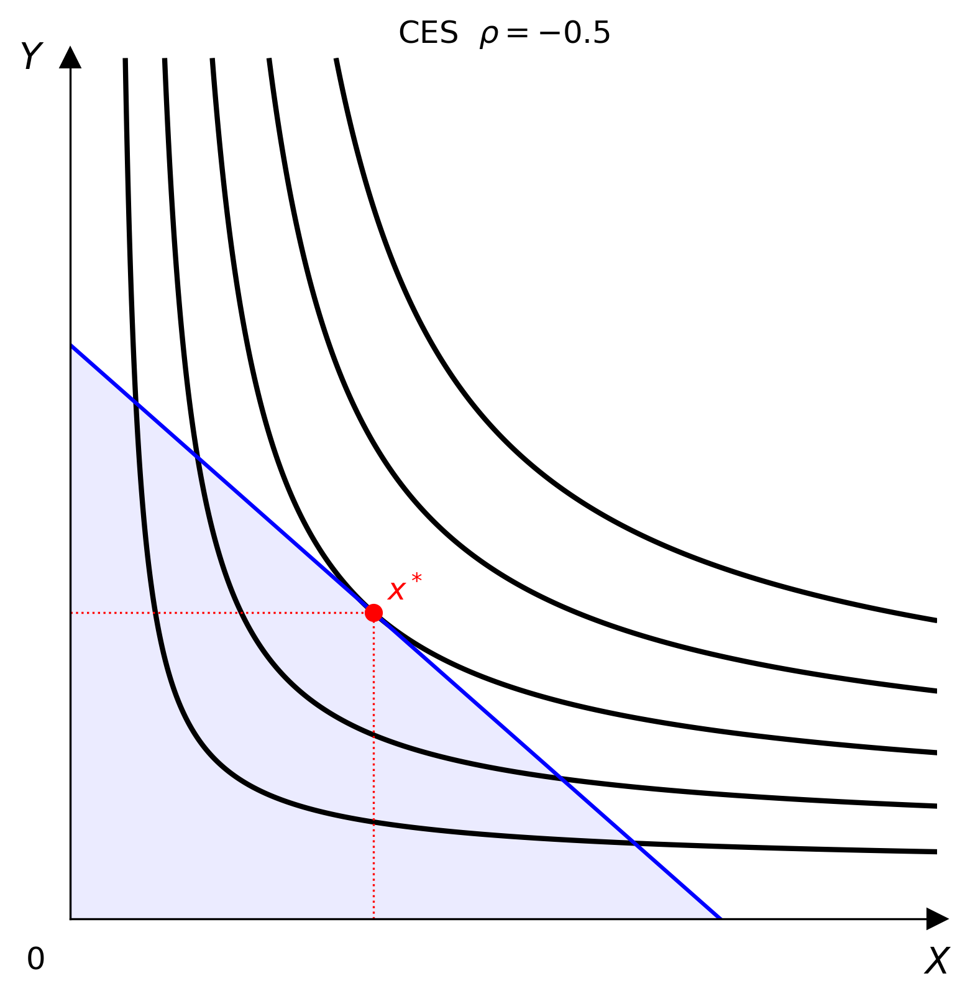
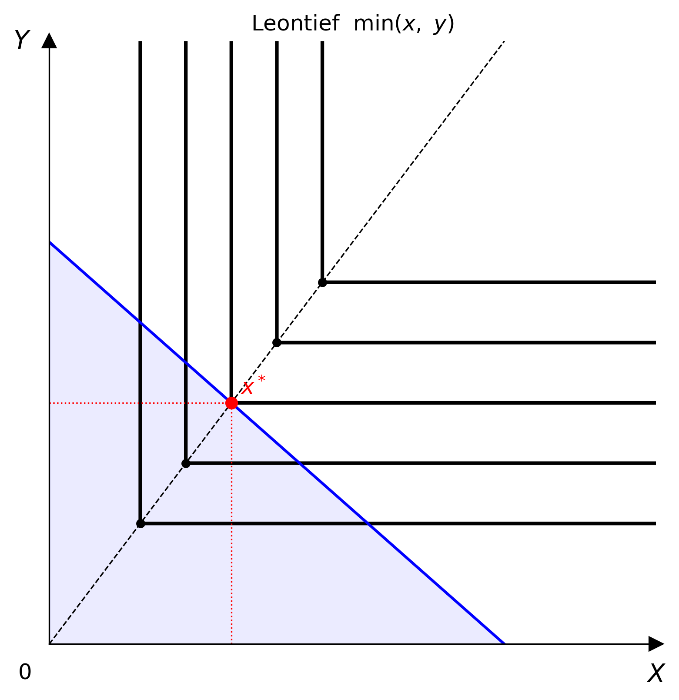
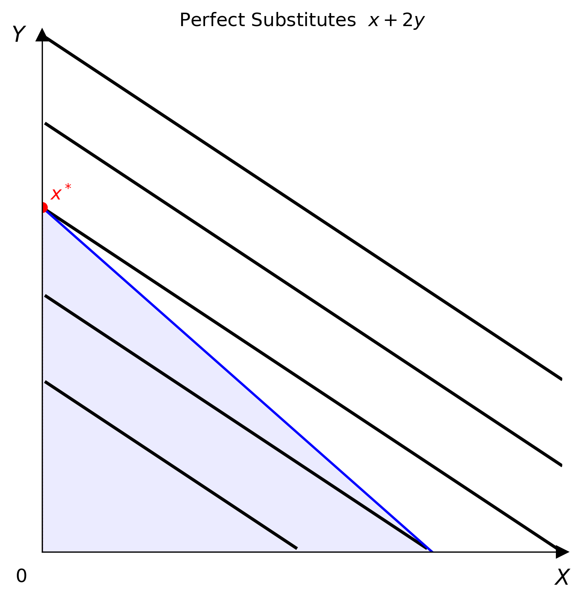
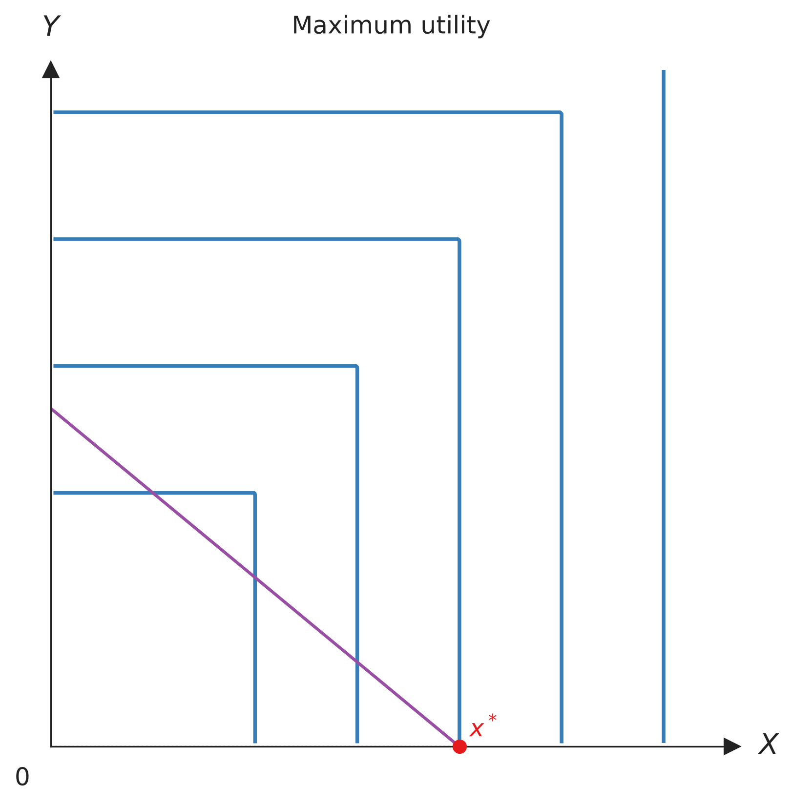
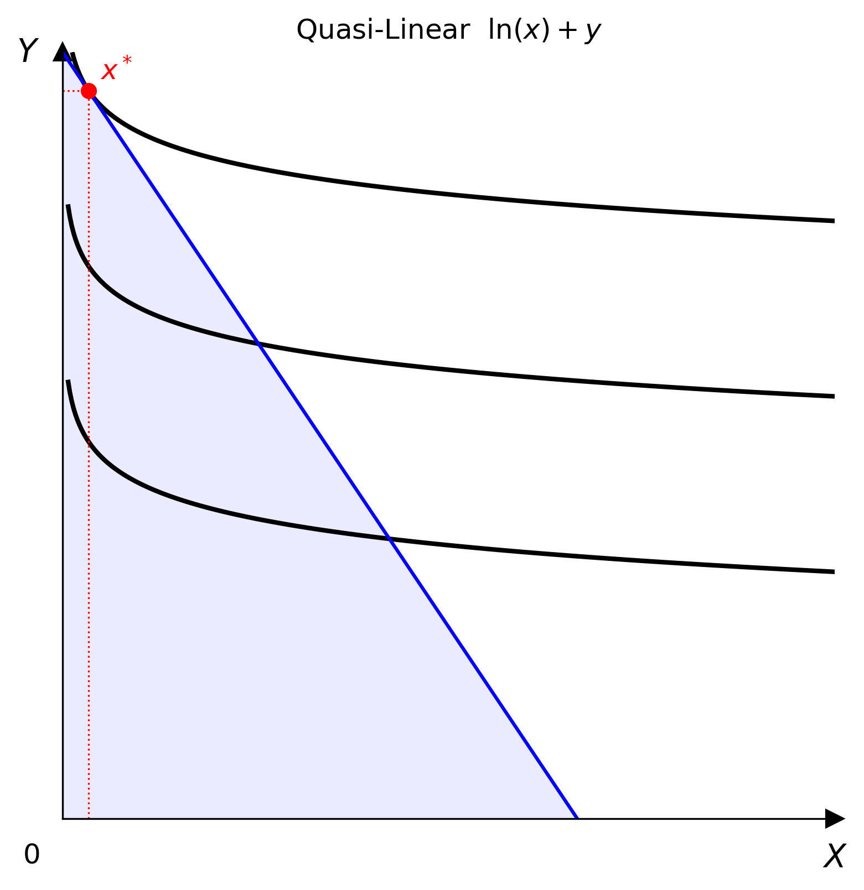
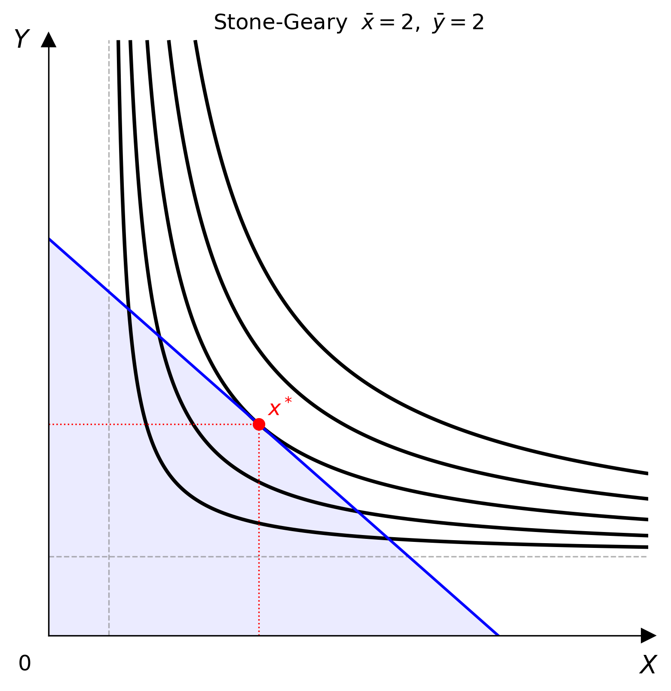

# 核心模型

核心模型涵蓋平滑偏好、折點與線性偏好，以及具有所得或參考點效果的偏好。
先選擇模型群組，再用分頁切換並比較模型。

## 平滑偏好

這組模型會產生平滑的無異曲線；價格與所得為正時，通常會得到內點解。

=== "Cobb-Douglas"

    Cobb-Douglas 是描述平滑、嚴格凸偏好的標準模型。

    $$
    U(x,y)=x^\alpha y^\beta
    $$

    指數決定兩種商品在效用中的相對權重。無異曲線會接近兩軸，但不會碰到兩軸。

    **參數**

    | 參數 | 預設值 | 意義 |
    |------|--------|------|
    | `alpha` | `0.5` | 商品 $x$ 的權重 |
    | `beta` | `0.5` | 商品 $y$ 的權重 |

    **程式碼**

    ```python
    from econ_viz import Canvas, levels, solve
    from econ_viz.models import CobbDouglas

    model = CobbDouglas(alpha=0.5, beta=0.5)
    eq = solve(model, px=2.0, py=3.0, income=30.0)

    (
        Canvas(x_max=20, y_max=15, title="Cobb-Douglas")
        .add_utility(model, levels=levels.around(eq.utility, n=5))
        .add_budget(2.0, 3.0, 30.0, fill=True)
        .add_equilibrium(eq, show_ray=True)
        .save("cobb_douglas.png")
    )
    ```

    

=== "CES"

    CES 能在維持平滑偏好的同時，調整兩種商品的替代難易度。

    $$
    U(x,y)=\left(\alpha x^\rho+\beta y^\rho\right)^{1/\rho}
    $$

    替代彈性是 $\sigma=1/(1-\rho)$。改變 $\rho$ 時，CES 會接近
    Cobb-Douglas、完全互補或完全替代。

    **參數**

    | 參數 | 預設值 | 意義 |
    |------|--------|------|
    | `alpha` | `0.5` | 商品 $x$ 的權重 |
    | `beta` | `0.5` | 商品 $y$ 的權重 |
    | `rho` | `0.5` | 替代參數，且 $\rho\ne1$ |

    **程式碼**

    ```python
    from econ_viz import Canvas, levels, solve
    from econ_viz.models import CES

    model = CES(alpha=0.5, beta=0.5, rho=-0.5)
    eq = solve(model, px=2.0, py=3.0, income=30.0)

    (
        Canvas(x_max=20, y_max=15, title="CES")
        .add_utility(model, levels=levels.around(eq.utility, n=5))
        .add_budget(2.0, 3.0, 30.0)
        .add_equilibrium(eq)
        .save("ces.png")
    )
    ```

    

=== "Translog"

    Translog 是描述平滑偏好的彈性對數二次模型。

    $$
    \begin{aligned}
    \ln U(x,y)={}&\alpha_0+\alpha_x\ln x+\alpha_y\ln y\\
    &+\tfrac12\beta_{xx}(\ln x)^2
    +\tfrac12\beta_{yy}(\ln y)^2
    +\beta_{xy}\ln x\ln y
    \end{aligned}
    $$

    二次項與交叉項讓曲率能隨消費組合改變。所有 $\beta$ 係數都設為零時，
    會得到類似 Cobb-Douglas 的對數線性形式。

    **參數**

    | 參數 | 預設值 | 意義 |
    |------|--------|------|
    | `alpha_0` | `0.0` | 對數效用截距 |
    | `alpha_x` | `0.5` | $\ln x$ 的一次項權重 |
    | `alpha_y` | `0.5` | $\ln y$ 的一次項權重 |
    | `beta_xx` | `0.0` | $x$ 方向的曲率 |
    | `beta_yy` | `0.0` | $y$ 方向的曲率 |
    | `beta_xy` | `0.0` | $x$ 與 $y$ 的交叉效果 |

    **程式碼**

    ```python
    from econ_viz import Canvas, levels, solve
    from econ_viz.models import Translog

    model = Translog(alpha_x=0.6, alpha_y=0.4, beta_xy=0.12)
    eq = solve(model, px=2.0, py=3.0, income=30.0)

    (
        Canvas(x_max=18, y_max=12, title="Translog")
        .add_utility(model, levels=levels.around(eq.utility, n=4))
        .add_budget(2.0, 3.0, 30.0)
        .add_equilibrium(eq)
        .save("translog.png")
    )
    ```

    

## 折點與角點

這組模型呈現不平滑或線性偏好如何改變最適點的位置。

=== "完全互補"

    完全互補偏好描述以固定比例搭配消費的商品。

    $$
    U(x,y)=\min(ax,by)
    $$

    無異曲線呈 L 型。最適點位於兩個加權數量相等的拗折點。

    **參數**

    | 參數 | 預設值 | 意義 |
    |------|--------|------|
    | `a` | `1.0` | 商品 $x$ 的權重 |
    | `b` | `1.0` | 商品 $y$ 的權重 |

    **程式碼**

    ```python
    from econ_viz import Canvas, levels, solve
    from econ_viz.models import Leontief

    model = Leontief(a=1.0, b=1.0)
    eq = solve(model, px=2.0, py=3.0, income=30.0)

    (
        Canvas(x_max=20, y_max=15, title="完全互補")
        .add_utility(
            model,
            levels=levels.around(eq.utility, n=5),
            show_rays=True,
            show_kinks=True,
        )
        .add_budget(2.0, 3.0, 30.0)
        .add_equilibrium(eq)
        .save("leontief.png")
    )
    ```

    

=== "完全替代"

    完全替代偏好讓兩種商品之間的效用交換比例維持固定。

    $$
    U(x,y)=ax+by
    $$

    無異曲線是直線。消費者通常只選擇每元邊際效用較高的商品，因此形成角點解。

    **參數**

    | 參數 | 預設值 | 意義 |
    |------|--------|------|
    | `a` | `1.0` | 商品 $x$ 的邊際效用 |
    | `b` | `1.0` | 商品 $y$ 的邊際效用 |

    **程式碼**

    ```python
    from econ_viz import Canvas, levels, solve
    from econ_viz.models import PerfectSubstitutes

    model = PerfectSubstitutes(a=1.0, b=2.0)
    eq = solve(model, px=2.0, py=3.0, income=30.0)

    (
        Canvas(x_max=20, y_max=15, title="Perfect Substitutes")
        .add_utility(model, levels=levels.around(eq.utility, n=5))
        .add_budget(2.0, 3.0, 30.0)
        .add_equilibrium(eq)
        .save("perfect_substitutes.png")
    )
    ```

    

=== "最大值效用"

    最大值效用只取每個消費組合中較大的加權數量。

    $$
    U(x,y)=\max(ax,by)
    $$

    每條無異曲線有兩條朝坐標軸延伸的直角線段，因此偏好不是凸的。在
    線性預算限制下，最適選擇通常落在加權效用較高的軸截距。

    **參數**

    | 參數 | 預設值 | 意義 |
    |------|--------|------|
    | `a` | `1.0` | 商品 $x$ 的權重 |
    | `b` | `1.0` | 商品 $y$ 的權重 |

    **程式碼**

    ```python
    import numpy as np
    from econ_viz import Canvas, levels, solve
    from econ_viz.models import CustomUtility

    a, b = 1.0, 1.0
    model = CustomUtility(
        func=lambda x, y: np.maximum(a * x, b * y),
        name="maximum",
    )
    eq = solve(model, px=2.0, py=3.0, income=30.0)

    (
        Canvas(x_max=25, y_max=20, title="最大值效用")
        .add_utility(model, levels=levels.around(eq.utility, n=5))
        .add_budget(2.0, 3.0, 30.0)
        .add_equilibrium(eq)
        .save("maximum.png")
    )
    ```

    

## 所得與參考點

這組模型加入特殊所得效果、基本需求量或偏好的消費參考點。

=== "準線性"

    準線性偏好讓其中一種商品以線性方式進入效用。

    $$
    U(x,y)=f(x)+y
    $$

    得到內點解後，非線性商品沒有所得效果。`linear_in` 可以對調 $x$ 與 $y$
    的角色。

    **參數**

    | 參數 | 預設值 | 意義 |
    |------|--------|------|
    | `v_func` | `numpy.log` | 遞增且凹的函數 $f$ |
    | `linear_in` | `"y"` | 線性進入的商品 |

    **程式碼**

    ```python
    import numpy as np
    from econ_viz import Canvas, levels, solve
    from econ_viz.models import QuasiLinear

    model = QuasiLinear(v_func=np.log, linear_in="y")
    eq = solve(model, px=2.0, py=1.0, income=20.0)

    (
        Canvas(x_max=15, y_max=15, title="Quasi-Linear")
        .add_utility(model, levels=levels.around(eq.utility, n=5))
        .add_budget(2.0, 1.0, 20.0)
        .add_equilibrium(eq)
        .save("quasi_linear.png")
    )
    ```

    

=== "Stone-Geary"

    Stone-Geary 在 Cobb-Douglas 中加入最低消費需求。

    $$
    U(x,y)=(x-\bar{x})^\alpha(y-\bar{y})^\beta
    $$

    消費者先滿足基本需求量 $\bar{x}$ 與 $\bar{y}$，再像 Cobb-Douglas 消費者
    一樣分配剩餘所得。

    **參數**

    | 參數 | 預設值 | 意義 |
    |------|--------|------|
    | `alpha` | `0.5` | 超額 $x$ 的權重 |
    | `beta` | `0.5` | 超額 $y$ 的權重 |
    | `bar_x` | `1.0` | 基本需求量 $\bar{x}$ |
    | `bar_y` | `1.0` | 基本需求量 $\bar{y}$ |

    **程式碼**

    ```python
    from econ_viz import Canvas, levels, solve
    from econ_viz.models import StoneGeary

    model = StoneGeary(alpha=0.5, beta=0.5, bar_x=2.0, bar_y=2.0)
    eq = solve(model, px=2.0, py=3.0, income=30.0)

    (
        Canvas(x_max=20, y_max=15, title="Stone-Geary")
        .add_utility(model, levels=levels.around(eq.utility, n=5))
        .add_budget(2.0, 3.0, 30.0, fill=True)
        .add_equilibrium(eq)
        .save("stone_geary.png")
    )
    ```

    

=== "飽和"

    飽和偏好有一個使效用達到最高的極樂點。

    $$
    U(x,y)=-a(x-x^*)^2-b(y-y^*)^2
    $$

    離開 $(x^*,y^*)$ 後，效用往任何方向都會下降，因此無異曲線是封閉橢圓，
    且偏好不具單調性。

    **參數**

    | 參數 | 預設值 | 意義 |
    |------|--------|------|
    | `bliss_x` | `5.0` | 極樂點座標 $x^*$ |
    | `bliss_y` | `5.0` | 極樂點座標 $y^*$ |
    | `a` | `1.0` | $x$ 軸方向的曲率 |
    | `b` | `1.0` | $y$ 軸方向的曲率 |

    **程式碼**

    ```python
    import numpy as np
    from econ_viz import Canvas, levels
    from econ_viz.models import Satiation

    model = Satiation(bliss_x=6.0, bliss_y=4.0)
    x = np.linspace(0.1, 12.0, 300)
    y = np.linspace(0.1, 10.0, 300)
    X, Y = np.meshgrid(x, y)

    (
        Canvas(x_max=12, y_max=10, title="Satiation")
        .add_utility(model, levels=levels.percentile(model(X, Y), n=5))
        .save("satiation.png")
    )
    ```

    

自訂函數與多商品 Cobb-Douglas 模型請見[進階模型](advanced.md)。
