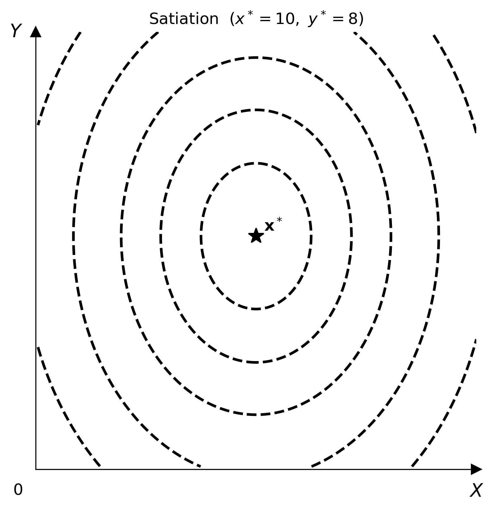

# 飽和（極樂點）

$$U(x, y) = -a(x - x^*)^2 - b(y - y^*)^2$$

效用越接近**極樂點** $(x^*, y^*)$ 越高，往任何方向遠離都會下降。無異曲線是以極樂點為中心的封閉橢圓。這違反了標準的**單調性公設**：消費者有可能擁有**太多**某種商品。



## 參數

| 參數 | 型別 | 預設值 | 說明 |
|-----------|------|---------|-------------|
| `bliss_x` | float | 5.0 | 極樂點 $x^*$ 的 $x$ 座標 |
| `bliss_y` | float | 5.0 | 極樂點 $y^*$ 的 $y$ 座標 |
| `a` | float | 1.0 | 沿 $x$ 軸的曲率（必須為正） |
| `b` | float | 1.0 | 沿 $y$ 軸的曲率（必須為正） |

## 最適化

消費者求解

$$\max_{x,\,y}\; -a(x-x^*)^2 - b(y-y^*)^2 \quad \text{s.t.}\quad p_x x + p_y y = I$$

Lagrangian 函數為

$$\mathcal{L}(x, y, \lambda) = -a(x-x^*)^2 - b(y-y^*)^2 - \lambda\,(p_x x + p_y y - I)$$

一階條件：

$$\begin{aligned}
\frac{\partial \mathcal{L}}{\partial x} &= -2a(x - x^*) - \lambda p_x = 0 \\[6pt]
\frac{\partial \mathcal{L}}{\partial y} &= -2b(y - y^*) - \lambda p_y = 0 \\[6pt]
\frac{\partial \mathcal{L}}{\partial \lambda} &= p_x x + p_y y - I = 0
\end{aligned}$$

把前兩個條件相除，得到切點條件：

$$\frac{a(x - x^*)}{b(y - y^*)} = \frac{p_x}{p_y}$$

如果極樂點 $(x^*, y^*)$ 位於預算集合內部（也就是 $p_x x^* + p_y y^* \le I$），無限制的最大值就出現在極樂點本身，消費者**不會花完所有所得**。

!!! note "注意"
    `Satiation` 不能搭配 `solve()` 使用，因為標準的預算切點最適解可能落在極樂點的橢圓之外。在命令列工具中請加上 `--no-budget --no-equilibrium`，在 Python 中則省略 `add_budget` / `add_equilibrium`。

`add_utility()` 預設會在極樂點畫一個 ★ 標記（`show_bliss=True`）。傳入 `show_bliss=False` 可以隱藏它。

## 使用方式

=== "Python"

    ```python
    import numpy as np
    from econ_viz import Canvas, levels
    from econ_viz.models import Satiation

    model = Satiation(bliss_x=6.0, bliss_y=4.0)

    x_pts = np.linspace(0.1, 12, 300)
    y_pts = np.linspace(0.1, 10, 300)
    X, Y  = np.meshgrid(x_pts, y_pts)
    lvls  = levels.percentile(model(X, Y), n=5)

    Canvas(x_max=12, y_max=10, title="Satiation — bliss at $(6, 4)$") \
        .add_utility(model, levels=lvls, show_bliss=True) \
        .save("satiation.png")

    # Pass show_bliss=False to hide the marker
    Canvas(x_max=12, y_max=10) \
        .add_utility(model, levels=lvls, show_bliss=False) \
        .save("satiation_no_marker.png")
    ```

=== "CLI"

    ```bash
    econ-viz plot --model satiation --bliss-x 6 --bliss-y 4 \
                  --x-max 12 --y-max 10 \
                  --no-budget --no-equilibrium \
                  --output satiation.png
    ```
