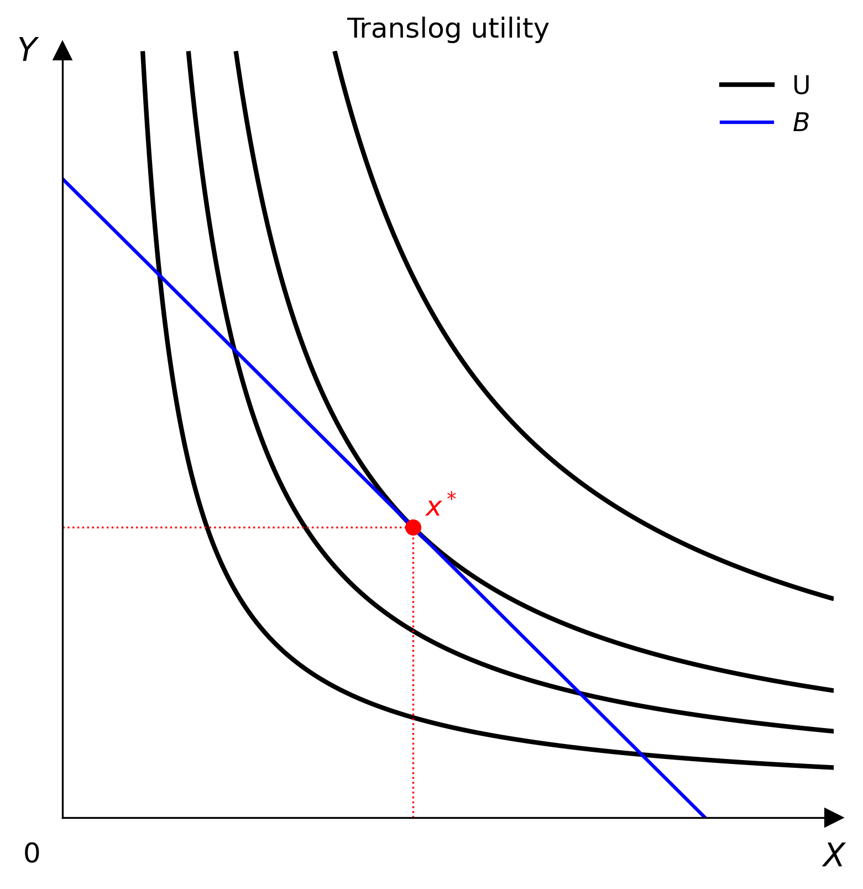

# Translog

`Translog` 提供一種彈性的**對數二次**效用設定，可以近似各種平滑的偏好。



```python
from econ_viz.models import Translog

model = Translog(
    alpha_x=0.5,
    alpha_y=0.5,
    beta_xx=0.1,
    beta_yy=-0.05,
    beta_xy=0.08,
)
```

## 函數形式

```text
ln U(x, y) = alpha_0
           + alpha_x ln x + alpha_y ln y
           + 0.5 beta_xx (ln x)^2
           + 0.5 beta_yy (ln y)^2
           + beta_xy ln x ln y
```

實作回傳的是：

```text
U(x, y) = exp(ln U(x, y))
```

令 `beta_xx = beta_yy = beta_xy = 0`，模型就會退化成 Cobb-Douglas 式的對數線性形式。

## 參數

| 參數 | 預設值 | 意義 |
|-----------|---------|---------|
| `alpha_x` | `0.5` | `ln x` 的一次項係數 |
| `alpha_y` | `0.5` | `ln y` 的一次項係數 |
| `beta_xx` | `0.0` | `ln x` 的二次自身效果 |
| `beta_yy` | `0.0` | `ln y` 的二次自身效果 |
| `beta_xy` | `0.0` | 交叉項 `ln x ln y` |
| `alpha_0` | `0.0` | 對數效用的截距 |

`alpha_x` 與 `alpha_y` 必須**嚴格大於零**。

## 性質

- `utility_type` 為 `UtilityType.SMOOTH`
- 可搭配 `Canvas.add_utility(...)` 使用
- 可透過套件的數值最適化流程搭配 `solve(...)` 使用

## 範例

```python
from econ_viz import Canvas, levels, solve
from econ_viz.models import Translog

model = Translog(alpha_x=0.6, alpha_y=0.4, beta_xy=0.12)
eq = solve(model, px=2.0, py=3.0, income=30.0)
lvls = levels.around(eq.utility, n=4)

Canvas(x_max=18, y_max=12, title="Translog utility") \
    .add_utility(model, levels=lvls, label="$U$") \
    .add_budget(2.0, 3.0, 30.0, label="$B$") \
    .add_equilibrium(eq) \
    .show_legend()
```
