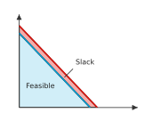
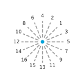
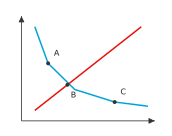

# 區域標籤與點標籤

標籤用來命名已繪製的填色區域或點。標籤圖層會在所有其他圖層之後，由延後處理程序繪製，因此能判斷必須避開哪些物件。點標籤先於區域標籤配置；每個已配置的標籤，都會成為後續標籤的障礙物。

## 區域標籤

<!-- api: agora.mosaickit.guides_labels_1 -->

為填色區域命名；區域可以是 `FillLayer` 的 id，也可以是至少由三點組成的多邊形。`stroke` 設定引線標註的引線樣式。

「文字放得下」是指：文字矩形置中於極點、每邊留白 2 pt 後，仍位於區域內（參見[多邊形內的矩形](geometry.md#thm-rect-inside)），且不碰到任何線條、標記、文字或其他區域。[區域內標籤與引線標註。](labels.md#fig-regions)同時呈現這兩種結果。

{ .ev-figure-sm }

## 點標籤

<!-- api: agora.mosaickit.guides_labels_2 -->

在點的旁邊加上文字為它命名，不使用引線。點的*足跡*是該處畫有標記時的標記，否則就是點本身。

標籤會在足跡周圍嘗試 16 個方向，依序與足跡邊緣間隔 4、7、11、16 pt，由近而遠。同一間隔內，依[候選順序](labels.md#def-candidate-order)的順序嘗試各方向（參見[方向的嘗試順序。](labels.md#fig-candidates)），採用第一個不遮蓋任何物件的位置。若沒有合適的位置，就選擇違規數最少者；違規數相同時，採用較早嘗試的位置，並發出指名該圖層的 `LayoutWarning`。若點嚴格位於某區域內（距邊緣超過 1.5 px），標籤應位於該區域內，因此不會將它視為障礙物。

!!! abstract "定義 · 候選順序"

    將方向自 $+x$ 起逆時針編號為 $k = 0, \ldots, 15$，角度為 $2 \pi k / 16$。點標籤依鍵值 $(\min(s, 16 - s), [s > 8])$（$s = (k - 2) \mod 16$）遞增的順序嘗試：依與右上方向 $k = 2$ 的角距離，角距離相同的兩個方向則逆時針者優先。

{ .ev-figure-sm }

{ .ev-figure-sm }

## 硬性限制

兩種標籤都遵守同一條規則：不遮蓋任何物件。障礙物包括座標軸上已繪製的內容：路徑的線段、標記與文字的矩形，以及填色區域的多邊形。以下搜尋函式位於 `mosaickit.layout.placement`；除 `place_beside` 外，也都由 `mosaickit.layout` 匯出。它們與幾何模組一樣，以顯示像素為單位運算；`scale` 則將以點為單位的間距換算為像素。

<!-- api: agora.mosaickit.guides_labels_3 -->

標籤必須避開的障礙物，以及標籤的配置結果：矩形、引線線段（不畫引線的標籤為 `None`），以及違反的限制數。`Obstacles.extended(segments=..., rects=...)` 會加入剛配置的標籤。

!!! abstract "定義 · 違規數"

    對候選矩形 $R$、障礙物 $O$、繪圖區界線 $B$ 與多邊形集合 $\mathcal{P}$，*違規數*為

    $$
    V(R) = [R \nsubseteq B] + \#\lbrace s \in O_\text{seg} : R \cap s \ne \emptyset\rbrace + \#\lbrace Q \in O_\text{rect} : R \cap Q \ne \emptyset\rbrace + \#\lbrace P \in \mathcal{P} : R \cap \overline{P} \ne \emptyset\rbrace ,
    $$

    其中 $[\cdot]$ 在條件成立時為 1，否則為 0。$V(R) = 0$ 時，稱候選位置*不遮蓋任何物件*。

各項分別由[線段與矩形](geometry.md#lem-rect-segment)、`Rect.intersects` 與[與多邊形重疊的矩形](geometry.md#cor-rect-overlap)精確計算。

## 引線標註

<!-- api: agora.mosaickit.guides_labels_4 -->

在區域周圍搜尋能容納指定大小引線標註的位置。搜尋從極點 $o$ 沿 16 個方向 $r$ 進行：把候選矩形放在 `ray_exit(o, r, P)` 的距離之外，再間隔 12、24 或 40 pt（近環），並將面向極點的邊或角對齊，使矩形向遠離區域的方向延伸。引線從極點拉向矩形上的最近點（參見[矩形上的最近點](geometry.md#lem-nearest)），並在距該點 2 pt 處停止。候選位置的代價以 $V(R)$ 為基礎（區域本身也列入多邊形）：若中心不在開闊空間中，加一；引線離開自身區域後，每穿過一條線、一段文字或一個其他區域，加一；每位於一個交叉點之外（參見[開闊空間與交叉點](labels.md#def-beyond)），再加一。

!!! abstract "定義 · 開闊空間與交叉點"

    *開闊空間*是在繪圖區 4 pt 網格上、面積至少占十分之一的連通空白區域的聯集；較小的空白區域稱為*口袋*，例如兩個陰影區域間未填色的窄帶，文字放在那裡看起來像在為口袋命名。區域的*交叉點*是兩條障礙線段真正交叉（各自嚴格穿過對方）之處，且位於區域邊界上或距邊界 1.5 px 以內。從極點 $o$ 看，若 $(p - x) \cdot (x - o) > 0$，則稱點 $p$ 位於 $x$ *之外*。

越過交叉點後，線條會向遠離區域的方向分開。若把標籤放在那裡，看起來會貼近線條的延伸方向，而非所命名的區域。交叉點本身由方向測試求得。

!!! abstract "引理 · 交叉點"

    若 $[a, b]$ 與 $[c, d]$ 真正交叉，則它們恰交於一點 $a + t (b - a)$，其中

    $$
    t = ((c - a) \times (d - c)) / ((b - a) \times (d - c)) \in (0, 1),
    $$

    而 $u \times v = u_x v_y - u_y v_x$。

!!! abstract "命題 · 引線標註的選擇"

    以鍵值（代價, 引線長度）依字典序排列候選位置，並逐方向、由近到遠的距離列舉。若近環中有代價為 0 的候選，`place_callout` 回傳其中引線最短的第一個；否則再嘗試遠環（60 與 90 pt），回傳兩環中鍵值最小的第一個候選。結果只取決於引數。

回傳的代價不為零時，繪製器仍會在該處畫出引線標註，並發出指名該圖層的 `LayoutWarning`；放大畫布或縮短文字，通常就能消除警告。

<!-- api: agora.mosaickit.guides_labels_5 -->

其他搜尋包括：置中於極點的矩形，若放得下且除自身區域外不碰到任何物件，就回傳該矩形；前述的點標籤搜尋；以及大括號尖端旁的搜尋。最後一種搜尋會嘗試尖端外 3 到 45 pt 的間隔，並沿跨距以 3 pt 為步長滑動，最多滑動 `reach`，且位移較小者優先。`place_beside` 回傳矩形與其違規數。若該處沒有空間容納大括號標籤，繪製器會改從尖端嘗試引線標註，並保留違規較少的結果。
