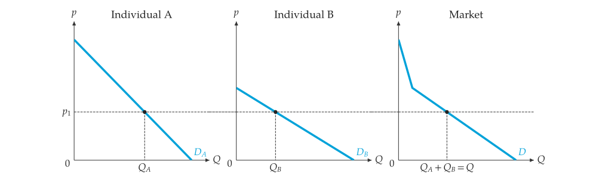
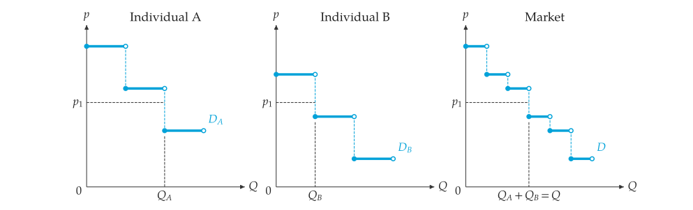

# 由個人加總市場曲線

<span id="sec-aggregation"></span>

市場曲線是個人曲線的水平加總：在每個價格下，市場數量等於所有買方（或賣方）在該價格下選擇的數量之和。買方在阻絕價格以上不購買，賣方在最低價格以下不銷售。線性個人曲線加總後的市場曲線是分段線性的，每多一人進入市場出現一個折點。

## 加總線性曲線

<!-- api: agora.principle_viz.guides_aggregation_1 -->

加總負斜率（需求）或正斜率（供給）的個人直線。供給加總由最低的最低價格延伸到 `p_max`。斜率方向不符時拋出 `AggregationError`。

<!-- api: agora.principle_viz.guides_aggregation_2 -->

通過 `points` $(Q, p)$ 的需求或供給曲線，點依數量排序。若第一點的 $Q = 0$，超出該點的價格下數量為零。

```python
from principle_viz import (
    line_from_inverse,
    market_demand,
    market_supply,
)

# p = 10 - 2Q
a = line_from_inverse(10, -2)
# p = 6 - 0.5Q
b = line_from_inverse(6, -0.5)
demand = market_demand((a, b))
# ((0.0, 10.0), (2.0, 6.0), (17.0, 0.0))
print(demand.points)
# 7.0 = Q_A + Q_B = 3 + 4
print(demand.q_at(4))
```

買方 B 在價格 6 進入市場，折點為 $(2, 6)$。價格為 4 時，$Q_A = 3$、$Q_B = 4$，市場需求量為 7。

<!-- api: agora.principle_viz.guides_aggregation_3 -->

逐段精確求解的市場均衡，以及沿價格積分得到的消費者剩餘與生產者剩餘。

```python
from principle_viz import (
    piecewise_surplus,
    solve_piecewise_equilibrium,
)

c = line_from_inverse(2, 1)
d = line_from_inverse(5, 0.5)
supply = market_supply((c, d), p_max=10)
eq = solve_piecewise_equilibrium(demand, supply)
# 3.818 5.273
print(round(eq.q_star, 3), round(eq.p_star, 3))
cs, ps = piecewise_surplus(demand, supply, eq)
```

`piecewise_surplus()` 回傳沿價格積分得到的消費者剩餘與生產者剩餘。

## 加總離散表

`DiscreteDemand.combine(*schedules)` 將所有買方的保留價格合併為一張市場表，由高到低排列；`DiscreteSupply.combine()` 合併單位成本，由低到高排列。相同的數值保留為不同單位，合併結果可直接交給 `solve_discrete_equilibrium()`（詳見[離散市場](discrete.md#sec-discrete)）。輸出參見[合併兩張離散需求表。](aggregation.md#fig-discrete-market-demand)。

```python
from principle_viz import DiscreteDemand

first = DiscreteDemand((10, 7, 4))
second = DiscreteDemand((8, 5, 2))
market = DiscreteDemand.combine(first, second)
print(market.values)
# (10.0, 8.0, 7.0, 5.0, 4.0, 2.0)
```

## 加總圖

<!-- api: agora.principle_viz.guides_aggregation_4 -->

每位個人一個面板，最後是市場面板，左右並排並共用價格軸。`individuals` 將名稱對應到曲線或逐單位表；曲線命名為 $D_A$、$D_B$……與 $D$（或 $S_A$……與 $S$）。在 `price` 處以虛線標出 $Q_A$、$Q_B$ 與 $Q_A + Q_B = Q$。`supply_aggregation_figure()` 另需 `p_max`。

回傳的 `AggregationFigure` 與 `MarketFigure` 一樣提供 `save()`、`hide()`、`show()`、`configure_label()`、`layer_ids` 與 `label_ids`。

```python
from principle_viz import demand_aggregation_figure

fig = demand_aggregation_figure(
    {"A": a, "B": b},
    price=4,
    link_price=True,
)
fig.save("market_demand.png")
```

`demand_aggregation_figure()` 的輸出參見[水平加總的市場需求。](aggregation.md#fig-market-demand)。

<span id="fig-market-demand"></span>

{ .ev-figure-sm }

<span id="fig-discrete-market-demand"></span>

{ .ev-figure-sm }
