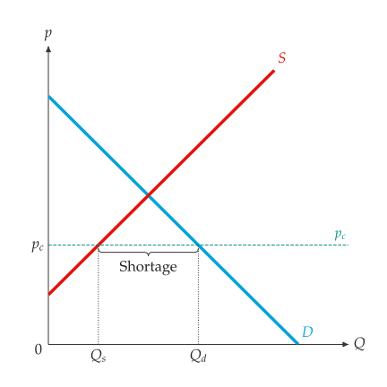
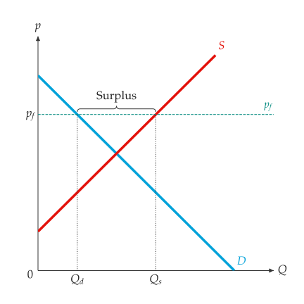
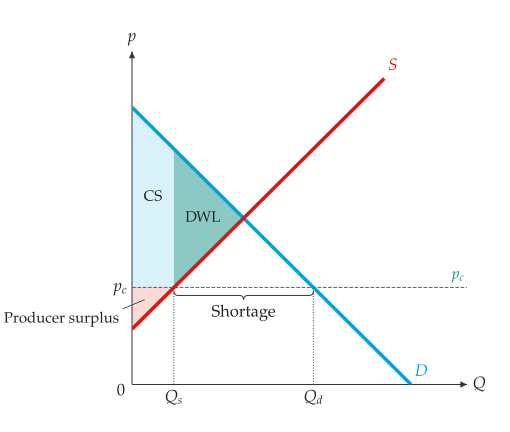

# 價格管制

<span id="sec-controls"></span>

低於均衡價格的價格上限，或高於均衡價格的價格下限，會*產生約束*：市場無法結清，成交量等於管制價格下需求量與供給量中較小者。

<!-- api: agora.principle_viz.guides_controls_1 -->

位於 `control_price` 的上限（`CEILING`）或下限（`FLOOR`），位於 `principle_viz.core.controls`。

<!-- api: agora.principle_viz.guides_controls_2 -->

管制下的市場，回傳 `PriceControlResult`：

```python
from principle_viz import evaluate_price_control
from principle_viz.core.controls import (
    PriceControlScenario,
    PriceControlType,
)

scenario = PriceControlScenario(PriceControlType.CEILING, 4.0)
ceiling = evaluate_price_control(demand, supply, scenario)
print(
    ceiling.is_binding,
    ceiling.traded_quantity,
    ceiling.shortage,
)
# True 2.0 4.0
```

上限高於均衡價格（例如 7）時，`is_binding` 為 `False`。

<!-- api: agora.principle_viz.guides_controls_3 -->

畫出管制線並命名為 "Price ceiling" 或 "Price floor"，在價格軸上標出 $p_c$。有約束時另標出 $Q_d$ 與 $Q_s$，並以括號標示差額：上限下方為 "Shortage"，下限上方為 "Surplus"。`gap_brace="axis"` 改在數量軸下方標示（參見[有約束的價格上限。](controls.md#fig-ceiling)、[有約束的價格下限。](controls.md#fig-floor)）。

<span id="fig-ceiling"></span>

{ .ev-figure-sm }

<span id="fig-floor"></span>

{ .ev-figure-sm }

`outcome_from_control()` 將結果轉為市場結果，可交給[福利](welfare.md#sec-welfare)的福利函式（參見[上限為 3.5 時的福利。](controls.md#fig-ceiling-welfare)）：

```python
from principle_viz.welfare.surplus import (
    compare_surplus,
    outcome_from_control,
    outcome_from_equilibrium,
)

eq = solve_equilibrium(demand, supply)
baseline = outcome_from_equilibrium(eq)
controlled = outcome_from_control(ceiling)
delta = compare_surplus(demand, supply, baseline, controlled)
fig.add_price_control(ceiling)
fig.add_welfare(delta.policy)
```

<span id="fig-ceiling-welfare"></span>

{ .ev-figure-sm }

價格上限下，無謂損失為未成交的交易利益；部分剩餘由賣方轉移給買方。
