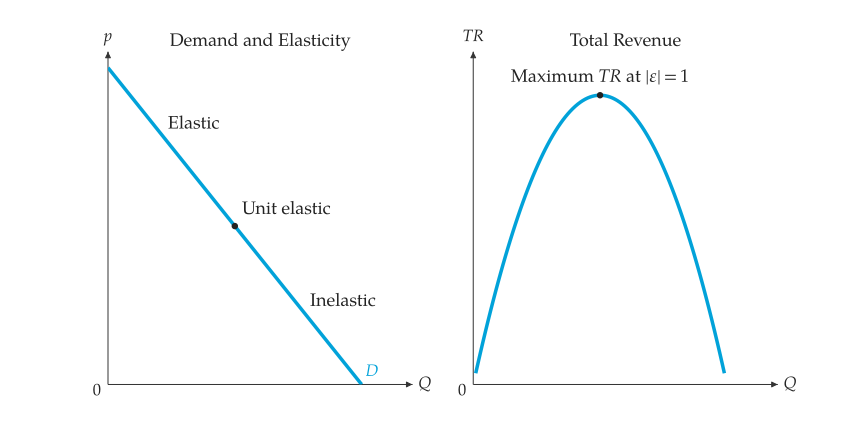

# 彈性與總收益

<span id="sec-elasticity"></span>

## 價格彈性

<!-- api: agora.principle_viz.guides_elasticity_1 -->

直線在某數量下的點價格彈性

$$
\epsilon = (\mathrm{d} Q) / (\mathrm{d} p) \cdot p / Q,
$$

以及兩點之間的弧彈性（中點法）

$$
\epsilon = (\Delta Q / \overline{Q}) / (\Delta p / \overline{p}),
$$

其中 $\overline{Q}$ 與 $\overline{p}$ 為兩點的平均值。負斜率需求的彈性皆為負值。

```python
from principle_viz import (
    compute_arc_elasticity,
    compute_point_elasticity,
    line_from_inverse,
)

demand = line_from_inverse(10.0, -1.0)
# -1.5
print(compute_point_elasticity(demand, 4))
# -1.0 (unit elastic)
print(compute_point_elasticity(demand, 5))
# -1.0
print(compute_arc_elasticity(4, 6, 6, 4))
```

$Q = 4$ 處彈性為 $-1.5$，絕對值大於 1，需求有彈性；$Q = 5$ 為單位彈性，也是 $p = 10 - Q$ 的中點。弧彈性以兩點的平均值計算，因此由 $(4, 6)$ 到 $(6, 4)$ 與反方向的結果相同。
`principle_viz.core.elasticity` 中的 `classify_elasticity(value)` 依絕對值分類：大於 1 為 `"elastic"`，等於 1 為 `"unit_elastic"`，小於 1 為 `"inelastic"`。

## 總收益

<!-- api: agora.principle_viz.guides_elasticity_2 -->

在線性需求上由 $Q = 0$ 取樣到阻絕數量，回傳每一點的價格、總收益 $p Q$、彈性與其分類。總收益在單位彈性處（直線的中點）最大。

$p = 12 - Q$ 的總收益最大值為 36，位於 $Q = 6$、$p = 6$。

<!-- api: agora.principle_viz.guides_elasticity_3 -->

回傳兩張 `mosaickit` 畫布，位於 `principle_viz.visuals.revenue`：一張是需求曲線，沿線標出 "Elastic"、"Unit elastic" 與 "Inelastic"，並標記單位彈性點；另一張是總收益對數量的曲線，標記最大值。兩張畫布各有標題。以 `mosaickit.CanvasGrid` 左右並排（參見[需求曲線上的彈性與總收益。](elasticity.md#fig-revenue)）。

```python
from mosaickit import CanvasGrid
from principle_viz import PlotTheme, elasticity_revenue_schedule
from principle_viz.visuals.revenue import (
    elasticity_revenue_canvases,
)

demand = line_from_inverse(12.0, -1.0)
schedule = elasticity_revenue_schedule(demand)
canvases = elasticity_revenue_canvases(
    demand,
    schedule,
    theme=PlotTheme(),
)
CanvasGrid(canvases, rows=1).save(
    "elasticity_total_revenue.png"
)
```

輸出參見[需求曲線上的彈性與總收益。](elasticity.md#fig-revenue)。

<span id="fig-revenue"></span>

{ .ev-figure-sm }
